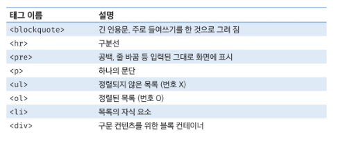
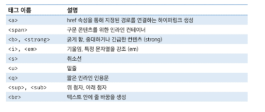
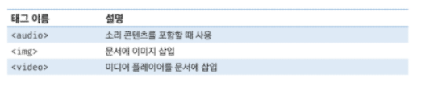
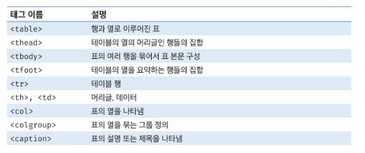
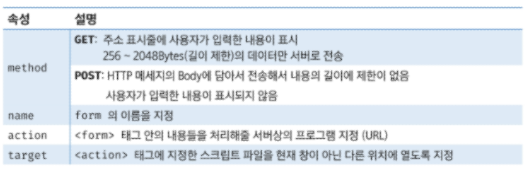
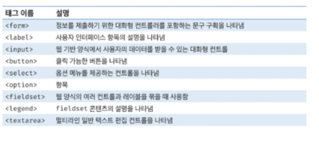
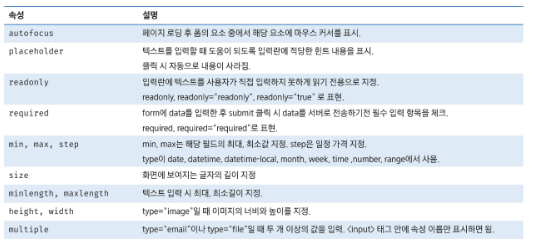

# HTML
- Web 소개
- HTML 개념
- HTML 구성 요소
    - Semantic Tag
    - DOM Tree
    - Block / Inline Text Content
    - Table Content
    - Form
    - Input

## Web 소개
### Web 소개
- Web의 구성
    - HTML - 구조 (뼈대, 설계)
    - CSS - 꾸밈, 스타일링
    - JS - 동작(애니메이션)
- 웹과 브라우저
    - 웹 사이트는 브라우저를 통해 동작
    - 브라우저마다 동작이 조금씩 달라서 실행에 문제가 생기는 경우 있음
    - 이러한 문제를 해결하기 위해서 웹 표준이 있음
- 웹 표준
    - 웹에서 사용되는 표준 기술이나 규칙
    - 브라우저 종류에 관계없이 동일하게 보이도록 가이드 제공
    - W3C/WHATWG
- 크롬 개발자 도구 - Chrome Developer Tools
    - 개발과 관련된 다양한 기능
    - 크롬 브라우저 우측 상단 ...> 도구 더보기 (More Tools) > 개발자 도구
    - Elements, Sources, Network, Performance, Application 등을 활용
    - ctril+shift+i || F12

## HTML
### HTML
    - Hyper Text Markup Language
    - Hyper Text: 참조를 통해 한 문서에서 다른 문서로 즉시 접근할 수 있는 텍스트
    - Markup: 태그(Tag) 등을 이용하여 문서나 데이터의 구조를 정의하는 언어
    - Markdown: Markup 언어의 일종으로 기호를 활용한 읽기와 쓰기 간단한 언어 .md 확장자 파일 
- HTML
    - 웹 페이지를 작성하기 위한 언어
    - .html 확장자를 가짐
    - 태그(Tag)는 대소문자 구분이 없음 (소문자 추천)
    - Enter, Tab 적용되지 않음 ()
    - 마크업 스타일
        - 1 indent == 2 space bar
### HTML 구성요소
- 기본 구조
    - `<!DOCTYPE>`
        - HTML 문서가 따라야할 일종의 오랜 약속이나 작성하지 않아도 잘 작동함
    - `<html></html>`
        - HTML 최상위 요소로 페이지 전체의 컨텐츠를 감싸는 루트 요소
        - 문서내에서 사용할 문자코드를  lang속성에 지정
    - `<head></head>`
        - HTML 문서에 표형하고 싶은 구성 요소의 재료들을 담고 있는 공간
        - 패키지 이름, CSS, faavicon등을 작성
        - 브라우저 화면에 출력되지 않음
    - <meta>    
        - 문서의 작성자, 날짜 등 화면에 출력되지 않는 일반 정보들
        - charset="utf-8": html 문서가 사용할 문서형태 지정
        - name="viewport, content-width="device-width": HTML문서에 너비를 보장해주어 흘러 넘치지 않게 함
    - `<title></title>`
        - HTML 문서의 제목으로 브라우저 탭에 표시됨
    - `<body></body>
        - 브라우저 화면에 나타나는 정볼, HTMl 문서에 보여줄 요소를 작성하는 공간
        - id 속성을 이용해서 문서 내에서 tag 식별 가능(중복x)
        - class 속성을 이용하여 여러 tag에 공통적인 특성 부여(중복o)
- 요소와 태그
    - HTML의 요소는 태그와 내용으로 구성
    - 시작태그/종료태그로 쌍을 이루거나 시작태그만 존재하는 경우도 있음
    - 각각의 시작태그는 속성을 가질 수 있음
    - 요소 중첩
        - 
 You can call me<strong>Kyu</strong.
 you can call me Kyu
        - Like a<b>magic</b>-<i/>Hong Gyun-</i> <>/span> ; 
        - Like mugic
    - 주석
        - 주석의 내용은 브라우저에 출력되지 않음
        - HTML Tage의 내용을 설명하기 위한 용도로 사용
    - 특수문자
    - Semantic Tag
        - 의미론적 요소를 담은 태그
        - 코드의 가독성을 높이고 유지보수를 쉽게 할 수 있음
        - 다양한 형식으로 활용 가능하며 정석/정답은 없음
        - ID와 class 속성으로 Semantic Tag를 대신하면 Semantic Tag 활용 가능
- DOM 트리
    - HTML 문서를 브라우저에 렌더링 하기 위한 구조
    - 조상관계 - ancestor
    - 자손관계 - descendant
    - 부모관계 - parent children
    - 형제관계 - sibling
- Block Text Content (요소를 아래로 쌓는다.)

- Inline Text Content (요소를 옆으로 쌓는다.)

    - a와 span을 구분하는 것이 중요(a는 Hyper Text사용할 때만 사용하고 나머지는 span을 쓸 것)

- Image & Multimedia

    - audio태그는 잘 안쓰임
    - image에서 src="경로" 형태로 함. alt="대신할 값"(이미지가 안보이면 대신할 값 설정)
    - iframe 많이 씀

- Table Content

- form 
    - 사용자로부터 데이터를 입력 받아 서버에 처리하기 위한 용도로 사용
    - 사용자가 작성한 데이터를 서버로 전송 (submit)
    - button tag의 기본타입은 submit

    - GET
        - 쓸 때 parameter가 url에 노출됨
        - querystring에 담겨서 전송됨
        - 보안에 취약하여 보통 Read에 쓰임
    - POST
        - 보안에 강함(어떤 토큰에 정보가 들어가기 때문)

- input
    - 요소의 동작은 type 속성에 따라 달라짐

