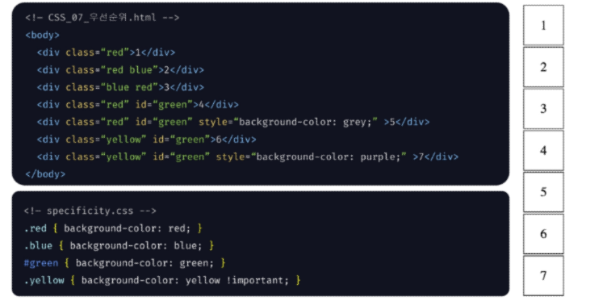

# CSS
- CSS 개념
- CSS 선택자
    - 전체, 유형, 아이디, 클래스, 특성, 목록
- CSS 결합자
    - 자손, 자식, 일반 형제, 인접 형제
## CSS
### CSS
- CSS
  - Cascading Style Sheets
  - HTML 문서를 화면에 표시하는 방식을 정의한 언어
	- 웹 문서의 내용과 관계없이 디자인만 바꿀 수 있음
	- 다양한 기기에 맞게 반응형으로 바뀌는 문서를 만들 수 있음
	- 웹 브라우저별 CSS3 지원

### CSS Syntax
- 기본구조

	``` 
	.box{  //선택자 
		background-color:red;  // 속성: 값;
		width: 10rem;
		height: 2rem;
		border: black 1rem dotted;	// 여러 속성을 넣을 때는 ,가 아닌 공백으로 구분
	} // box안의 내용은 선언부
	```

- 주석
	- 주석의 내용을 style 탭에 표시되지 않음
		- 'source'나 'element'탭에서는 확인 가능
	- /* CSS 주석 내용 */
	
	## CSS 적용 방법
	### CSS 적용방법
	- External Style Sheet - 외부 스타일 시트
		- 외부에 작성된 css 파일을 불러와서 스타일을 적용시키는 방식
		- `<head>` 안에 `<link>`를 사용하여 외부 스타일 시트 적용
		- href 속성에 css 파일의 (상대)경로 작성(rel 속성값은 stylesheet)
		- 선언부 이후 한줄 띄는 것이 관행, 내용 넣을 때는 공백을 4개 넣는게 관행
	- Internal Style Sheet - 내부 스타일 시트
		- HTML 파일 내에 스타일을 적용하는 방식
		- `<head>`안에 `<style>` 사용
			- CSS 파일에 작성하는 내용과 동일하게 작성
		- 외부 스타일 시트보다 우선 적용
		- 한 줄로 작성할 수도 있다.
	- Inline Style - 인라인 스타일
		- 요소의 태그에서 `style 속성`을 사용하여 속성값으로 스타일을 적용시키는 방식
		- 여러 개 가능

### CSS 우선순위
- CSS 적용 우선순위
	- Inline Style
	- Internal Style Sheet
	- External Style Sheet

## CSS Selector Combinator
- CSS 선택자
	- HTML 문서에서 CSS 규칙을 적용할 요소를 정의

	- 기본 선택자
		- 전체 선택자 (General Selector) `*`
		- 유형 선택자 (Type Selector) `요소(태그명)`
		- 아이디 선택자 (ID Selector) `#`
			- 중복불가능
		- 클래스 선택자 (Class Selector) `.` 예를 들면 `.클래스명`
			- 중복가능
		- 특성 선택자 (Attribute Selector) `[attribute]`

	- 그룹 선택자
		- 선택자 목록 (Selector List) `,`

- CSS 결합자
	- 결합자
		- 자손 결합자 (Descendant Combinator) `공백`
		- 자식 결합자 (Child Combinator) `>`
			- 바로 연결되는 요소만 바꿈
		- 일반 형제 결합자(Subsequent-sibling Combinator) `~`
		- 인접 형제 결합자(Adjacent-sibling Combinator) `+`
	- 의사 클래스 / 요소
		- 링크, 동적 의사 클래스 (Pseudo Class)
		- 구조적/기타 의사 클래스, 의사 엘리먼트, 속성 선택자
	- 우선순위, 상속

## CSS Selector
### CSS Selector - 기본 선택자 (Basic Selector)
- 전체 선택자(Universal Selector)
	- HTML 문서 내 모든 요소를 선택
	- 사용법 `*{style properties}`
- 유형 선택자 (Type Selector)
	- 요소의 이름 - 태그(Tag)을 이용하여 스타일을 적용
	- HTML 내에서 주어진 유형의 모든 요소를 선택
	- 사용법 `element {style properties}`
- 아이디 선택자 (ID Selector)
	- ID 특성 값을 비교하여, 동일한 ID를 가진 태그(Tag)를 선택
	- HTML 내에서 주어진 ID를 가진 요소가 하나만 존재 해야함
	- 사용법 `#id-name { style properties}`
- 클래스 선택자 (Class Selector)
	- Class가 적용된 모든 태그를 선택
	- HTML 내에서 동일한 클래스 명을 중복해서 사용 가능
	- 사용법 `.class-name { style properties}`
- 특성 선택자 (Attribute Selector)
	-태그/아이디/클래스 와 속성명과 속성값을 활용하여 요소를 선태
	- HTML 내부에서 동일한 특성을 가진 요소는 모두 선택
	- 사용법 `element | id-name|class-name[property=value] { style properties}`
	- `input::placeholder`로 접근하여 입력값의 색깔도 바꿀 수 있음
- 선택자 목록 (Selector List)
	- .를 이용하여 선택자 그룹을 생성하는 방법
	- 일치하는 모든 노드를 선택
	- 사용법 `element, element ... { style properties}`

### CSS Selector - 우선순위 (Specificity)
- 우선순위
	- *<.<#<인라인<!important
	- important가 가장 강함
	- 같은 요소에 두 개 이상의 CSS 규칙이 적용된 경우
	- 마지막 규칙, 구체적인 규칙,!important가 우선적용



- html순서가 중요하지 않고 CSS 순서중 마지막으로 갈수록 우선순위
- 답: red-blue-blue-green-grey-yellow-yellow

### CSS Selector - 상속 (Inheritance)
- 상속
	- 부모 요소에 적용된 스타일이 자식 요소에게 상속이 될 수도 있고, 안될 수도 있음
	- 상속 되는 속성
		- 요소의 상속되는 속성에 값이 지정되지 않은 경우, 요소는 부모 요소의 해당 속성의 계산 값을 얻음
		- 대표적인 예시는 color 속성
	- 상속 되지 않는 속성
		- 요소의 상속되지 않는 속성에 어떤 값이 지정되지 않는 경우, 요소는 그 속성의 초기값을 얻음
		- 대표적인 예는 border, padding, margin, width 속성

## CSS Combinator
### CSS Combinator - 결합자
- 자손 결합자
	- 첫 번째 요소의 자손인 노드를 선택
	- 공백(Space bar)를 사용
	- 사용법 
`selector1 selector2 {style properties}`

- 자식 결합자 (Child Combinator)
	- 첫 번째 요소의 바로 아래 자식인 노드를 선택
	- \>를 사용
	- 사용법
	`selector1 selector2 {style properties}`

- 일반 형제 결합자 (Subsequent Sibling Combinator)
	- 첫 번째 요소를 뒤따르면서 같은 부모를 공유하는 두 번째 요소를 모두 선택
	- ~를 사용
	- 사용법
`former-element ~ target-element {style properties}`

- 인접 형제 결합자 (Adjacent Sibling Combinator)
	- 첫 번쨰 요소의 바로 뒤에 위치하면서 같은 부모를 공유하는 두번째 요소 선택
	- +를 사용
	- 사용법
`former-element + target-element {style properties}`

## 실습실
### CSS 선택자
- 특정 속성 선택
```
a[title]{

}
```

- 가상 클래스 (마우스 커서)

```
a:hover{

}
```

- 가상 요소 

```
p::first-line{

}
```

### CSS 속성
#### color
- 어떤 한 요소의 text나 tesx-decoration에 색상을 적용하는 속성
- 색상을 적용할 때 여러가지 방법 존재
1. 색상 이름으로 적용
```
p{
	color: red;
}
```
2. hex값으로 적용
```
p{
	color: #00A400;
}
```
3. rgb함수로 적용
```
p{
	color: rgb(34,12,64,0.6); //마지막은 투명도
}
```

#### text
- text-decoration
	- 텍스트를 꾸며주는 속성
	- 텍스트의 줄, 색상, 두께 등을 설정할 수 있음
```
p{
	text-decoration: underline;
	text-decoration: underline dotted; 
	text-decoration: underline dotted red;
	text-decoration: none; 
}
```
- text-align
	- 테이블의 셀이나 블록 레벨의 태그의 안에서 인라인 레벨의 내용을 수평 정렬하는 속성
``` 
p{
	text-align: center; // 인라인 레벨의 콘텐츠를 가운데로 위치시킴
	text-align: start; // 인라인 레벨의 컨텐츠를 첫 시작 부분에 위치시킴 (left와 동일)
	text-align: end; // 인라인 레벨의 컨텐츠를 끝 부분에 위치시킴(right와 동일)
	text-align: justify; // 인라인 레벨의 요소의 크기에 맞춰 위치시킴 (한 줄을 모두 사용)
}
```

#### 요소
- width
	- 요소의 너비를 지정하는 속성
	- 기본값으로 콘텐츠의 크기만큼 차지
	- box-sizing 속성이 border-box로 설정되어 있으면 그 크기는 border 영역까지가 너비가 됨
```
p{
	width: 100px;
	widthL 100%;
	width: 20em;
	width: 10rem;
	width: auto;
}
```
- height 
	- 콘텐츠의 높이를 설정하는 속성
```
p{
	height:100px;
}
```

- position
	- 어느 곳에 위치할 것인지를 설정하는 속성
```
p {
	position: static; // 일반적인 흐름에 따라 배치되며, left, right, top, bottom, z-index는 효과 없음
	position: relative; // 일반적인 흐름에 따라 배치되며, left, right, top, bottom을 기준으로 배치됨
	position stricky; // 일반적인 흐름에 따라 배치되며, 가장 가까운 블록 레벨의 요소를 기준으로 배치됩니다.

	position: absolute; //일반적인 흐름에 따르지 않고, 상위 태그를 기준으로 배치됨
	position fixed; //일반적인 흐름에 따르지 않고, 레이아웃의 공간이 생성되지 않습니다.
}
```
- border
	- 요소의 테두리를 설정하는 속성입니다.
```
p {
	border: solid;
	border: dashed red;
	border: 1rem solid;
	border: tick double #32a1ce;
	border: dotted;
} 
```