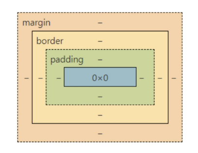

# CSS 속성 & Flexbox
- CSS 속성
- Flexbox
## CSS 속성
### CSS 단위
- 크기 단위
  - 내용 길이 값(length): px, cm, mm, in, em, rem 등의 길이 단위 사용
  - 백분율(%) : 상위 block에 대한 백분율의 단위, 상위 block 크기가 바뀌면 자신의 크기도 자동으로 변경
  - auto (width) : 100%, 자신의 상위 block이 허용하는 width 크기만큼 채운다.
  - auto (height) : 0%, 높이를 결정하는 요인은 block box 속의 내용물의 크기
- 색상 단위
  - 색상 키워드 : 대소문자 구분 x ex) red, blue ...
  - RGB 색상 : 16진수 표기법 혹은 함수형 표기법을 사용해서 특정 생을 표현하는 방식
  - HSL 색상: 색상, 채도, 명도를 통해 특정 색을 표현하는 방식 
    - 색조: red 360, green 120, blue 240
    - 채도: 0% 회색, 100% 순수한 음영x
    - 밝기: 0% 검은, 100% 흰색
### CSS font
- font 
  - html은 link로, CSS는 import로 가져올 수 있음

|속성|의미|
|---|---|
|font-family|글꼴 지정 (font name)|
|font-size|글자 크기 지정(em,rem,px)|
|font-style|글자 스타일 지정(normal,itotic,oblique) |
|font-variant|소문자를 작은 대문자로 변형|
|font-weight|글자 굵기 지정(100~700 일반 400, 굵게 700)|
|font|font에 관한 속성을 한번에 지정하는 단축형 속성|

### CSS text
- text

|속성|의미|
|---|---|
|text-align|정렬 방식 지정 (left,right,center,justify-글이 좌우로 쭉 늘어남)|
|text-decoration|text 장식 지정(none,underline,overline,line-through(취소선),blink(깜빡임))|
|text-indent|text-block안 첫 라인의 들여쓰기 지정 (px,em,rem 등등 음수도 가능)  |
|text-transform|text 대/소 문자화 (capitalize, uppercase, lowercase)|
|white-space|요소(element)안의 공백 지정 (normae,pre,pre-line,nowrap,pre-wrap)|
|vertical-align|수직 정렬 지정|
|letter-spacing|문자 간의 space 간격을 줄이거나 늘림|
|work-spacing|단어 간의 간격 지정|
|line-height|줄(행) 간격 지정|
|color|text 색상 지정|

### CSS background
- background
  - html에서 css 관련된 head는 href를, 브라우저에 보여지면 src를 사용
  - CSS에서는 모두 url url("경로")

|속성|의미|
|---|---|
|background-color|배경색을 지정|
|background-image|배경을 이미지로 지정(div, main, a, p, span)|
|background-attachment|배경 이미지를 고정하거나 scroll여부를 지정|
|background-repeat|배경 그림의 반복 여부를 지정|
|background-position|배경 그림의 위치를 지정|
|background|배경 관련 속성을 한번에 지정 (font 속성과 달리 속성 값 순서에 구애받지 않음)|
|background-size|배경 이미지 크기 조절|
|background-clip|배경 적용 범위 조절|

### CSS box model
- box model
  - 모든 HTML 요소는 box 형태로 되어 있음
  - 네모의 세상 - '멈무미'
  - `margin` 테두리 바깥 외부 여백
  - `border` 테두리
  - `padding` 테두리 안쪽 내부 여백
  - `box-sizing` 실제 내용

- margin
  - block 요소일 때만 지정 가능
  - margin 속성은 box의 마진영역의 너비를 지정

  - 값 1개 -> 모든 면 적용
  - 값 2개 -> {top,bottom} , {right, left}
  - 값 3개 -> {top},{right, left}, {bottom}
  - 값 4개 -> top, right, bottom, left 순으로 적용

  - margin: 0 auto 를 통해 가운데 정렬이 되도록 설정 가능

  - 마진 상쇄 현상이 일어날 수 있음 
- border
  - border-style : 선의 모양
  - border-width : 선의 굵기
  - border-color : 선의 색상
  - 위의 세 속성을 줄여서 사용가능

  - border-radius : 선의 모서리를 둥글게 만드는 속성
  - box-shadow : 그림자 효과
- padding
  - padding 속성은 box의 패딩 영역의 너비를 지정

  - 값 1개 -> 모든 면 적용
  - 값 2개 -> {top,bottom} , {right, left}
  - 값 3개 -> {top},{right, left}, {bottom}
  - 값 4개 -> top, right, bottom, left 순으로 적용
- box-sizing
  - 기본적으로 모든 요소의 box-sizing은 content-box 
  - padding을 제외한 순수 contents 영역만을 box로 지정

  - border까지의 너비를 크기로 보기 원할 때
    - box-sizing : border-box

### CSS display
- display : block
  - 줄 바꿈이 일어나는 요소
  - 화면 크기 전체의 가로 폭을 차지
  - 블록 레벨 요소 안에 인라인 레벨 요소가 들어갈 수 있음
  - 대표적인 블록 레벨 요소
    - `div`
    - `ul`, `ol`, `li`
    - `p`
    - `hr`, `br`
    - `form`
    - `...`
- display : inline
  - 줄 바꿈이 일어나지 않는 행의 일부 요소
  - content 너비만큼 가로 폭을 차지
  - width, height, margin-top, margin-bottom을 지정할 수 없음
  - 상하 여백은 line-height로 지정
  - 대표적인 인라인 레벨 요소
    - `span`
    - `a`
    - `input`, `label`
    - `b`, `em`, `i`, `strong`
    - ...
- diplay : inline-block
  - block과 inline 레벨 요소의 특징을 모두 갖고 있음
  - inline 처럼 한 줄에 표시 가능
  - block 처럼 width, height, margin 속성 지정 가능
- display : none 
  - 해당 요소를 화면에 표시하지 않음(공간x, 화면x)
  - `visibility: hidden;` 은 해당 요소 (공간O 화면x)

### CSS position
- position
  - static : (기본) 일반적인 내용물의 흐름, 상단, 좌측에서의 거리를 지정할 수 없음
  - relative : HTML 문서에서의 일반적인 내용물의 흐름을 말하지만, top, left 거리를 지정
  - absolute : 자신의 상위 box속에서의 top, left, right, bottom 등의 절대적인 위치를 지정
  - fixed : 스크롤(scroll)이 일어나도 항상 화면상의 지정된 위치에 있음

### CSS float
- float 
  - float 속성은 박스를 어느 위치에 배치할 것인지를 결정하기 위해 사용
  - none : 기본값
  - left : 요소를 왼쪽으로 띄움
  - right : 요소를 오른쪽으로 띄움
- clear
  - float 속성이 가지고 있는 값을 초기화 하기 위해 사용
  - left, right : 각각의 속성 값을 취소할 수 있음
  - both : 양쪽의 float 속성 값을 취소할 수 있음
  - none : 기본값

## Flexbox
### Flexbox
- Flexbox
  - Flexible Box module은 인터페이스 내의 아이템 간 공간 배분과 강력한 정렬 기능을 제공하기 위한 1차원 레이아웃 모델로 설계
- 주요 개념
  - Main Axis(주축), Cross Axis(교차축)
  - 시작선(start), 끝선(end)
  - Container와 item

### Flex Container
- Flex Container
	- display 속성을 이용하여 container를 생성
	- `display: flex;` -> block 성격의 container
	- `display: inline-flex` -> inline 성격의 container

	- flex-direction : container 안의 item들의 나열되는 방향 (row, column,row-reverse, column-reverse)
	- flex-wrap : conatiner 안의 item들의 크기가 container의 크기보다 클 때 줄 넘김 (wrap, no-wrap)
	- flex-flow : 방향과 줄 넘김을 동시에 설정 (ex: row wrap) 
	- justify-content : 메인 축의 정렬을 제어 (start,end,center,space-evenly,space-between - 양옆에 붙인다면 간격을 동일하게 함,space-around)
	- align-items : 교차 축의 정렬을 제어 
	- align-content : wrap 속성에 의해서 여러 줄이 발생한 경우의 교차 축 정렬

## Appendix
### Flex Item
-	Flex Item
	- order : item의 배치 순서 제어 (order를 통해 자동 배열됨, 기본값은 0)
	- flex-basis : item의 너비를 지정
	- flex-grow : item의 팽창 제어 (팽창, 기본(0), 양수만 가능)
	- flex-shrink : item의 수축 제어 (수축, 기본(1), 양수만 가능)
	- flex : flex-grow,flex-shrink,flex-basis의 속성을 단축 지정
	- align-self : 특정 item의 교차 축 정렬을 제거
		- auto: 자동
		-	stretch: 칸에 맞게 늘어남
		- flex-start: start위치로 감
		- flex-end: end위치로 감
		- center: 중앙으로 옴
