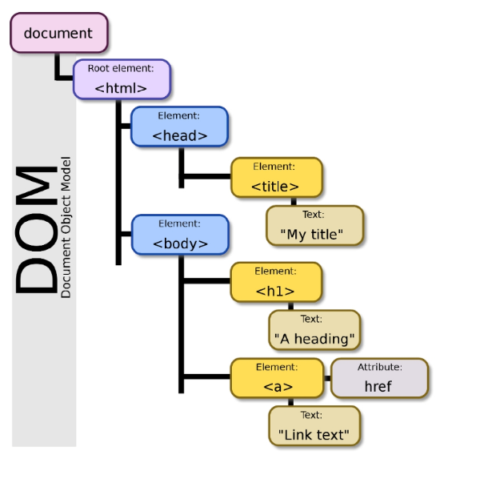
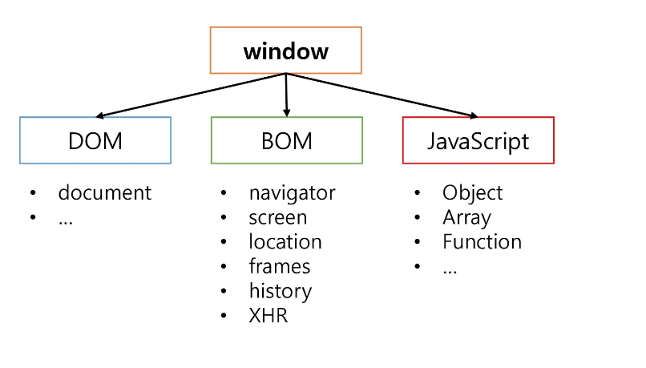

# JavaScript
- DOM
- Event
## DOM
### DOM
- DOM 이란?
  - 문서 객체 모델 (Document Object Model)
  - XML, HTML 문서의 각 항목을 계층으로 표현하여 생성, 변형, 삭제할 수 있도록 돕는 인터페이스
  - DOM은 문서 요소 집합을 트리 형태이 계층 구조로 HTML 표현
  - HTML 문서의 요소를 제어하기 위해 지원
  - 상단의 document 노드를 통해 접근



- DOM의 주요 객체
  - `window`
  - `document`



### DOM - window
- window
  - DOM을 표현하는 창
  - 가장 최상위 객체
  - `window` 키워드 생략 가능

- window 제공 메소드
  - alert : 알림을 줌 (어떤 문구를 넣어줄지)
  - confirm : 취소/확인 (문구를 넣음) 
  - prompt : 
  - open : url넣음 없으면 기본창
  - parseInt, parseFloat
  - setTimeout, clearTimeout
  - setInterval, clearInterval

### DOM - document
- document
  - document는 window의 속성
	- 브라우저에 렌더링된 웹 페이지
	- 우리가 보고 있는 웹페이지의 최상단
	- `document` 키워드로 접근

## DOM 조작
### DOM 조작
- DOM 조작
	- Document가 제공하는 기능을 사용해서 웹 문서를 조작
	- DOM 조작 순서
		1. 접근 (Select)
		2. 조작 (Manipulation)
			- 생성
			- 추가
			- 수정
			- 삭제

### DOM - 문서 접근 방식
- 문서 접근 방식 이해
	- `getElementByID("string")`
	- `querySelector("css selector")`
	- `querySelectorAll("css selector")`

- `getElementById("string")`
	- id의 이름으로 요소에 접근
	- 존재하지 않는 id값인 경우 null을 반환
	- `let ele = document.getElementById("a")` > div#a.b 

- `querySelector("css selector")`
	- #id, .class, tag, [property] 활용해서 첫번째 요소를 반환
	- `querySelector("#id")`
		- id의 기호와 이름으로 첫번째 요소를 반환
			- `let ele = document.querySelector("#a")`
			- `let ele = document.querySelector("a")`
			- 동일한 결과
	- `quearySelector(.class)`
		- class의 기호와 이름으로 첫번째 요소를 반환
			- `let ele = document.querySelector(".b)`
	- `quearySelector("tag")`
		- tag 이름으로 첫번째 요소를 반환
		- `let ele = document.querySelector("div")`
	- `quearySelector("[property]")`
		- 속성이름과 값으로 첫번째 요소를 반환
		- `let ele = document.querySelector("[name='c']")`
	- `querySelector("css selector")`
		- id, class, tag, property 모두 섞고, 결합자를 활용해서도 사용 가능
		- `let ele = document.querySelector("div:nh-child(2)")`
		- `let ele = document.querySelector("p[name='c']")`
		- `let ele = document.querySelector("main p.d")`
	- `querySelectorAll("css selector")`
		- css selector를 만족시키는 모든 요소를 NodeList로 반환
		- querySelector(...)와 사용방식은 동일
		- NodeList를 반환하고 배열처럼 사용가능 - 유사 배열, 배열은 아님(반복문 사용 가능)

### DOM - 문서 조작 방식
- `createElement("tagName")`
	- 작성한tagName의 HTML 요소를 생성해서 반환
	1. element 생성
		- `let ele =document.createElement("img")`
	2. 추가할 기존 element 접근
		- `let parent = document.getElementByid("ele")` 
	3. element 추가
		-	`parent.append(ele)` appendchild도 가능
- `createTextNode("text)`
	- 텍스트 노드 생성함, appendChild를 사용해서 노드 요소에 텍스트를 추가
	1. text node 생성
		- `let myText = document.createTextNod("SSAFY")`
	2. element 접근
		- `let pTag = document.getElementById("p")`
	3. element에 node 추가
		-	`pTag.appendChild(myText)` append 사용 불가
- append, appendChild
	- 부모 노드에 자식 노드를 추가하는 메소드
	- appendChild는 node만 추가 가능
- remove, removeChild
	- 요소 삭제, 노드 삭제
	- remove는 부모 엘리먼트가 불필요하나 removeChild는 필요
	- remove는 매개변수가 필요없고 removeChile는 node object를 매개변수로 가짐
	- remove는 반환하지 않지만 후자는 삭제된 노드 참조를 반환한다
- `setAttribute("attributeName",value)`
	- 지정된 속성의 값을 설정
	- 속성이 이미 존재하면서 값을 갱신 & 존재하지 않았던 속성이라면 이름과 값으로 새 속성을 추가
	1. element 생성
		- `let ele = document.createElement("img")`
	2. 생성된 img element 속성에 추가
		- `ele.setAttribute("src","./img/junho.png")`
		- `ele.src="./img/junho.png"` 이런식으로도 가능
- `getAttribute("attributeName")`
	- 지정된 요소의 값을 반환
	- 매개변수에 담은 속성이 존재하지 않는 경우 null을 반환
	- `const ssafy = document.getElementById("ssafy")`
	- `const myId = ssafy.getAttribute("id")` > ssafy
	- `const myName = ssafy.getAttribute("name")` > null
- `innerHTML`
	- 요소 내용을 HTML 내용 그대로 변경
	1. 조작할 element 접근
		- `let list = document.getElementByID("list")`
	2. 처리할 작업 진행
		- `list.innerHTML("")`
- `innerText`
	- Node 객체와 그 자손의 텍스트 컨텐츠를 표현
	- element 접근 후 innerText로 값 확인
		- `document.querySelector("span").innerText` 
	- innerText로 값 변경
		- `document.querySelector("span").innerText = "Eevee`
		- `document.querySelector("span").innerText`

## Event
### Event
- Event
	- (특히 중요한) 사건[일]
	- 웹 페이지에서 여러 종류의 상호작용이 있을 때 마다 이벤트가 발생
	- 마우스를 이용했을 때, 키보드를 눌렀을 때 등 많은 이벤트가 존재
	- JavaScript를 사용하여 DOM에서 발생하는 이벤트를 감지하고 대응하는 작업을 수행할 수 있음
- Event의 종류
	- keyboard -> keyup, keydown, keypress
	- Mouse -> click, mousemove, mouseup, mousedown, mouseenter, mouseleave
	- Loading -> load, unload
	- Form -> input, change, blur, focus, submit
- Event 객체 (Object)
	- 네트워크 활동이나 사용자와의 상호작용 같은 사건(action) | 발생(Occurrence)의 발생을 알리기 위한 객체
	- Event 발생
		- 마우스를 클릭하거나 키보드를 누르는 등 사용자 행동으로 발생 가능
		- 특정 메서드를 호출하여 프로그래밍적으로 표현 가능
- Event 처리|통신
	- DOM 요소는
		- Event를 수신할 수 있음
		- Event를 처리할 수 있음
	- Event는 주로 `addEventListener()`f를 사용함
	- 다양한 HTML 요소에 이벤트 처리기 (Event Handler)를 붙여서 처리함
- Event 처리 방식의 이해
	- 고전 이벤트 처리 방식: attribute/property 방식으로 등록
	- 표준 이벤트 처리 방식 `addEventListener()` 메서드 이용

### Event - 고전 이벤트 처리 방식
- 고전 이벤트 처리 방식 - 1
	- 인라인 이벤트 설정 -> 엘리먼트에 직접 지정
	- 설정하려는 이벤트를 정하고 on이벤트종류의 형식으로 지정
		- `<button onclick="changeColor()">change</button>`

- 고전 이벤트 처리 방식 - 2
	- 엘리먼트에서 이벤트를 직접 설정하지 않고 스크립트에서 이벤트 설정
	
``` javascript
h1.onclick = function(){
	alert('클릭');
	h1.onclikc = null;
}
```

### Event - 표준 이벤트 처리 방식
- 표준 이벤트 처리 방식
	- `addEventListener()`
		- Event 추가 
		- EvemtTarget.addEventListener(type, listener[,option])
	- `preventDefault()`
		- 현재 Event의 기본 동작을 중단|취소
		- HTML 요소의 기본 동작을 작동하지 않게 함
### Event - addEventListener()
- 특정 이벤트에 특정 이벤트가 발생하면, 할 일을 등록하자
- `EventTarget.addEventListener(Type,Listener)`
- EventTarget
	- 특정 이벤트가 목표물에 전달될 때마다 호출할 함수를 설정
	- Event를 지원하는 모든 객체를 EventTarget으로 지정 가능
- Type
	- 반응할 Event 유형을 나타내는 대소문자 구분 문자열
	-	e.g input, click. submit
- Listener
	- 지정된 타입의 Event를 수신할 객체
	- 자바스크립트 함수 객체 (콜백 함수)이여야만 함
	- 콜백 함수는 발생한 Event의 데이터를 가진 Event객체를 유일한 매개변수로 받음
### Event - prevantDafault() 
- 특정 이벤트의 이벤트의 기본 동작을 중단