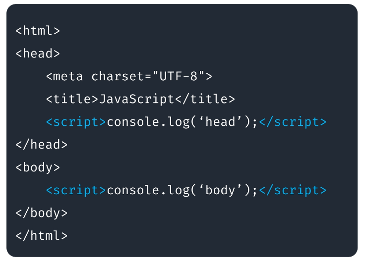
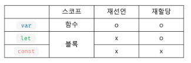

# JavaScript
- JavaScript 
- 기본 문법
- 반복문
- 객체
- 함수
- Appendix
	- 익명 함수
	- 화살표 함수
	- 즉시실행 함수 (IIFE)
## JavaScript
### JavaScript
- 자바스크립트란?
	- 프로토타입 기반 객체 생성을 지원하는 동적 스크립트 언어
	- 웹 브라우저에서 주로 사용, Node.js를 이용하여 콘솔 환경에서 사용
	- 웹 브라우저의 UI를 제어하기 위해 만들어진 프로그래밍 언어
	- 자바와 기본 구문이 비슷하다. (C언어의 기본 구문을 바탕)
	- 브랜든 아이크 개발(1995)
	- Mocha ->LiveScript -> JavaScript
- 브라우저 엔진
	- 브라우저가 작동하는데 필요한 기반 기술을 모두 포함하는 엔진
	- 단순 markup이 아니라 자바스크립트나 통신 모듈을 실행하기 위해서 필요
	- 웹 브라우저마다 사용하는 엔진이 조금씩 다름
- 자바스크립트
	- ECMA International : 정보 통신에 대한 표준을 제정하는 비영리 표준화 기구
	- ECMAScript : ECMA-262 기술 규격에 의해 정의된 범용 스크립트 언어
	- ECMAScript6 (ES6) : ECMA에서 제안하는 6번째 표준 명세 (2015년 발표)

## 기본 문법
### 기본 문법
-	HTML 자바스크립트 사용
	- `<script>`, `</script>` 태그를 사용
	- 문서 내의 위치의 제약이 없다. (head나 body나 상관없음, 하지만 body의 가장 밑에 넣는 것을 권장)



- 외부스크립트 참조하기
	- .js 확장자를 가진 파일을 생성
	- html 문서에서 `<script src="outer.js"</script>`
		- outer.js
			- `console.log('hello');`
		- html

``` html
<body>
	<h1> 외부 스크립트 파일 참조</h1>
	<script src="outer.js">console.log("실행되지 않는 부분임");</script>
	<script>
		console.log("파일 호출과 별도의 태그를 만들어서 실행"); // 출력부분
	</script>
</body>
```

- 주석 (Comment)
	- `//` 한 줄 주석
	- `/* */` 여러 줄 주석
- 변수 (Variable)
	- 자바스크립트의 변수 타입은 가리키는 값에 대한 타입을 나타냄
	- `var`, `let`, `const` 키워드를 이용해서 변수를 선언
	- `undefined`는 변수에 아무 값도 없어서 타입을 알 수 없는 경우를 말함
	- 동적 타입 : 대입되는 값에 따라서 용도가 변경되는 방식
	- 문자, $, _로 시작, 대소문자 구분, 예약어 사용x



- var
	- 재선언 가능, 재할당 가능
	- ES^ 이전에 변수 선언 시 사용
	- 호이스팅 (Hoisting) 특성이 있음 - 없는 변수를 다음에 나오는 코드에서 찾아와 알려줌(디버깅이 힘듦) 
	- 함수 스코프

- let
	- 재선언 불가, 재할당 가능
	- 블록 스코프
- const
	- 재선언 불가, 재할당 불가
	- 블록스코프
	- 대문자 SNAKE-CASE 사용
	- 선언 시 값을 할당애햐 함
	- 상수로 사용
- undefined
 - 변수에 값이 대입되지않은 상태
 - 0은 공간은 있으나 값이 없고, undefined는 둘 다 비어있다.
- 데이터 타입 (Data Type)
	- 기본 데이터 타입 (Primitive TYpe)
		- String, Number, Booleaan null, undefined
	- 객체 타입
		- Onject-function=arr용
	- es6 추가된 타입
	- symbol(변경 불가능한 기본타입)
- typeof - 변수의 자료형 검사
	- typeof 데이터
	- typeof (데이터)
	- typeof의 결과는 문자열 반환

	- null의 데이터 타입은 object
		- (설계 실수)
		- null 아님
	- function은 기능을 가진 객체
	- *es6 추가된 타입
		- Symbol(변경 불가능한 기본타입)
- 동적 데이터 타입 - 다양한 값의 대입이 가능
- 숫자형 (Number)
	- 정수와 실수로 나누어 구분하지 않음 (부동소수점 형식)
	- 일반적인 숫자 외 특수 숫자 포함 (Infinity, Nan ...)
	- e를 활용하여 거듭제곱 표현 가능
- 문자열 (String)
	- ""로 감싼다.
	- ''로 감싼다.
	- Template Literal (ES6) -> ``(backtick)으로 감싼다.
		- 여러 줄 입력이 가능 -공백,줄 넘김 유지
		- 문자열 내에서 #(변수명)을 이용하여 변수와 문자열을 결합
	- UTF-16 형식
- 문자열 (String) 연산
	- 문자열과 숫자 타입의 +연산
		- -> 문자열
	- 문자열과 숫자 타입의 +연산 이외
		-	-> 숫자
- 자바스크립트 false
	- 아래의 5가지 값은 false로 인식
		- null
		- undefind
		- 0
		- "" 빈문자열
		- NaN
	- 나머지 값은 true로 인식

- 연산자
	- +(덧셈) 단항 사용시 Number()와 동일한 역할
	- -(뺄셈)
	- *(곱셈)
	- /(나눗셈)
	- %(나머지)
	- ** (거듭제곱)
	- =(할당 연산자)
	- +=,-=,*= (복합 할당 연산자)
	- ++,--(증감 연산자)
- 일치 연산자
	- 값과 타입이 일치하는지 체크
	- ===,!==
- 제어문 (Java 유사)
	- 조건문 (Condition)
		- if 
		- switch
	- 반복문 (Loop)
		- for
		- while
		- do-while
- 배열 (Array)
	- 배열의 생성 : [] 또는 Array() 활용
	- 배열의 크기는 동적으로 변경된다.
	- 크기가 지정되어 있지 않은 경우에도 데이터의 입력 가능
	- 배열은 여러가지의 데이터 타입을 하나의 배열에 입력할 수 있음
	- 함수를 사용하여 데이터 추가 가능
		- .pop(): 배열의 마지막 원소 삭제
		- .push(): 배열 마지막에 원소 삽입
		- .unshift(): 배열 맨 앞에 원소 삽입
		- .shift(): 배열 맨 앞에 원소삭제 
		- .splice(i,n): i위치에서 n개 삭제
		- .slice(i,j): i~j에 대한 얕은 복사
		- .join() : 배열 원소 전체를 하나의 문자열로
		- .reverse() : 배열의 원소 순서를 거꾸로
		- .concat(newArr) : 배열을 합치고 병합된 배열사본 반환
		- ....
## 반복문
### 반복문
- 반복문
	- while
	- for
	- for ... in
	- for... of
	- forEach
- while
	- 조건이 true인 동안 반복	
- for
	- 가장 일반적인 반복문
	- for문 안에 사용할 변수를 정의하고, 해당 변수를 기준으로 조건이 false가 될때까지 반복
 - for ... in
	- Object -> key || Array->index를 순회하는 반복문
- for ... of
	- 배열에서 요소를 하나씩 순회하며 반복하는 반복문
	- 꺼내지는 모든 요소는 블럭 내에서 변수로 선언되기 때문에 변수 선언 키워드 작성 필수
- forEach
	- Array의 메서드(method)로 요소들에 접근하는 반복문의 형태
	- forEach 에서 매개변수로 지정한 값이 배열 안에 있는 각 요소들을 담을 변수로 취급

``` javascript
const foods = ["kebab","taco"]
foods.forEach(function(food){
	console.log(food)
})
foods.forEach((food)=>console.log(food)) // 화살표 함수 형식
```

## 객체
### 객체
- 객체(Object) 
	- 객체는 문자열로 이름을 붙인 값들의 집합체(Key:Value)
	- 객체에 저장하는 값을 프로퍼티(Property)라고 함
	- 객체는 prototype 이라는 특별한 프로퍼티를 가지고 있음
- 객체 (Object) 만들기
	- 객체 리터럴 이용 : {}
	- Object 생성자 이용 : new Object()
	- 생성자 함수 이용 
		-`function Member(매개변수){함수본문}`을 선언 후 `let member명 = new Member(매개변수)`
- 객체 프로퍼티
	- 생성자 함수를 사용해서 Property 추가 가능 & this 키워드 사용 가능
	- .(dot) 또는 []를 이용하여 프로퍼티의 조회 및 변경을 처리
		- `객체명.변수명`으로 접근 가능(변수에 ""가 없을 때)
		- `객체명["변수명"]`으로 접근 가능(변수에 ""가 없을 때)
		- 변수명이 ""로 감싸져 있다면 `객체명[변수명]`으로만 접근 가능
- 객체 프로퍼티 - 추가/수정/삭제
	- 추가: `객체명.새로운변수명=값`
	- 수정: `객체명.기존변수명=값` 혹은 `객체명[기존변수명]=값` - 형식에 맞게 쓸것
	- 삭제: `delete 객체명.변수명`
- 객체 변수에는 주소가 저장되어 공유 가능
	- member2=member1을 하고 member2의 변수를 바꾸면 member1의 변수도 바뀜
- 함수 안에서의 this는 함수를 호출한 객체
	- 객체명.함수에서 this.변수명으로 객체의 변수를 가져올 수 있음

## 함수
### 함수
- 함수
	- 자바스크립트에서 함수는 객체 타입으로 값처럼 사용이 가능
	- 함수를 변수에 대입하거나 매개변수로 넘길 수 있음
	- 배열의 요소에 넣거나 객체의 프로퍼티로 설정이 가능
	- 매개변수의 개수가 일치하지 않아도 호출이 가능
	- JavaScript의 함수는 일급 객체(First-class citizen)에 해당
		- 변수에 할당 가능
		- 함수의 매개변수로 전달 가능
		- 함수의 반환 값으로 사용가능
	- `function` 키워드 사용
	- 함수의 블럭은 중괄호 `{}` 사용
	- 선언식, 표현식
- 함수 만들기
	- 함수 선언식
		- 일반적인 프로그래밍 언어의 함수 정의 방식
			- `function 함수명(){함수 내용}`

	- 함수 표현식
		- JavaScript의 특징을 활용한 함수 정의 방식
			- `let 함수명 = function(){함수 내용}`
- 함수 선언식
	- 일반적인 프로그래밍 언어의 함수 정의 방식
	- 함수의 이름과 함께 정의하는 방식
	- 함수의 이름
	- 매개변수
	- 내용
	- 호이스팅 됨
- 함수 표현식
	- 익명함수로 정의 가능
	- 매개변수
	- 내용
- 선언식 vs 표현식
	- 선언식 함수를 호이스팅의 영향을 받아 함수 선언 이전에 호출이 가능
	- 표현식 함수는 선언 이전에 호출이 불가능
- 함수의 리턴
	- 함수의 실행 결과로 함수를 반환할 수 있음
	- 함수가 특별한 값을 리턴 하지 않은 경우 undefined가 반환됨
- 함수의 호출
	- 정의된 함수를 호출 시 함수 값으로 넘길 수 있음
- 함수 매개변수
	- 함수는 호출 시 매개변수의 영향을 받지 않음
	- `arguments` 라는 함수 내부의 프로퍼티를 이용하여 매개변수의 처리가 가능
	- 기본 인자 (deafult arguments)를 사용할 수 있음
	- 자바스크립트의 함수는 오버로딩 개념을 지원하지 않음 (마지막 함수가 진짜 함수)

## Appendix
### Anonymous Function
- 익명 함수
	- 이름이 정의되지 않은 함수를 의미
	- 익명 함수는 함수 표현식에서만 사용 가능
	- 표현식에서 이름을 명시하는 것이 가능
### Arrow Function
- 화살표 함수
	1. `function` 키워드 생략 가능
	2. 함수의 매개변수가 오직 한 개라면 `()`도 생략 가능
	3. 함수의 내용이 한 줄이라면 `{}`와 `return`도 생략 가능
	4. 인자가 없다면 `()||_` 으로 표시 가능	
### IIFE
- 즉시 실행 함수
	- 선언과 동시에 실행되는 함수
	- 함수의 선언 끝엔 `()`를 추가하여 선언되자마자 실행되는 함수
	- `()`에 값을 넣어 인자로넘겨줄 수 있음
	- 선언과 동시에 실행되며, 재호출이 불가
	- 일회성이기 때문에 익명 함수로 사용됨
