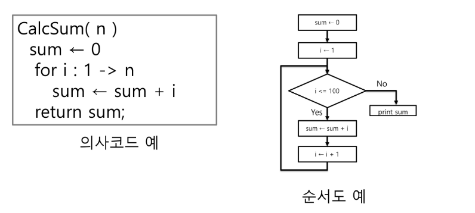
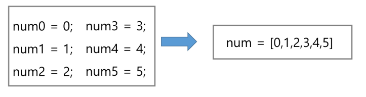
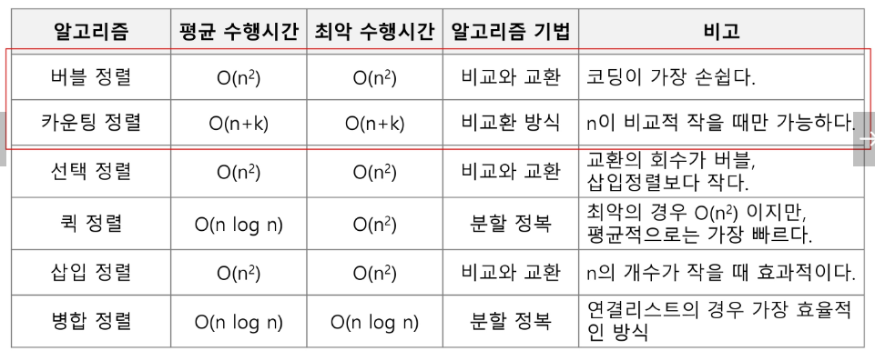

## 알고리즘
- 알고리즘: 유한한 단계를 통해 문제를 해결하기 위한 절차나 방법
- 어떤 문제를 해결하기 위한 절차

### 알고리즘을 표현하는 방법
- 의사코드(슈도코드, Pseudocode)와 순서도



### 좋은 알고리즘의 조건
1. 정확성: 얼마나 정확하게 동작
2. 작업량: 얼마나 적은 연산으로 원하는 결과를 얻는가
3. 메모리 사용량: 얼마나 적은 메모리
4. 단순성: 얼마나 단순한가
5. 최적성: 더 이상 개선할 여지가 없는가?
- 보통은 알고리즘의 작업량을 비교한다.

### 알고리즘의 성능
- 알고리즘의 작업량은 시간복잡도로 표현한다.
- 시간 복잡도
    - 실제 걸리는 시간 측정
    - 실행되는 명령문의 개수를 계산

### 시간 복잡도는 빅오 표기법과 유사
- 시간 복잡도 함수 중에서 가장 큰 영향력을 주는 n에 대한 항만을 표시
- 계수는 생략하여 표시

## 배열 
### 배열이란
- 일정한 자료형의 변수들을 하나의 이름으로 열거하여 사용하는 자료구조
- 6개의 변수를 사용해야 하는 경우, 이를 배열로 바꾸어 사용하는 예


- 이 경우 메모리에 순서대로 들어감

### 배열의 필요성
- 프로그램 내에서 여러 개의 변수가 필요할 때, 일일이 다른 변수명을 이용하여 자료에 접근하는 것은 매우 비효율적일 수 있다.
- 배열을 사용하면 하나의 선언을 통해서 둘 이상의 변수를 선언할 수 있다.
- 단순히 다수의 변수 선언을 의미하는 것이 아니라, 다수의 변수로는 하기 힘든 작업을 배열을 활용해 쉽게 할 수 있다.

### 1차원 배열
- 1차원 배열의 선언
    - 별도의 선언 방법이 없으면 변수에 처음 값을 할당할 때 생성
    - 이름: 프로그램에서 사용할 배열의 이름
    - 웬만하면 배열의 크기를 미리 정하고 하는게 좋음
    - ex) `Arr=list()`, `Arr=[]`, `Arr=[1,2,3]`, `Arr=[0]*10`
- 1차원 배열의 접근
    - `Arr[0]=10` 배열 Arr의 0번 원소에 10을 저장하라.
    - `Arr[idx]=20` 배열 Arr의 idx번 원소에 20을 저장하라.
- 입력받은 정수를 1차원 배열에 저장하는 방법
    - 첫 줄에 양수의 개수 N이 주어진다.
    - 다음 줄에 빈칸으로 구분된 N개의 양수 A_i가 주어진다.
``` python
n=int(input())
arr=list(map(int,input().split()))
```

## 정렬
- 2개 이상의 자료를 특정 기준에 의해 작은 값부터 큰 값 혹은 그 반대의 순서대로 재배열하는 것
- 키: 자료를 정렬하는 기준이 되는 특정 값

### 대표적인 정렬 방식의 종류
- 버블 정렬
- 카운팅 정렬
- 선택 정렬
- 퀵 정렬
- 삽입 정렬
- 병합 정렬

### 버블 정렬
- 인접한 두 개의 원소르 비교하며 자리를 계속 교환하는 방식
- 정렬 과정
    - 첫 번째 원소부터 인접한 원소끼리 계속 자리를 교환하면서 맨 마지막 자리까지 이동
    - 한 단계가 끝나면 가장 큰 원소가 마지막 자리로 정렬된다.
- 시간 복잡도: O(n^2)
- 코드

``` python
def BubbleSort(a,N):    # 정렬할 List, N 원소 수
    for i in range(N-1,0,-1):  # 범위의 끝 위치
        for j in range(0,i):    # 비교할 왼쪽 원소
            if a[j]>a[j+1]:
                a[j],a[j+1]=a[j+1],a[j]

```

### 카운팅 정렬
- 항목들의 순서를 결정하기 위해 집합에 각 항목이 몇 개씩 있는지 세는 작업을 하여, 선형 시간에 정렬하는 효율적인 알고리즘
- 제한 사항
    - 정수나 정수로 표현할 수 있는 자료에 대해서만 적용 가능: 각 항목의 발생 회수를 기록하기 위해, 정수 항목으로 인덱스 되는 카운트들의 배열을 사용하기 때문
    - 카운트들을 위한 충분한 공간을 할당하려면 집합 내의 가장 큰 정수를 알아야 한다.
- 정렬 과정
    - 먼저 각 항목별로 몇 개씩 있는지 counting하는 리스트1 생성
    - 리스트1의 누적합 리스트2 생성
    - 리스트3를 선언 후 끝에서부터 탐색하여 k가 있다면 리스트2[k]를 1 줄이고 리스트2[k] 위치에 넣는다. 
- 시간 복잡도
    - O(n+k) : n은 리스트 길이, k는 정수의 최대값
- 코드:

``` python
def Counting_Sort(DATA,TEMP,k):
# DATA[] -- 입력 배열
# TEMP [] --정렬된 배열
# COUNTS [] --카운트 배열
    COUNTS=[0]*(k+1)
    for i in range(0,len(DATA)):
        COUNTS[DATA[i]] +=1
    for i in range(1,k+1):
        COUNTS[i]+=COUNTS[i-1]
    for i in range(len(TEMP)-1,-1,-1): # 마지막부터 탐색하는 이유는 배열의 안정성을 위해서(같은 3이어도 뒤에 있던 3이 그대로 뒤에 있음)
        COUNTS[DATA[i]]-=1
        TEMP[COUNTS[DATA[i]]]=DATA[i]
```

### 여러 정렬 알고리즘의 특성



### 완전 검색
- 문제의 해법으로 생각할 수 있는 모든 경우의 수를 나열해보고 확인하는 기법
- Brute-force 혹은 generate-and-test기법이라고도 불리운다.
- 모든 경우의 수를 테스트한 후, 최종 해법 도출
- 일반적으로 경우의 수가 상대적으로 작을 때 유용

### 탐욕 알고리즘 (Greedy algorithm)
- 탐욕 알고리즘은 최적해를 구하는 데 사용되는 근시안적인 방법
- 여러 경우 중 하나를 결정해야 할 땜마다 그 순간에 최적이라고 생각되는 것을 선택해 나가는 방식으로 진행
- 지역적으로 최선이여도 최종 해답이 최적이라는 보장은 없다.

#### 동작 과정
1. 해 선택: 현재 상태에서 부분 문제의 최적 해를 구한 뒤, 이를 부분해 집합에 추가
2. 실행 가능성 검사: 새로운 부분해 집합이 실행 가능한지를 확인한다.
곧 문제의 제약 조건을 위반하지 않는지를 검사한다.
3. 해 검사: 새로운 부분해 집합이 문제의 해가 되는지를 확인한다. 아직 전체 문제의 해가 완성되지 않는다면 1부터 다시 시작한다.