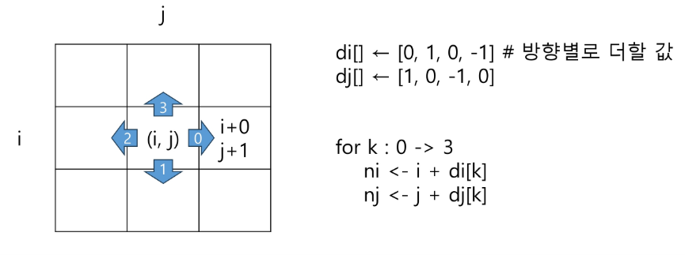

## 배열 2 (Array 2)
- 배열 : 2차원 배열
- 부분집합 생성
- 검색
- 이진 검색
- 셀렉션 알고리즘
- 선택 정렬

### 2차원 배열
#### 2차원 배열의 선언
    - 1차원 List를 묶어놓은 List
    - 2차원 이상의 다차원 List는 차원에 따라 Index를 선언
    - 2차원 List의 선언: 세로길이(행의 개수), 가로길이(열이 개수)를 필요로 함
    - Python 에서는 데이터 초기화를 통해 변수선언과 초기화가 가능함.
`arr=[[0,1,2,3],[4,5,6,7]]` (2행 4열의 2차원 List) 
#### 입력받을 때 팁
``` python
n=int(input())
arr= [list(map(int,input.split()))for _ in range(n)] # n을 입력받고 n*n배열 입력받기, 입력이 공백으로 구분될 때 ex) 1 2 3\n 4 5 6\n 7 8 9
```
``` python
n=int(input())
arr= [list(map(int,input()))for _ in range(n)] # 입력이 붙어있을 때 ex) 123\n456\n789 - 문자열이 iterable하기 때문에 map함수에서 하나씩 떼서 map object를 생성함. - 배열의 요소가 한자리일 때만 가능
```
#### 출력받을 때 팁
``` python
arr=[[0]*3 for _ in range(3)]
for i in range(3): 
    print(*arr[i])  # 언패킹 활용
for i in range(3):
    for j in range(3):
        print(arr[i][j],end=" ") # 요소별 출력
    print("")
```
#### 2차원 배열의 접근
- 배열 순회
    - nxm배열의 n*m개의 모든 원소를 빠짐없이 조사하는 방법

- 행 우선 순회

``` python
for i in range(n):  # i행
    for j in range(m): #j열
        f(array[i][j]) # 필요한 연산 수행
```
- 열 우선 순회

``` python
for j in range(m):  # j열
    for i in range(n): #i행
        f(array[i][j]) # 필요한 연산 수행
```

-  지그재그 순회
``` python
for i in range(n):  # i행
    for j in range(m): #j열
        f(array[i][j+(m-1-2*j)*(i%2)]) # 홀수행은 정방향, 짝수행은 역방향
```

- 델타를 이용한 2차 배열 탐색
    - 2차 배열의 한 좌표에서 4방향의 인접 배열 요소를 탐색하는 압법
    - 인덱스 (i,j)인 칸의 상하좌우 칸 (ni,nj)
    - 2차 배열의 한 좌표에서 4방향의 인접 배열 요소를 탐색하는 방법



``` 
arr[0...N-1][0...N-1] # N*N배열
di[] <- [0,1,0,-1]
dj[] <- [1,0,-1,0]
for i: 0 -> N-1
    for j: 0->N-1:
        for k in range(4):
            ni<- i+di[k]
            nj<- j+dj[k]
            if 0<=ni<N and 0<=ni<N
                f(arr[ni][nj])
```
- 전치 행렬
- 방법1

``` python
arr=[[1,2,3],[4,5,6],[7,8,9]]
for i in range(3):
    for j in range(3):
        if i<j:
            arr[i][j],arr[j][i]=arr[j][i],arr[i][j]
```

- 방법2

``` python
arr=[[1,2,3],[4,5,6],[7,8,9]]
arr=list(zip(*arr))
```

### 부분집합 생성
- 주어진 집합의 부분집합을 생성하는 방법
- 비트로 표현
    - arr이 집합을 표현할 때 i번째 원소가 부분집합에 속하면 bit[i]=1, 없으면 bit[i]=0
    - 길이가 4인 집합의 경우 다음과 같이 나타낼 수 있다.
    ``` python
    bit=[0,0,0,0]
    for i in range(2):
        bit[0]=i    # 0번 원소
        for j in range(2):
            bit[1]=j    # 1번 원소
            for k in range(2):
                bit[2]=k    # 2번 원소
                for l in range(2):
                    bit[3]=l    # 3번 원소
                    print_subset(bit) # 생성된 부분집합 출력
### 비트 연산자
- 비트 연산자

| 기호 | 기능 | 
| :---: | :---: |
| `&` | 비트 단위로 AND 연산 | 
| `\|` | 비트 단위로 OR 연산 |
| `<<` | 피연산자의 비트 열을 왼쪽으로 이동 | 
| `>>` | 피연산자의 비트 열을 오른쪽으로 이동 |

- << 연산자
    - `1<<n` 2^n 즉, 원소가 n개일 경우의 모든 부분집합의 수를 의미
- &연산자
    - `i & (1<<j)` i의 j번째 비트가 1인지 아닌지를 검사
- 간결하게 부분집합 생성

``` python
arr=[3,6,7,1,5,4]
n=len(arr)      # n 원소의 개수
for i in range(1<<n):   # 1<<n: 부분 집합의 개수
    for j in range(n):  # 원소의 수만큼 비트를 비교함
        if i & (1<<j):  # i의 j번 비트가 1인 경우
            print(arr[j],end=",")  # j번 원소 출력
    print()
print()
```

### 검색