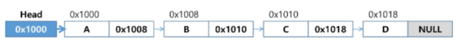
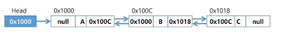

# 링크드리스트 (Linked List)
- 연결리스트
- Singly Linked List
- Doubly Linked List
- 부록) 연결스택 &연결큐

## 연결리스트
### 연결리스트
- 특성
    - 자료의 논리적인(실제 컴퓨터 메모리상에 저장되는 구조) 순서와 메모리 상의 물리적인 순서가 일치하지 않고, 개별적으로 위치하고 있는 원소의 주소를 연결하여 하나의 전체적인 자료구조를 이룬다.
    - 링크를 통해 원소에 접근하므로, 순차 리스트와 같이 물리적인 순서를 맞추기 위한 작업이 필요하지 않다.
    - 자료구조의 크기를 동적으로 조정할 수 있어, 메모리의 효율적인 사용이 가능하다.
- 노드
    - 연결 리스트에서 하나의 원소에 필요한 데이터를 갖고 있는 자료 단위
    - 구성 요소
        1. 데이터 필드
            - 원소의 값을 저장하는 자료구조
            - 저장할 원소의 종류나 크기에 따라 구조를 정의하여 사용함
        2. 링크 필드
            - 다음 노드의 주소를 저장하는 자료구조
    - 표현할 때 클래스 사용
- 헤드
    - 리스트의 시작 위치에 해당하는 노드
    - 데이터필드가 없고 링크필드만 있으면 됨(시작 위치만 나타내면 되기 떄문)
## 단순 연결 리스트(Singly Linked List)
### 단순 연결 리스트
- 단방향 연결 리스트(Single Linked List)라고도 함
- 연결 구조
    - 노드가 하나의 링크 필드에 의해 다음 노드와 연결되는 구조를 가진다.
    - 헤드가 가장 앞의 노드를 가리키고, 링크 필드가 연속적으로 다음 노드를 가리킨다.
    - 최종적으로 NULL을 가리키는 노드가 리스트의 가장 마지막 노드이다.

- 구현 방법
    1. head: 첫번째 데이터를 가지는 Node
    2. head: 빈 데이터를 가진 더미노드(구현이 쉽다.) - 모든 연산이 중간삽입, 중간삭제인 것처럼 구현가능
        - 메모리 사용량이 1의 경우보다 크다.(큰 손해는 아님)
- 'A', 'C', 'D'를 원소로 갖고 있는 리슽의 두 번째에 'B' 노드를 삽입
    1. 메모리를 할당하여 새로운 노드 new생성
    2. 새로운 노드 new의 데이터 필드에 'B'저장
    3. 삽입될 위치의 바로 앞에 위치한 노드의 링크 필드를 new에 복사
    4. new의 주소를 앞 노드의 링크 필드에 저장

- 구현
    - 새노드 생성
    - 삽입
        - i 인덱스에 데이터 삽입
        - 0이면 제일 앞에 추가
        - size가 같으면 제일 뒤에 추가
        - 삽입할 위치 앞에 있는 노드 찾기
        - 새 노드부터 연결(기존 앞에 있는 노드의 링크를 복사해옴)
        - 기존 노드의 링크를 수정(newNode를 가리키도록함)
        - size++
    - 삭제
        - 0번: 제일 앞에 있는 데이터 삭제
        - size-1번: 마지막 데이터 삭제
        - 삭제할 노드의 앞 노드로 이동
        - 그 노드의 링크를 2번 뒤에 있는것에 연결하는 것으로 수정 
        - size--
    - 출력
        - head에서 시작하여 링크된 노드의 데이터를 계속 출력할 것인데 링크된 노드의 링크가 null이 아닐 때까지 함

> 삽입, 삭제보다 조회선행이 필요함(O(N)).
> 이를 줄이는 방법이 존재

## 이중 연결 리스트 (Doubly Linked List)
### 이중 연결 리스트
- 특성
    - 양쪽 방향으로 순회할 수 있도록 노드를 연결한 리스트
    - 두 개의 링크 필드와 한 개의 데이터 필드로 구성 (prev-data-next)
- 연결 구조

- cur가 가리키는 노드 다음으로 D값을 가진 노드를 삽입하는 과정
    1. 메모리를 할당하여 새로운 노드 new를 생성하고 데이터필드 'D'에 저장
    2. cur의 next를 new의 next에 저장하여 cur의 오른쪽 노드를 삽입할 노드 new의 오른쪽 노드로 연결한다.
    3. cur의 주소를 new의 prev에 저장하여 cur를 new의 왼쪽에 연결한다.
    4. new의 주소를 cur의 next에 저장하여 노드 new를 cur의 오른쪽 노드로 연결한다.
    5. new의 주소를 new의 오른쪽 노드의 prev에 저장하여 노드 new의 오른쪽 노드의 왼쪽 노드로 new를 연결한다.

- cur가 가리키는 노드를 삭제하는 과정
    1. 삭제할 노드 cur의 오른쪽 노드의 주소를 cur의 왼쪽노드의 next에 저장하여 cur의 오른쪽 노드를 cur의 왼쪽 노드의 오른쪽 노드로 연결
    2. 삭제한 노드 cur의 왼쪽 노드의 주소를 cur의 오른쪽 노드의 prev에 저장하여 cur의 왼쪽 노드를 cur의 오른쪽 노드의 왼쪽 노드로 연결한다.
    3. cur가 가리키는 노드에 할당된 메모리를 반환한다. (Garbage Collector가 알아서 해줌)

- 구현
    - 삽입
        - i 인덱스에 데이터 삽입
        - 0이면 제일 앞에 삽입
        - size면 제일 뒤에 삽입
        - 삽입 위치 앞의 노드를 찾는다. (cur)
        - 새 노드 만들기
        - 새 노드부터 연결 (prev에 cur을 넣고, next에 cur의 next를 넣는다.)
        - 기존 노드 수정(cur의 next.prev에 newNode를, cur의 next에 newNode를 넣는다.)
        - size++
    
    - 삭제
        - i 인덱스 데이터 삭제
        - 0이면 제일 앞 삭제
        - size-1이면 제일 뒤 삭제
        - 삭제 위치를 찾기 (Rmnode)
        - 앞의 노드의 연결상태 수정 (Rmnode.prev의 next를 Rmnode.next로 수정)
        - 뒤의 노드의 연결상태 수정 (Rmnode.next의 prev를 Rmnode.prev로 수정)
    
    - 출력
        - 이번엔 tail에서 부터 출력
        - head가 나오기전까지 Node의 data 출력

- 스택과 큐의 구현

||배열로 구현|연결리스트로 구현|
|---|---|---|
|크기|크기 고정|동적 크기 조절 가능|
|삽입,삭제|재배치 O(N)|O(1)|
|조회|O(1)|O(N)|