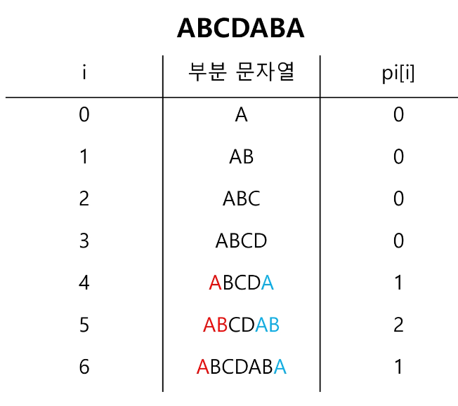

# Pattern Matching
- Pattern Matching
- KMP
- Rabin-Karp
- Boyer-Moore
- 생성형 AI 활용
- 관통명세서

## Pattern Matching
### Pattern Matching
- 패턴 매칭에 사용되는 알고리즘들
    - 고지식한 팬턴 검색 알고리즘
    - KMP 알고리즘
    - 카프-라빈 알고리즘
    - 보이어-무어 알고리즘

### Patter Matching (Brute Force)
- 고지식한 알고리즘 (Brute Force)
    - 본문 문자열을 처음부터 끝까지 차례대로 순회하면서 패턴 내의 문자들을 일일이 비교하는 방식으로 동작
    - 시간 복잡도 O(NM) // N: 문자열 길이, M: 패턴 길이

## KMP 
### Pattern Matching (KMP)
- KMP Algorithm
    - Knuth, Morris, Pratt 의 앞 글자를 한 글자 씩 따서 KMP
    - 불일치가 발생한 텍스트 문자열의 앞부분에 어떤 문자가 있는지를 미리 알고 있으므로, 불일치가 발생한 앞 부분에 대하여 다시 비교하지 않고 매칭을 수행
    - 시간 복잡도 O(N+M) -> // N:문자열의 길이, M: 패턴 길이

- 접두사 / 접미사
    - banana를 예로 들자
        - 접두사: b, ba, ban, bana, banan, banana
        - 접미사: a, na, ana, nana, anana, banana
    - 0 ~ i 까지 문자열 중 접두사와 접미사가 같은 경우의 가장 긴 길이를 구하자.
        - pi배열



- KMP 알고리즘 (pi배열)
    - pi배열은 단순하게 구하면 O(m^2)
    - 패턴이 크다면 시간이 오래 걸리므로 O(m)의 시간 복잡도로 pi배열을 구하자

``` java
static int[] getPi(String pattern){
    int[] pi = new int[pattern.length()];       //jump 위치 저장 
    char[] p = pattern.toCharArray();           // 문자배열
    
    ing j = 0;
    for (int i = 1; i<pattern.length();i++){
        while(j>0 && pt[i] !=pt[j])
            j = pi[j-1];
        if(p[i]==p[j])
            pi[i] = ++j;
    }
    return pi;
}
```

## Rabin-Karp
### Pattern Matching (Rabin-Karp)
- Rabin-Karp
    - 문자열 검색을 위해 해시 값 함수를 이용
    - 패턴 내의 문자들을 일일이 비교하는 대신에 패턴의 해시 값과 본문 안에 있는 하위 문자열의 해시 값만을 비교
    - 최악의 시간 복잡도는 O(MN)이지만 평균적으로는 선형에 가까운 빠른 속도를 가지는 알고리즘

- 동작과정
    1. 패턴의 해시 값을 계산한다.
    2. text에서 패턴의 길이 만큼 잘라서 해시 값 계산
    3. 해시 값을 비교하여 패턴의 유무를 판단.
        1. 다음 글자부터는 주어진 해시 값에서 2*(해시값-첫글자*2^(패턴길이-1))+다음글자
        2. 패턴의 해시값과 text의 해시값이 같다면 정확히 일치하는지 두 문자열 비교
    4. text 길이 - pattern 길이 만큼 반복하고 종료

- Rabin-Karp의 해시값이 일치할 때 확인하는 이유
    - 무수히 클 결우에는 mode연산을 통해 길이를 맞추어준다.
    - 실제 값이 달라도 해시 값이 똑같이 나올 수 있다.
    - 해시값이 다르면 무조건 다르지만 값이 같을 땐 두 문자열을 검사해 일치 여부를 판단한다.

## Boyer-Moore
### Pattern Matching (Boyer-Moore)
- Boyer-Moore
    - 오른쪽에서 왼쪽으로 비교
    - 대부분의 사용 소프트웨어에서 채택하고 있는 알고리즘
    - 보이어-무어 알고리즘은 패턴에 오른쪽 끝에 있는 문자가 불일치하고, 이 문자가 패턴 내에 존재하지 않는 경우, 이동 거리는 무려 패턴의 길이 만큼이 된다.
- 동작과정
    1. 점프테이블을 만든다.
    2. 패턴의 오른쪽 끝부터 비교
        1. 글자가 같을 때 왼쪽으로 이동하면서 비교
        2. 글자가 다르면서 패턴 내의 글자가 있을 때는 그만큼 점프
        3. 글자가 다르면서 패턴 내의 글자가 없을 때는 패턴 길이 만큼 점프
    3. 문자열의 끝까지 가면서 비교

## 생성형 AI 활용
### 생성형 AI 활용
- 생성형 AI를 활용하는 방안 (알고리즘 학습)
    - 생성형 AI를 이용하여 알고리즘을 요약 정리할 수 있음
    - 시각적인 자료를 요청하여 흐름의 이해를 도울 수 있음
    - 샘플 코드 요청으로 확인 가능
- 생성형 AI를 활용하는 방안 (문제풀이 학습)
    - 문제 풀이 시 URL을 제공함으로써 해당 문제 이해와 접근 방법을 도움받을 수 있음
    - 샘플 테스트 케이스를 얻을 수 있음(부정확할 수 있음)
- 생성형 AI를 활용방안 (프로젝트 기획)
    - 기획하는 기능에서 적용해볼 수 있는 알고리즘을 추천받을 수 있음.