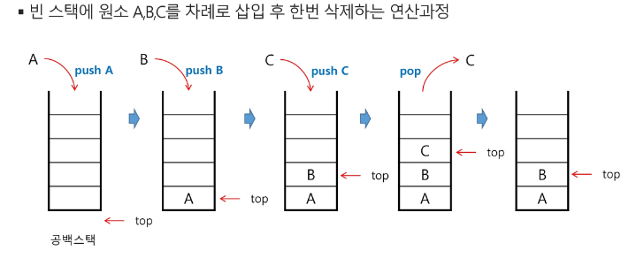
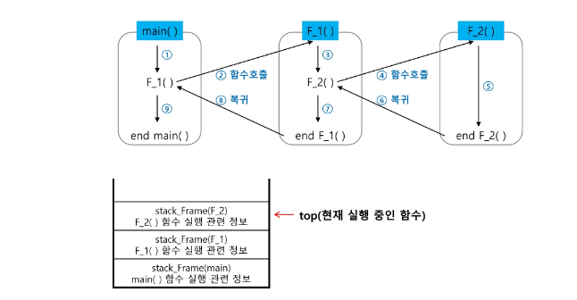

# 스택(Stack)
- 스택
- 스택 응용
- 계산기
- 재귀호출

## 스택
### 스택
- 스택의 특성
    - 물건을 쌓아 올리듯 자료를 쌓아올린 형태의 자료구조이다.
    - 스택에 저장된 자료는 선형구조를 갖는다.,
        - 선형구조: 자료 간의 관계가 1대1의 관계를 갖는다.
        - 비선형구조: 자료 간의 관계가 1대N의 관계를 갖는다.(예: 트리)
    - 스택에 자료를 삽입하거나 스택에서 자료를 꺼낼 수 있다.
    - 마지막에 삽입한 자료를 가장 먼저 꺼낸다. 후입선출이라고 부른다.
        - 예를 들어 스택에 1,2,3 순으로 자료를 삽입한 후 꺼내면 역순으로 3,2,1순으로 꺼낼 수 있다.
### 스택의 구현
- 스택을 프로그램에서 구현하기 위해서 필요한 자료구조와 연산
    - 자료구조: 자료를 선형으로 저장할 저장소
        - C언어에서는 배열을 사용할 수 있다.
        - 저장소 자체를 스택이라 부르기도 한다.
        - 스택에서 마지막 삽입된 원소의 위치를 top이라 부른다. (스택이 비어있으면 top=-1)
        - 스택에서의 관심사는 마지막 원소
            - 추상화: 마지막 원소 외에는 접근할 수 없게 만드는 것
    - 연산
        - 삽입: 저장소에 자료를 저장한다. 보통 push라고 부른다.
        - 삭제: 저장소에서 자료를 꺼낸다. 꺼낸 자료는 삽입한 자료의 역순으로 꺼낸다. 보통 pop이라고 부른다.
        - 스택이 공백인지 아닌지를 확인하는 연산 .isEmpty
        - 스택의 top에 있는 item(원소)을 반환하는 연산.peek
        - size: top+1
    - 스택의 삽입/삭제 과정

    

### 스택 구현 고려 사항
- 1차원 배열을 사용하여 구현할 경우 구현이 용이하다는 장점이 있지만 스택의 크기를 변경하기가 어렵다는 단점이 있다.
- 이를 해결하기 위한 방법으로 저장소를 동적으로 할당하여 스택을 구현하는 방법이 있다. 동적 연결리스트를 이용하여 구현하는 방법을 의미한다. 구현이 복잡하다는 단점이 있지만 메모리를 효율적으로 사용한다는 장점을 가진다. 스택의 동적 구현은 생략한다.

### 스택의 응용1: 괄호검사
- 괄호의 종류: 대괄호, 중괄호, 소괄호
- 조건
    1. 왼쪽 괄호의 개수와 오른쪽 괄호의 개수가 같아야 한다.
    2. 같은 괄호에서 왼쪽 괄호는 오른쪽 괄호보다 먼저 나와야 한다.
    3. 괄호 사이에는 포함 관계만 존재한다.
- 풀이
    - 여는 괄호가 나오면 스택에 넣는다.
    - 닫는 괄호가 나왔을떄
        - 스택에 여는 괄호가 들어있다면 pop
        - 아니면 잘못된 괄호 
    - 끝까지 확인했을 때 
        - 스택이 비어있지 않으면 잘못된 괄호
        - 스택이 0이면 정상

### 스택의 응용2: function call
- Function call
    - 프로그램에서의 함수 호출과 복귀에 따른 수행 순서를 관리
        - 가장 마지막에 호출된 함수가 가장 먼저 실행을 완료하고, 복귀하는 후입선출 구조이므로
        - 함수 호출이 발생하면 호출한 함수 수행에 필요한 지역변수, 매개변수 및 수행 후 복귀할 주소 등의 정보를 스택 프레임에 저장하여 시스템 스택에 삽입
        - 함수의 실행이 끝나면 시스템 스택의 top 원소(스택 프레임)를 삭제(pop)하면서 프레임에 저장되어 있던 복귀주소를 확인하고 복귀
        - 함수 호출과 복귀에 따라 이 과정을 반복하여 전체 프로그램 수행이 종료되면 시스템 스택은 공백 스택이 된다.

### 스택의 응용3: 실행취소
- 현재 작업에 대해 실행 취소/ 실행 취소의 취소 같은 작업을 프로그래밍 해보자.
    - 작업: Undo 스택 push, Redo 스택 초기화
    - ctrl+Z : Undo스택 pop -> Redo스택 push
    - ctrl+Y : Redo스택 pop -> Undo스택 push

## 계산기
### 계산기
- 문자열로 된 계산식이 주어질 때, 스택을 이용하여 이 계산식의 값을 계산할 수 있다.
- 문자열 수식 계산의 일반적 방법
    - step1. 중위 표기법의 수식을 후위 표기법으로 변경한다. (스택 이용)
    - step2. 후위 표기법의 수식을 스택을 이용하여 계산한다.
- 중위표기법
    - 연산자를 피연산자의 가운데 표기하는 방법
    - ex) A+B
- 후위표기법
    - 연산자를 피연산자 뒤에 표기하는 방법
    - ex) AB+
- step1. 중위표기식의 후위표기식 변환 방법
    - 수식의 각 연산자에 대해서 우선순위에 따라 괄호를 사용하여 다시 표현한다.
    - 각 연산자를 그에 대응하는 오른쪽 괄호의 뒤로 이동시킨다.
    - 괄호를 제거한다.
    - ex) A*B-C/D
        - 1단계: (A*B)-(C/D)
        - 2단계: (AB)*(CD/)-
        - 3단계: AB*CD/-
- step1. 중위표기법에서 후위 표기법으로의 변환 알고리즘(스택 이용)2 
    1. 입력 받은 중위 표기식에서 토큰을 읽는다.
    2. 토큰이 피연산자이면 토큰을 출력한다.
    3. 토큰이 연산자(괄호포함)일 때, 이 토큰이 스택의 top에 저장되어 있는 연산자보다 우선 순위가 높으면 스택에 push하고 그렇지 않다면 스택 top의 연산자의 우선순위가 토큰의 우선순위보다 작을 때까지 스택에서 pop 한 후 토큰의 연산자를 push한다. 만약 top에 연산자가 없으면 push한다.
    4. 토큰이 오른쪽 괄호 ')'이면 스택top에 왼쪽 괄호 '('가 올 때까지 스택에 pop 연산을 수행하고 pop한 연산자를 출력한다. 왼쪽 괄호를 만나면 pop만 하고 출력하지는 않는다.
    5. 중위 표기식에 더 읽을 것이 없다면 중지하고, 더 읽을 것이 있다면 1부터 다시 반복한다.
    6. 스택에 남아 있는 연산자를 모두 pop하여 출력한다.
        - 스택 밖의 왼쪽 괄호는 우선 순위가 가장 높으며, 스택 안의 왼쪽 괄호는 우선 순위가 가장 낮다.
    - (6+5*(2-8)/2) -> 6528-*2/+    
- step2. 후위표기법의 수식을 스택을 이용하여 계산
    - 피연산자를 만나면 스택에 push 한다.
    - 연산자를 만나면 필요한 만큼의 피연산자를 스택에서 pop하여 연산하고, 연산 결과를 다시 스택에 push한다.
    - 수식이 끝나면, 마지막으로 스택을 pop하여 출력한다.    

## 재귀호출
### 재귀호출
- 자기 자신을 호출하여 순회 수행되는 것
- 함수 호출은 메모리 구조에서 스택을 사용한다. (이름만 같은 다른 메서드)
    - 간단한 문제에 대해서는 반복문에 비해 메모리 및 속도에서 성능저하가 발생한다.
- 일반적으로 기본 부분(Base case), 재귀 부분(Recursive case)으로 구성된다.
    - 기본 부분: 재귀 호출에서 빠져 나가기 위한 조건
    - 재귀 부분: 자신을 호출하는 부분
- 재귀적 프로그램을 작성하는 것은 반복 구조에 비해 간결하고 이해하기 쉽다.
- 함수에서 실행해야 하는 작업의 특성에 따라 일반적인 호출방식보다 재귀호출방식을 사용하여 함수를 만들면 프로그램의 크기를 줄이고 간단하게 작성
- 피보나치 - 0과 1로 시작하고 이전의 두 수의 합을 다음 항으로 하는 수열

### Memorization
- 피보나치 수를 구하는 함수를 재귀로 구현하면 엄청난 중복 호출이 존재한다.
- 앞의 예에서 피보나치 수를 구하는 알고리즘에서 fibo(n)의 값을 계산하자마자 저장하면 실행시간을 O(n)으로 줄일 수 있다.
