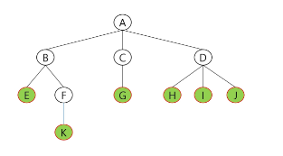
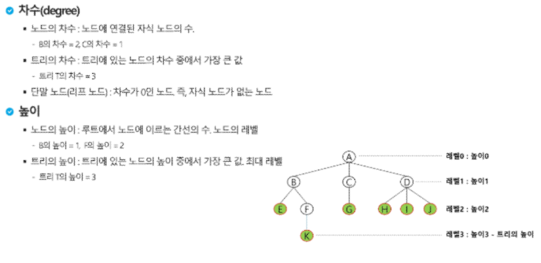
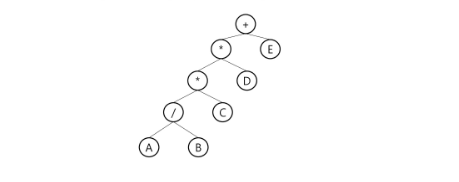

# 트리(Tree)
- 트리
- 이진트리
- 수식 트리
- 힙
## 트리
### 트리
- 트리의 개념
    - 비선형 구조
    - 원소들 간에 1:N 관계를 가지는 자료구조
    - 원소들 간에 계층관계를 가지는 계층형 자료구조
    - 상위 원소에서 하위 원소로 내려가면서 확장되는 트리(나무)모양의 구조

### 트리 - 정의
- 한 개 이상의 노드로 이루어진 유한 집합이며 다음 조건을 만족한다.
    - 노드 중 최상위 노드를 루트(root)라 한다.
    - 나머지 노드들은 n(>=0)개의 분리 집하 T1, ..., TN으로 분리될 수 있다.,
- 이들 T1,...,Tn은 각각 한의 트리가 되며(재귀적 정의) 루트의 부 트리 (subtree)라 한다.

### 트리 - 용어정리
- 노드(node) - 트리의 원소
    - 트리 T의 노드 - A,B,C,D,E,F,G,H,I,J,K
- 간선(edge) - 노드를 연결하는 선, 부모 노드와 자식 노드를 연결
- 루트 노드 - 트리의 시작 노드
    - 트리 T의 루트 노드 - A


- 형제 노드 (sibling node) - 같은 부모 노드의 자식 노드들
    - B, C, D는 형제 노드
- 조상 노드 - 간선을 따라 루트 노드까지 이르는 경로에 있는 모든 노드들
    - K의 조상 노드: F,B,A
- 서브 트리(subtree) - 부모 노드와 연결된 간선을 끊었을 때 생성되는 트리
- 자손 노드 - 서브 트리에 있는 하위 레벨의 노드들
    - B의 자손 노드-E,F,K



- 차수(degree)
    - 노드의 차수: 노드에 연결된 자식 노드의 수
        - B의 차수=2, C의 차수 =1
    - 트리의 차수: 트리에 있는 노드의 차수 중에서 가장 큰 값
        - 트리 T의 차수 = 3
    - 단말 노드(리프 노드): 차수가 0인 노드. 즉, 자식 노드가 없는 노드
- 높이(level)
    - 노드의 높이: 루트에서 노드에 이르는 간선의 수. 노드의 레벨
        - B의 높이 = 1, F의 높이 = 2
    - 트리의 높이 : 트리에 있는 노드의 높이 중에서 가장 큰 값. 최대 레벨
        - 트리 T의 높이 = 3



## 이진 트리
### 이진 트리
- 모든 노드들이 최대2개 까지의 서브 트리를 갖는 특별한 형태의 트리
- 각 노드가 자식 노드를 최대 2개까지만 가질 수 있는 트리
    - 왼쪽 자식 노드
    - 오른쪽 자식 노드

## 이진트리 - 특성
- 레벨 i에서의 노드의 최대 개수는 2^i개
- 높이가 h인 이진 트리가 가질 수 있는 노드의 최소 개수는 (h+1)개가 되며, 최대 개수는 (2^(h+1)-1)개가 된다. (2^0~2^h의 합)

## 이진트리 - 종류
- 포화 이진 트리
    - 모든 레벨에 노드가 포화상태로 차 있는 이진 트리
    - 높이가 h일때 최대 노드 개순인 (2^(h+1)-1)개의 노드를 가진 이진 트리
    - 루트를 1번으로 하여 2^(h+1)-1까지 정해진 위치에 대한 노드 번호를 가짐 ( 높이가 낮은것부터, 같으면 왼쪽부터)
- 완전 이진 트리
    - 높이가 h이고 노드 수가 n개 일때 포화 이진 트리의 노드 번호 1번부터n번까지 빈 자리가 없는 이진 트리    
- 편향 이진 트리
    - 높이 h에 대한 최소 개수의 노드를 가지면서 한쪽 방향의 자식 노드 만을 가진 이진 트리
        - 왼쪽 편향 이진 트리
        - 오른쪽 편향 이진 트리

## 이진트리의 표현
### 이진트리의 표현 - 배열
- 배열을 이용한 이진 트리의 표현
    - 이진 트리에 각 노드 번호를 다음과 같이 부여
    - 루트의 번호를 1로 함
    - 레벨 n에 있는 도드에 대하여 왼쪽부터 오른쪽으로 2^n부터 2^(n+1)-1까지 번호를 차례대로 부여
- 노드 번호의 성질
    - 노드 번호가 i인 노드의 부모 노드 번호는 (int)i/2
    - 노드 번호가 i인 노드외 왼쪽 자식 노드 번호는 2*i
    - 노드 번호가 i인 노드의 오른쪽 자식 노드 번호는 2*i+1
    - 레벨 n의 노드 번호 시작 번호는 2^n
- 배열을 이용한 이진 트리의 표현의 단점
    - 편향 이진 트리의 경우에 사용하지 않는 배열 원소에 대한 메모리 공간 낭비 발생
    - 트리의 중간에 새로운 노드를 삽입하거나, 기존의 노드를 삭제할 경우 배열의 크기 변경이 어려워 비효율적
    - 따라서 배열의 삽입, 삭제가 자주 일어나지 않고 완전 이진트리 일때는 탐색이 효율적이다.

### 트리의 표현 - 연결리스트
- 배열을 이용한 이진 트리의 표현의 단점을 보완하기 위해 연결리스트를 이용하여 트리를 표현할 수 있다.
- 연결 자료구조를 이용한 이진트리의 표현
    - 이진 트리의 모든 노드는 최대 2개의 자식 노드를 가지므로 일정한 구조의 단순 연결 리스트 노드를 사용하여 구현 [left|데이터|right]를 클래스로 정의하여 구현

### 이진트리 - 순회
- 순회랑 트리의 각 노드를 중복되지 않게 전부 방문하는 것을 말하는데, 트리는 비 선형 구조이기 때문에 선형구조에서와 같이 선후 연결 관계를 알 수 없다.
- 순회: 트리의 노드를 체계적으로 방문하는 것
- 3가지의 기본적인 순회방법
    - 전위 순회(preorder traversal) VLR
        - 부모 노드 방문 후, 자식 노드를 좌,우 순서로 방문한다.
    - 중위 순회(inorder traversal) LVR
        - 왼쪽 자식 노드, 부모 노드, 오른쪽 자식 노드 순으로 방문한다.
    - 후위 순회(postorder traversal) LRV
        - 자식노드를 좌우 순서로 방문한 후, 부모 노드로 방문한다.
- 전위 순회
    - 수행 방법
        1. 현재 노드 n을 방문하여 처리한다. -> V
        2. 현재 노드 n의 왼쪽 서브 트리로 이동한다. -> L
        3. 현재 노드 n의 오른쪽 서브 트리로 이동한다. -> R
    - 전위 순회 알고리즘

```
preorder_traverse(T){
    if (T is not null){
        visit(T)
        preorder_traverse(T.left)
        preorder_traverse(T.right)
    }
}
```

- 중위 순회
    - 수행 방법
        1. 현재 노드 n의 왼쪽 서브트리로 이동한다. ->L
        2. 현재 노드 n을 방문하여 처리한다. -> V
        3. 현재 노드 n의 오른쪽 서브 트리로 이동한다. -> R
    - 전위 순회 알고리즘

```
inorder_traverse(T){
    if (T is not null){
        inorder_traverse(T.left)
        visit(T)
        intorder_traverse(T.right)
    }
}
```

- 후위 순회
    - 수행 방법
        1. 현재 노드 n의 왼쪽 서브트리로 이동한다. ->L
        2. 현재 노드 n의 오른쪽 서브 트리로 이동한다. -> R
        3. 현재 노드 n을 방문하여 처리한다. -> V
        
    - 전위 순회 알고리즘

```
postorder_traverse(T){
    if (T is not null){
        postorder_traverse(T.left)
        postorder_traverse(T.right)
        visit(T)
    }
}
```

## 수식 트리
### 수식 트리
- 수식을 표현하는 이진 트리
- 수식 이진 트리라고 부르기도 함
- 연산자는 루트 노드이거나 가지 노드
- 피연산자는 모두 잎 노드

### 수식 트리의 순회
- 중위 순회: A/B*C*D+E (식의 중위 표기법)
- 후위 순회: AB?C*D*E+ (식의 후위 표기법)
- 전위 순회: +**/ABCDE (식의 전위 표기법)



## 힙 (Heap)
### 힙
- 완전 이진 트리에 있는 노드 중에서 키 값이 가장 큰 노드나 키 값이 가장 작은 노드를 찾기 위해서 만든 자료구조
- 최대힙
    - 키 값이 가장 큰 노드를 찾기 위한 완전 이진 트리
    - 부모 노드의 키 값>=자식 노드의 키 값
    - 루트 노드: 키 값이 가장 큰 노드
- 최소힙
    - 키 값이 가장 작은 노드를 찾기 위한 완전 이진 트리
    - 부모 노드의 키 값<=자식 노드의 키 값
    - 루트 노드: 키 값이 가장 작은 노드

### 힙 - 삽입 (최대힙 기준)
- 삽입되는 과정
    - 가장 마지막 자리에 원소를 삽입
    - 그 원소와 원소의 부모노드와 비교하여 부모노드보다 자신이 크면 자리를 바꿈
    - 부모 노드가 나보다 크거나 같을 때까지 자리 바꿈을 계속함

### 힙 - 삭제 (최대힙 기준)
- 힙에서는 루트 노드의 원소만을 삭제할 수 있다.
- 루트 노드의 원소를 삭제하여 반환한다.
- 힙의 종류에 따라 최대값 또는 최소값을 구할 수 있다.
- 삭제되는 과정
    - 루트 노드의 원소 삭제
    - 마지막 노드의 원소를 가장 위로 올리고 마지막 노드 삭제
    - 루트 노드를 기준으로 자식 노드 중 큰 값과 자리 바꿈
    - 자리가 확정될 때까지 이동(자식노드가 나보다 작거나 같을때까지 내려감)

### 힙의 활용 1 - 우선순위 큐
- 우선순위 큐를 구현하는 가장 효율적인 방법이 힙을 사용하는 것이다. 
    - 노드 하ㅏ의 추가/삭제의 시간 복잡도가 O(log N)이고 최댓값/최솟값을 O(1)에 구할 수 있다.
- 배열을 통해 트리 형태를 쉽게 구현가능
    - 부모나 자식 노드를 O(1)연산으로 쉽게 찾을 수 있다.
    - n 위치에 있는 노드의 자식은 2*n과 (2xn+1)에 위치한다.
    - 완전 이진 트리의 특성에 의해 추가/삭제의 위치는 자료의 시작과 끝 인덱스로 쉽게 판단 가능
    - java.util.PriorityQueue

### 힙의 활용 2 - 힙 정렬
- 힙 정렬은 힙 자료구조를 이용해서 이진 트리와 유사한 방법으로 수행된다.
- 정렬을 위한 2단계
    - 하나의 값에 힙을 삽입한다.
    - 힙에서 순차적(오름차순)으로 값을 하나씩 제거한다.
- 힙정렬의 시간복잡도
    - N개의 노드 삽입연산+N개의 노드 삭제 연산
    - 삽입과 삭제 연산은 각각 O(logN)이다.
    - 따라서, 전체 정렬은 O(NlogN) 이다.
- 힙 정렬은 배열에 저장된 자료를 정렬하기에 유용하다.
- 최대값 몇 개만 확인하고 싶을 때 유용