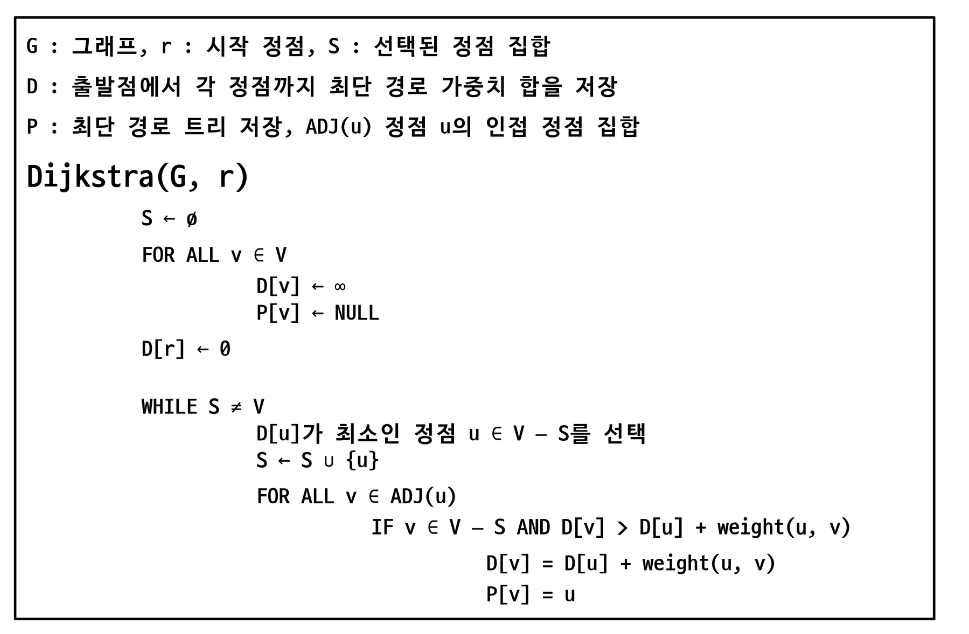

# 그래프 비용 (Graph)
- 서로소 집합
- 최소 비용 신장 트리
- 크루스칼 알고리즘
- 프림 알고리즘
- 다익스트라 알고리즘

## 서로소 집합
### 서로소 집합
- 상호 배타 집합
    - 중복 포함된 원소가 없는 집합 -> 교집합이 없음
    - 각 집합은 대표자를 통해 구분
- 상호 배타 집합 표현 방법
    - 연결 리스트
    - 트리
- 상호 배타 집합 연산
    - Make-Set(x): 집합 생성
    - Find-Set(x): x속한 대표 가져온다.
    - Union(x,y) : x와 y의 집합을 하나로

### 상호 배타 집합 표현 - 연결리스트
- 같은 집합의 원소들은 하나의 연결리스트로 관리
- 연결리스트의 맨 앞의 원소를 집합의 대표자로 결정
- 각 원소는 집합의 대표원소를 가리키는 링크를 갖는다.

### 상호 배타 집합 표현 - 트리
- 하나의 집합을 하나의 트리로 표현한다.
- 자식 노드가 부모 노드를 가리키며 루트 노드가 대표자가 된다.
- 상호 배타 집합 트리를 배열에 저장

### 상호 배타 집합 연산
- Make-Set(x) : 유일한 멤버 x를 포함하는 새로운 집합을 생성하는 연산
- Find-Set(x) : x를 포함하는 집합을 찾는 연산
- Union(x,y) : x와 y를 포함하는 두 집합을 통합하는 연산 

- 연산의 효율을 높이는 방법
    - Rank를 이용한 union
        - 각 노드는 자신을 루트로 하는 subtree의 높이를 rank라는 이름으로 저장
        - 두 집합을 Union 할 때 rank가 낮은 집합을 높은 집합에 붙인다.
        - 같으면 임의로 하나를 다른 곳에 붙이고 rank를 수정
    - Path Compression
        - Find-Set을 행하는 과정에서 만나는 모든 노드들이 직접 대표를 가리키도록 수정한다.

- Make-Set () 연산
    - 유일한 멤버 x를 포함하는 새로운 집합을 생성하는 연산
    - 반복문을 이용하여 간소화
    - 이와 동시에 rank[x]도 저장하면 됨

```
p[x] : 노드 x의 부모 저장
rank[x] : 루트 노드가 x인 트리의 랭크 값 저장

Make-Set(x)
    p[x] <- x
    rank[x] <- 0
```

- Find-Set 연산
    - Find-Set(x): x를 포함하는 집합을 찾는 연산
    - 특정 노드에서 루트 노드까지의 경로를 찾아 가면서 노드 부모의 정보를 갱신

```
Find-Set(x)
    IF x!=p[x]:
        p[x] <- Find-Set(p[x])
    Return p[x]
```

- Union 연산
    - Union(x,y): x와 y를 포함하는 두 집합을 합하는 연산

```
Union(x,y)                          // x,y 는 대표자
    IF rank[x] > rank[y] :          // rank는 트리의 높이
        p[y] <-x
    ELSE
        p[x] <- y
        IF rank[x] == rank[y] :
            rank[y]++
```

## 최소 비용 신장 트리(Minimum Spanning Tree)
### 최소 신장 트리(MST)
- 신장 트리 Tree
    - 그래프의 모든 정점과 간선의 부분 집합으로 구성되는 트리
- 최소 신장 트리
    - 신장 트리 중에서 사용된 간선들의 가중치 합이 최소인 트리
    - 무 방향 가중치 그래프
    - N개의 정점을 가지는 그래프에 대해 반드시 (N-1) 개의 간선을 사용
    - 사이클을 포함X
- 왜 사용하는가?
    - 도로망, 통신망, 유통망 등등 여러 분야에서 비용을 최소로 해야 이익을 볼 수 있다.
    - 대표적인 알고리즘으로 크루스칼, 프림이 있음

## KRUSKAL Algorithm
### KRUSKAL 알고리즘
- 크루스칼 알고리즘
    1. 최초, 모든 간선을 가중치에 따라 오름차순으로 정렬
    2. 가중치가 가장 낮은 간선부터 선택하면서 트리를 증가시킴
        - 사이클이 존해마녀 다음으로 가중치가 낮은 간선 선택
    3. N-1개의 간선이 선택될 때까지 2반복
- 크루스칼 알고리즘 의사코드

``` MST-KRUSKAL(G)
    A <-0                   // 0: 공집합
    FOR v in G.V            // G.V : 그래프의 정점 집합
        Make-Set(v)         // G.E : 그래프의 간선 집합
    
    G,E에 포함된 간선들을 가중치 w에 의해 정렬

    FOR 가중치가 가장 낮은 간선 (u,v)을 G.E에서 선택(n-1개)
        IF Find-Set(u) != Find-set(v)
            A <- Union(A,{(u,v)})
            Union(u,v);

    RETURN A
```

## Prim Algorithm
### Prim 알고리즘
- 프림 알고리즘
    - 하나의 정점에서 연결된 간선들 중에 하나씩 선택하면서 MST를 만들어 가는 방식
    1. 임의 정점을 선택하여 시작
    2. 선택한 정점과 인접하는 정점들 중의 최소 비용의 간선이 존재하는 정점을 선택
    3. 모든 정점이 선택될 때까지 2과정을 반복

    - 서로소인 2개의 집합 정보를 유지
        - 트리 정점: MST를 만들기 위해 선택된 정점들
        - 비트리 정점들: 선택되지 않은 정점들

- 프림 알고리즘 의사코드

``` 
MST-PRIM(G,r)                   // G: 그래프, r:시작 정점
    FOR u in G.V                // G.V 그래프의 정점 집합
        u.key <-무한            // u.key: u에 연결된 간선 중 최소 가중치
        u.p <- NULL             // u.p : 트리에서 u의 부모 

    r.key <-0
    Q <- G.V                    // 우선순위 Q에 모든 정점 넣기
    WHILE Q!=0                  // 빈 큐가 아닐 동안 반복
        u <- Extract-MIN(Q)     // key 값이 가장 작은 정점 가져오기
        FOR v in G.adj[u]       // u의 인접 정점들 v
            IF v in Q AND w(u,v) <v.key  // Q에 있는 v의 key값 갱신
                v.key <- w(u,v)
                v.p <- u
```

## Dijkstra Algorithm
### 최단 경로
- 최단 경로 정의
    - 가중치가 있는 그래프에서 두 정점 사이의 경로들 중 간선의 최소치 합이 최소인 경로
- 하나의 시작 정점에서 끝 정점까지의 최단 경로
    - 다익스트라 알고리즘(음의 가중치 허용 X)
    - 벨만-포드 알고리즘 (음의 가중치 허용 O)
- 모든 정점들에 대한 최단 경로
    - 플루이드-워셜 알고리즘
## Dijkstra 알고리즘
- 다익스트라 알고리즘
    - 시작 정점에서 거리가 최쇤 정점을 선택해 나가면서 최단 경로를 구하는 방식
    - 탐욕 알고리즘 중 하나이고, 프림 알고리즘과 유사
    - 정점 A에서 정점 B까지의 최단 경로 (A -> X + X -> B)
- 다익스트라 알고리즘 동작 과정
    - 시작 정점 입력
    - 거리 저장 배열을 무한으로 초기화
    - 시작점에서 갈 수 있는 곳의 값 갱신
    - 아직 방문하지 않은 점들이 가지고 있는 거리값과 현재 정점에서 방문하지 않는 정점까지의 가중치의 합이 작다면 갱신
    - 모든 정점을 방문할 때까지 반복

- 다익스트라 의사코드 



