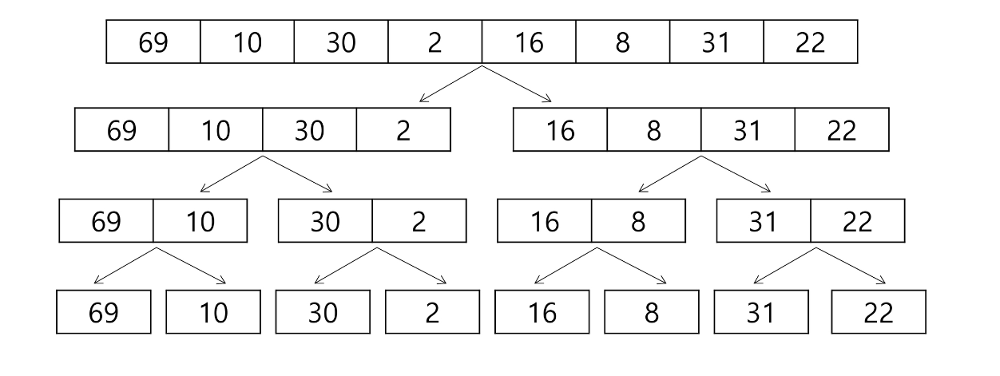
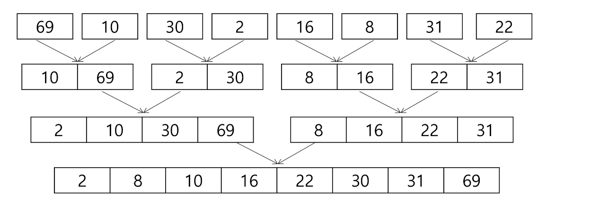
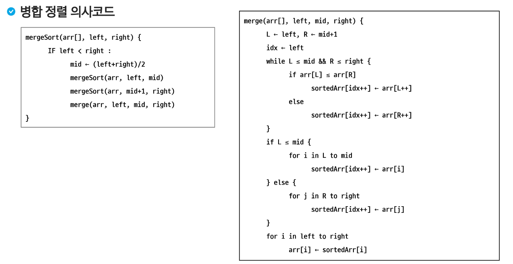
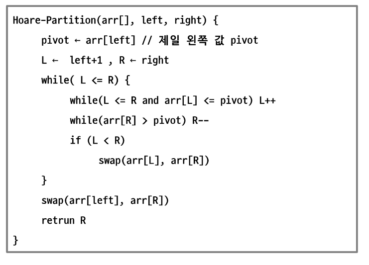

# Divide and Conquer
- 분할 정복
- 이진 검색
- 병합 정렬
- 퀵 정렬

## 분할 정복
### 분할 정복
- 분할 정복
    - 큰 문제를 작은 하위 문제로 나누어 해결하는 방식
    - 과거의 군사적인 유래부터 현대의 컴퓨터과학에서 응용까지 활용되는 개념
- 설계 전략 
    - 분할 : 해결할 문제를 여러 개의 작은 부분으로 나눈다.
    - 정복 : 나눈 작은 문제를 각각 해결한다.
    - 결합 : (필요하다면) 해결된 해답을 모은다.
### 분할 정복 - 거듭제곱
- C^8을 구하기 위해서는?
    - C^8=(C^4)^2=((C^2)^2)^2
- C^9을 구하기 위해서는?
    - C^9=((C^2)^2)^2*C
- C^n을 구하기 위해서는?
    - 반복문을 이용한 거듭제곱 O(N)
    - 분할정복을 이용한 거듭제곱 O(logN)

```
Recursive_Power(x,n)
    IF n == 1 : RETURN x
    IF n is even
        y <- Recursive_Power(x,n/2)
        RETURN y*y
    ELSE
        y <- Recursive_Power(x,(n-1)/2)
        RETURN y*y*x 
```

### 이진 검색
- 이진 검색
    - 정렬된 배열에서 특정한 값을 빠르게 찾기 위한 알고리즘
    - 검색 범위를 반으로 줄여가면서 보다 빠르게 검색을 수행함
- 검색 과정
    - 중앙 값 찾기
    - 목표 값과 중앙 값 비교
        1. 목표값과 중앙 값이 같은 경우 : 검색 종료
        2. 목표 값이 중앙 값 보다 작을 경우 : 왼쪽 절반 검색 수행
        3. 목표 값이 중앙 값 보다 클 경우 : 오른쪽 절반 검색 수행
    - 탐색 범위가 한 개의 원소가 될 때까지 반복 수행
- 이진 검색 구현 (반복문)

```
binarySearch(S[],n,k)
low <-0
high <-n-1

WHILE low <=high
    mid <-(low+high)/2
    IF S[mid]== key
        Return mid
    ELSE IF S[mid]>key
        high<-mid-1
    ELSE
        low<-mid+1
RETURN -1
```

- 이진 검색 구현 (재귀함수)

```
binarySearch(S[],low,high,key)
    IF low>high
        RETURN -1
    ELSE
    mid <-(low+high) / 2
    IF key== S[mid]
        RETURN mid
    ELSE IF key < S[mid]
        RETURN binarySearch(S[],low,mid-1,key)
    ELSE
        RETURN binarySearch(S[],mid+1,high,key)
```

- 이진 검색정리
    - 시간 복잡도 O(log N)
    - 미리 정렬이 되어 있어햐 함
    - 크기가 작은 배열에서는 크게 이점이 없을 수 수 있음
- 심화 공부
    - java.util.binarySearch 메서드 공부
    - BTS (Binary Search Tree)
    - 이진 검색 응용 -> Lower Bound, Upper Bound

## 병합 정렬 
### 병합 정렬(Merge Sort)
- 병합 정렬 
    - 분할 정복 기법을 활용한 안정적인 정렬 알고리즘
    - 배열을 절반으로 분할하고, 각 부분을 재귀적으로 정렬한 뒤, 정렬된 부분 배열을 다시 병합하는 정렬 방식
    - 시간 복잡도 O(NlogN)
    - 추가적인 공간 필요
- 단계별 동작
    - 분할 : 주어진 배열을 반으로 나눈다.
    - 정복 : 각 부분 배열을 재귀적으로 병합 정렬을 사용해 정렬한다.
    - 병합 : 정렬된 부분 배열들을 합쳐 전체 배열을 정렬한다.
- 병합 정렬 과정 (분할)



- 병합 정렬 과정 (정복 & 병합)



- 병합 정렬 의사 코드



## 퀵 정렬
### 퀵 정렬(Quick Sort)
- 퀵 정렬
    - 분할 정복 기법을 활용한 효율적인 정렬 알고리즘
    - 피벗(Pivot)이라는 기준 요소를 선택하여 배열을 두 부분으로 분할하고, 재귀적으로 정렬하는 방식
    - 시간 복잡도 O(NlogN), 최악에는 O(N^2)
    - 추가적인 공간을 필요치 않아 함
- 단계 별 동작
    - Pivot 결정 (여러 개의 선정하는 방법이 존재)
    - 분할 : Pivot보다 작은 요소는 왼쪽에, 큰 요소는 오른쪽에 위치하도록 배열을 나눈다.
    - 정복 : 분할된 배열을 다시 재귀적으로 정복함
    - 병합 : 따로 필요치 않습니다.
- 퀵 정렬 아이디어
    - 피벗 값들보다 큰 값은 오른쪽, 작은 값들은 왼쪽 집합에 위치하도록 한다.
    - 피벗을 두 집합의 가운데에 위치시킨다.
- 퀵 정렬 과정 (Hoare 파티션)
    - 피벗 선택하기
        1. 첫 번째 요소 선택
        2. 마지막 요소 선택
        3. 중간 요소 선택
        4. 랜던 요소 선택
        5. 세 값의 중앙 값 선택
    - 정렬하기
        1. i는 앞에서부터, j는 뒤에서부터 오면서 i는 피벗보다 큰 값이 오면 멈추고, j는 피벗보다 작은 값이 나오면 멈춤 - 교환
        2. 피벗과 작은 값 중 가장 오른쪽 값과 교환 
- 퀵 정렬 과정 의사코드



- 퀵 정렬 과정 (Lomuto 파티션)    
    - i,j모두 앞에서 출발