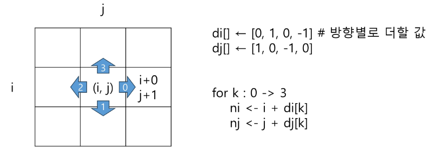

## 배열 2 (Array 2)
- 배열 : 2차원 배열
- 부분집합 생성
- 검색
- 이진 검색
- 셀렉션 알고리즘
- 선택 정렬

### 2차원 배열
#### 2차원 배열의 선언
    - 1차원 List를 묶어놓은 List
    - 2차원 이상의 다차원 List는 차원에 따라 Index를 선언
    - 2차원 List의 선언: 세로길이(행의 개수), 가로길이(열이 개수)를 필요로 함
    - Python 에서는 데이터 초기화를 통해 변수선언과 초기화가 가능함.
`arr=[[0,1,2,3],[4,5,6,7]]` (2행 4열의 2차원 List) 
#### 입력받을 때 팁
``` python
n=int(input())
arr= [list(map(int,input.split()))for _ in range(n)] # n을 입력받고 n*n배열 입력받기, 입력이 공백으로 구분될 때 ex) 1 2 3\n 4 5 6\n 7 8 9
```
``` python
n=int(input())
arr= [list(map(int,input()))for _ in range(n)] # 입력이 붙어있을 때 ex) 123\n456\n789 - 문자열이 iterable하기 때문에 map함수에서 하나씩 떼서 map object를 생성함. - 배열의 요소가 한자리일 때만 가능
```
#### 출력받을 때 팁
``` python
arr=[[0]*3 for _ in range(3)]
for i in range(3): 
    print(*arr[i])  # 언패킹 활용
for i in range(3):
    for j in range(3):
        print(arr[i][j],end=" ") # 요소별 출력
    print("")
```
#### 2차원 배열의 접근
- 배열 순회
    - nxm배열의 n*m개의 모든 원소를 빠짐없이 조사하는 방법

- 행 우선 순회

``` python
for i in range(n):  # i행
    for j in range(m): #j열
        f(array[i][j]) # 필요한 연산 수행
```
- 열 우선 순회

``` python
for j in range(m):  # j열
    for i in range(n): #i행
        f(array[i][j]) # 필요한 연산 수행
```

-  지그재그 순회
``` python
for i in range(n):  # i행
    for j in range(m): #j열
        f(array[i][j+(m-1-2*j)*(i%2)]) # 홀수행은 정방향, 짝수행은 역방향
```

- 델타를 이용한 2차 배열 탐색
    - 2차 배열의 한 좌표에서 4방향의 인접 배열 요소를 탐색하는 압법
    - 인덱스 (i,j)인 칸의 상하좌우 칸 (ni,nj)
    - 2차 배열의 한 좌표에서 4방향의 인접 배열 요소를 탐색하는 방법



``` 
arr[0...N-1][0...N-1] # N*N배열
di[] <- [0,1,0,-1]
dj[] <- [1,0,-1,0]
for i: 0 -> N-1
    for j: 0->N-1:
        for k in range(4):
            ni<- i+di[k]
            nj<- j+dj[k]
            if 0<=ni<N and 0<=ni<N
                f(arr[ni][nj])
```
- 전치 행렬
- 방법1

``` python
arr=[[1,2,3],[4,5,6],[7,8,9]]
for i in range(3):
    for j in range(3):
        if i<j:
            arr[i][j],arr[j][i]=arr[j][i],arr[i][j]
```

- 방법2

``` python
arr=[[1,2,3],[4,5,6],[7,8,9]]
arr=list(zip(*arr))
```

### 부분집합 생성
- 주어진 집합의 부분집합을 생성하는 방법
- 비트로 표현
    - arr이 집합을 표현할 때 i번째 원소가 부분집합에 속하면 bit[i]=1, 없으면 bit[i]=0
    - 길이가 4인 집합의 경우 다음과 같이 나타낼 수 있다.
    ``` python
    bit=[0,0,0,0]
    for i in range(2):
        bit[0]=i    # 0번 원소
        for j in range(2):
            bit[1]=j    # 1번 원소
            for k in range(2):
                bit[2]=k    # 2번 원소
                for l in range(2):
                    bit[3]=l    # 3번 원소
                    print_subset(bit) # 생성된 부분집합 출력
### 비트 연산자
- 비트 연산자

| 기호 | 기능 | 
| :---: | :---: |
| `&` | 비트 단위로 AND 연산 | 
| `\|` | 비트 단위로 OR 연산 |
| `<<` | 피연산자의 비트 열을 왼쪽으로 이동 | 
| `>>` | 피연산자의 비트 열을 오른쪽으로 이동 |

- << 연산자
    - `1<<n` 2^n 즉, 원소가 n개일 경우의 모든 부분집합의 수를 의미
- &연산자
    - `i & (1<<j)` i의 j번째 비트가 1인지 아닌지를 검사
- 간결하게 부분집합 생성

``` python
arr=[3,6,7,1,5,4]
n=len(arr)      # n 원소의 개수
for i in range(1<<n):   # 1<<n: 부분 집합의 개수
    for j in range(n):  # 원소의 수만큼 비트를 비교함
        if i & (1<<j):  # i의 j번 비트가 1인 경우
            print(arr[j],end=",")  # j번 원소 출력
    print()
print()
```

### 검색
- 저장되어 있는 자료 중에서 원하는 항목을 찾는 작업
- 목적하는 탐색 키를 가진 항목을 찾는 것
    - 탐색 키: 자료를 구별하여 인식할 수 있는 키
- 검색의 종류
    - 순차 검색
    - 이진 검색
    - 해쉬

#### 순차 검색
- 일렬로 되어 있는 자료를 순서대로 검색하는 방법
    - 배열이나 연결 리스트 등 순차구조로 구현된 자료구조에서 원하는 항목을 찾을 때 유용함
    - 알고리즘이 단순하여 구현이 쉽지만, 검색 대상의 수가 많은 경우에는 수행시간이 급격히 증가하여 비효율적임
- 2가지 경우
    - 정렬되어 있지 않은 경우
    - 정렬되어 있는 경우
##### 정렬되어 있지 않은 경우
- 첫 번째 원소부터 순서대로 검색 대상과 키 값이 같은 원소가 있는지 비교하며 찾는다.
- 키 값이 동일한 원소를 찾으면 그 원소의 인덱스를 반환한다.
- 자료구조의 마지막에 이를 때까지 검색 대상을 찾지 못하면 검색 실패
- 찾고자 하는 원소의 순서에 따라 비교회수가 결정됨
    - k번째 원소를 찾을 때는 k번 비교
    - 정렬되지 않은 자료에서의 순차 검색의 평균 비교 횟수=(1+2+···+n)/(n)=(n+1)/2
- 시간 복잡도: O(n)
- 코드

``` python
def sequential_search(a,n,key):
    i=0
    while i<n and a[i]!=key:
        i+=1
    if i<n: 
        return i
    else:
        return -1
```
##### 정렬되어 있는 경우
- 검색 과정
    - 자료가 오름차순으로 정렬된 상태에서 검색을 실시한다고 가정하자.
    - 자료를 순차적으로 검색하면서 키 값을 비교하여, 원소의 키 값이 검색 대상의 키 값보다 크면 찾는 원소가 없다는 것이므로 더 이상 검색하지 않고 검색을 종료한다.
- 찾고자 하는 원소의 순서에 따라 비교회수가 결정됨
    - 정렬이 되어있으므로, 검색 실패를 반환하는 경우 평균 비교 회수가 반으로 줄어든다.
    - 시간 복잡도: O(n)
- 코드

``` python
def sequential_search2(a,n,key):
    i=0
    while i<n and a[i]<key:
        i+=1
    if i<n and a[i]==key: 
        return i
    else:
        return -1
```

#### 이진 검색
- 자료의 가운데에 있는 항목의 키 값과 비교하여 다음 검색의 위치를 결정하고 검색을 계속 진행하는 방법
    - 목적 키를 찾을 때까지 이진 검색을 순환적으로 반복 수행함으로써 검색 범위를 반으로 줄여가면서 보다 빠르게 검색을 수행함
- 이진 검색을 하기 위해서는 자료가 정렬된 상태여야 한다.

##### 구현
- 검색 범위의 시작점과 종료점을 이용하여 검색을 반복 수행한다.
- 이진 검색의 경우, 자료에 삽입이나 삭제가 발생했을 때 배열의 상태를 항상 정렬상태로 유지하는 추가 작업이 필요하다.

- 코드 (while문 이용)

``` python
def binarySearch(a,N,key):
    start=0
    end=N-1
    while start <=end:
        middle=(start+end)//2
        if a[middle]==key:
            return True
        elif a[middle]>key:
            end=middle-1
        else:
            start=middle+1
    return False
```

- 코드(재귀함수 이용)

``` python
def binarySearch(a,low,high,key):
    if low>high:
        return False
    else:
        middle=(low+high)//2
        if key==a[middle]:
            return True
        elif key<a[middle]:
            return binarySerch2(a,low,middle-1,key)
        elif a[middle]<key:
            return binarySearch2(a,middle+1,high,key)
```

### 인덱스
- 인덱스라는 용어는 Database에서 유래했으며, 테이블에 대한 동작 속도를 높여주는 자료 구조를 일컫는다.
- Database 분야가 아닌 곳에서는 Look up table 등의 용어를 사용하기도 한다.
- 인덱스를 저장하는데 필요한 디스크 공간은 보통 테이블을 저장하는데 필요한 디스크 공간보다 작다. 왜냐하면 보통 인덱스는 키-필드만 갖고 있고, 테이블의 다른 세부 항목들은 갖고 있지 않기 때문이다.

#### 인덱스
- 대량의 데이터를 매번 정렬하면, 프로그램의 반응은 느려질 수 밖에 없다. 이러한 대량 데이터의 성능 저하 문제를 해결하기 위해 배열 인덱스를 사용할 수 있다.
- 데이터베이스 인덱스는 이진 탐색 트리 구조로 되어 있다.

### 선택 정렬
- 주어진 자료들 중 가장 작은 값의 원소부터 차례대로 선택하여 위치를 교환하는 방식
    - 셀렉션 알고리즘을 전체 자료에 적용
- 정렬 과정
    - 주어진 리스트 중에서 최소값을 찾는다.
    - 그 값을 리스트의 맨 앞에 위치한 값과 교환한다.
    - 맨 처음 위치를 제외한 나머지 리스트를 대상으로 위의 과정을 반복한다.
- 시간 복잡도
    - O(n^2)
- 코드

``` python
def selectionSort(a,N):
    for i in range(N-1):
        min_idx=i
        for j in range(i+1,N):
            if a[min_idx]>a[j]:
                min_idx=j
        a[i],a[min_idx]=a[min_idx],a[i]
```
#### 셀렉션 알고리즘
- 저장되어 있는 자료로부터 k번째로 큰 혹은 작은 원소를 찾는 방법
- 선택과정
    - 정렬 알고리즘을 이용하여 자료 정렬하기
    - 원하는 순서에 있는 원소 가져오기
- 앞의 선택 정렬을 끝까지 하는게 아닌 k번만 한다.
- O(kn)의 시간복잡도를 가지기에 k가 작을 때 유리
- 코드

``` python
def selectionSort(arr,k):
    for i in range(k):
        min_idx=i
        for j in range(i+1,len(arr)):
            if a[min_idx]>a[j]:
                min_idx=j
        a[i],a[min_idx]=a[min_idx],a[i]
    return arr[k-1]
```