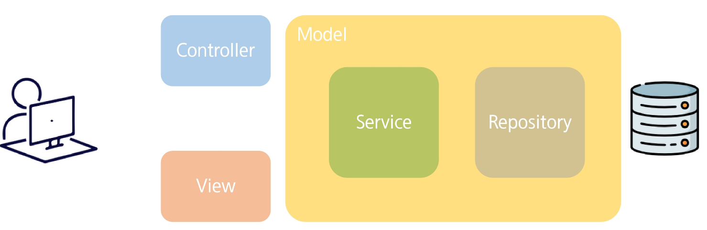

# Back-End PJT
- MVC 패턴
- MVC 패턴 실습
- 생성형 AI 활용
- 관통프로젝트 명세서

# MVC 패턴 (Model-View-Controller)
## MVC 패턴 
- MVC 패턴
    - SW공학에서 사용되는 디자인 패턴
    - 어플리케이션을 세 가지(모델, 뷰, 컨트롤러) 부분으로 분할하여 관리
    - 각 부분 간의 의존성을 최소화하고 유연하고 확장 가능한 구조 제공

- DTO (Data transfer Object)

- Model
    - 어플리케이션의 비즈니스 로직과 데이터 로직을 처리
    - 비즈니스 로직 (Service)
        - 클라이언트에 대한 서비스 기능 제공
        - Repository를 이용하여 데이터를 가져오고, 결과를 가공하여 클라이언트에게 반환
        - 부가적인 로직을 처리할 수도 있음
        - 사용자 친화적인
    - 데이터 로직 (Repository) (Dao)
        - CRUD 작업을 수행하며, 데이터 베이스와의 통신을 처리
        - DB 친화적인

- View 
    - 사용자가 데이터를 볼 수 있도록 시각적으로 표현
    - 로직을 위한 코드를 작성하지 않고 출력을 위한 코드만 존재
    - HTML / JSP / JSON 등과 같은 형식으로 데이터 표현

- Controller
    - View와 Model 사이의 실행 흐름을 제어하는 역할
    - 클라이언트로부터 요청을 받아 분석하고 비즈니스 로직을 수행할 Service를 호출
    - 로직의 결과를 보여주기 위한 View를 선택하여 호출

# MVC 패턴 실습
## MVC 패턴 실습
- Board 만들기
    - 게시글 등록 / 조회 / 수정 / 삭제 할 수 있는 간단한 게시판을 만들어보자.

- WEB-INF안에 넣은 파일들은 주소창에 파일 이름을 적는 것으로 접근할 수 없다.