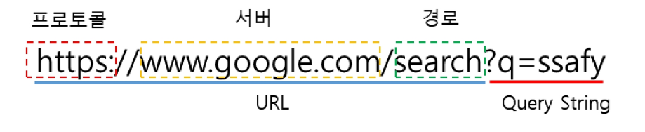

# Servlet
- 웹 프로그래밍
- Servlet
- Servlet 실습

## 웹프로그래밍
### 웹프로그래밍
- 프로그램: 명령어들의 모음집 ex) main()
- 프로그램을 필요로 하는 사람들에게 물리적으로(USB) 전달하기 힘듦
- 클라이언트는 서버에게 요청(Request)하고 서버는 응답(response)한다.
- 과거엔 서버 DB, HTML, CSS, JS등등을 다 저장하고 전달하였으나 지금은 서버는 DB만 보관하고 나머지는 클라이언트에서 HTML, CSS, JS를 만들어 처리한다.
- 통신은 AJax 통신 (by JavaScript)
- 서버쪽은 보통 백앤드, 클라이언트에서 처리하는 일을 하는 사람은 프론트엔드라고 한다.
- 자바에서는 Spring을 이용하여 백엔드를 할 것
- DB관리는 MySQL 사용 (Spring과 통신은 JDBC를 쓸건데, 이를 쉽게 쓰는게 MyBatis)
- 웹을 구성할 때 각 페이지마다 html파일을 생성했는데, html 1개에 묶을 것이다. SPA를 사용할 것인데 이 때 사용하는 프로그램이 Vue.js이다. 

- Web Architecture
    - 서버의 page에는 Static page, Dynamic page가 있다. 
        - Static page는 정해진 page로, DB에 접근하지 않아도 줄 수 있음
        - Dynamic page는 요청한 자료를 DB에서 꺼내서 채운 다음 줘야 함.
            - DB에 요청할 때도 Application Server를 거친다.
            - web server + Application server를 web application server(WAS)라고 한다. 
- tomcat : WAS의 일종 - 요청에 따라 적절한 프로그램을 실행시켜서 응답으로 보내주는 것
- XML : eTtensible Markup Language
    - tomcat이 파일을 어떻게 처리할지를 지시하는 것

## Servlet
### Servlet
- Servlet 이란?
    - Server + Applet 의 합성어
    - java 언어로 작성된 웹 어플리케이션의 서버 측 프로그램
    - java를 이용하여 웹페이지를 동적으로 생성할 수 있음
    - Servlet은 자바 코드 안에 HTML을 포함
- Servlet 생명주기 (Life-Cycle)
    - Servlet 인스턴스는 웹컨테이너에 의해 제어
    - Servlet 인스턴스가 존재하지 않으면 아래의 작업을 수행ㄹ
        - Servlet 클래스 로드
        - Servlet 클래스 인스턴스 생성
        - Servlet 인스턴스 초기화
        - 웹 컨테이너에 의한 서비스 메서드 호출
        - destroy 메서드를 호출하여 Servlet 종료
    - 서비스 메서드는 요청이 들어올 때 마다 호출

## Servlet실습
### Servlet실습

- URI? URL? URN
    - URI(Uniform Resource Identifier)
        - 통합 자원 식별자
        - 인터넷 상의 자원을 고유하게 식별하는 데 사용
        - URL 과 URN을 포함하는 상위 개념
    - URL(Uniform Resource Locator)
        - 통합 자원 위치
        - 자원의 위치를 나타내는 데 사용
    - URN(Uniform Resource Name)
        - 통합 자원 이름
        - 자원에 대한 고유한 이름을 제공
- URL 구성요소

|구성요소|설명|
|---|---|
|프로토콜|절차를 포함한 통신규약|
|서버|웹 페이지를 요청할 서버의 주소, 실제 IP주소나 도메인을 입력할 수 있다.|
|경로|서버 내의 상세 경로|
|쿼리 스트링|추가로 서버로 데이터를 전송하기 위해서 사용한다.   '?'마크를 적어 시작을 표시한다. Parameter Name=value 형태로 작성하며,  파라미터가 여러 개 일 경우 '&'로 구분하여 작성한다.|

- GET 과 POST

|GET|POST|
|---|---|
|지정된 리소스에서 데이터를 요청하는 데 사용|리소스를 생성/업데이트하기 위해 서버에 데이터를 보내는데 사용|
|query string(name/value 쌍)이 URL에 포함되어 전송됨.  POST와 비교하여 보안에 취약함|HTTP header의 body에 파라미터를 포함하여 전송   데이터 길이에 대한 제한 없음   매개변수가 브라우저나 웹 서버에 저장되지 않음 |
|URL이 길이 제한이 있으므로, 전송가능한 데이터의 길이가 제한적   (URL maximum characters : 2048)   ASCII 문자만 가능|제한 없음, 바이너리 데이터도 허용|

- subletmapping 
    - `sublet-name` 은 `url-pattern`에 있는 내용이 주소 뒤에 오면 실행할 파일의 name
    - `url-pattern` 은 주소 뒤에 추가적인 내용을 적을 때 `sublet-name`의 파일 실행
- Servlet 요청과 응답 (기존방식)
    - 매핑 주소마다 servlet 존재
    - 많은 servlet 필요
- Servlet 요청과 응답 (Front Controller)
    - 웹에서 발생하는 모든 요청에 대해 호출되는 Servlet을 만들어 처리함