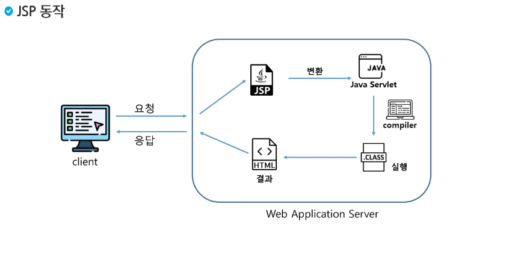
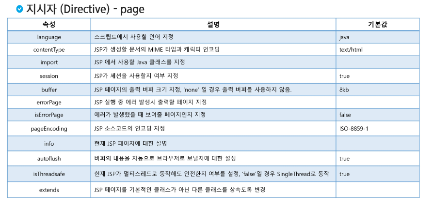

# JSP
- JSP
- JSP 기본 태그
- 페이지 이동

## JSP(Java Server Pages)
### JSP
- JSP 
    - Servlet 표준을 기반으로 작성된 웹 어플리케이션 개발 언어
    - HTML 내에 Java를 작성하여 동적으로 웹페이지를 생성하여 브라우저에게 돌려주는 페이지.
    - 실행 시 Servlet으로 변환된 후 실행
    - <% %> 안에 자바 코드쓰는 느낌
- Hello JSP 
    - JSP 파일을 Servlet 파일로 바뀜

- JSP 구성요소
    - 지시자
        - JSP 페이지에 대한 설정 정보를 지정하기 위해서 사용
    - 스크립트 요소: 스크립트릿(Scriptlet), 표현식(Expression), 선언부(Declaration)
        - JSP에서 문서의 내용을 동적으로 생성하기 위해서 사용
    - JSP 기본객체
        - 요청 및 응답 관련 정보를 얻거나, 응답 결과를 만들기 위해서 사용
    - 표현언어
        - JSP를 좀 더 간결하게 작성하기 위해서 사용
    - Action Tag 와 JSTL
        - 자주 사용하는 기능을 모아 미리 정의하여 Tag형태로 작성한다.
        - JSP에서 자바코드를 쉽게 작성할 수 있도록 사용

## JSP 기본태그
- JSP 태그 종류

|종류|사용용도|형식|
|---|---|---|
|스크립트릿(scriptlet)|자바코드 작성|<% %>|
|선언(declaration)|변수와 메소드를 선언|<%! %>|
|표현식(expression)|계산식이나 함수를 호출한 결과를 문자열 형태로 출력|<%= %>|
|주석(comment)|JSP 페이지 설명 작성|<%-- --%>|
|지시자(directive)|JSP 페이지 속성 지정|<%@ %>|

- 스크립트릿 (Scriptlet)
    - 스크립팅 언어(java)로 작성된 코드 조각을 포함하는데 사용된다.

- 선언부 (Declaration)
    - 멤버변수 선언이나 메서드를 선언하는 영역
    - 스크립트릿에 메서드 선언은 불가
- 표현식 (Expression)
    - 변수의 값이나 계산식 혹은 함수를 호출한 결과를 문자열 형태로 웹문서에 출력
    - 표현식없이 out.print로 출력도 가능 (똑같음 자동으로 바뀌는 느낌)
- 주석문 (Comment)
    - 작성한 코드에 대한 설명을 기술할 경우 사용
    - HTML 주석문과 동일한 기능을 하지만 HTML 주석문은 클라이언트에게 보여지고 JSP주석문을 보여지지 않는다.
- 지시자 (Directive)
    - 웹컨테이너(Tomcat)가 JSP 번역하고 실행하는 방법을 서술
    - page: 해당 JSP 페이지 전반적으로 환경을 설정할 내용 지정
    - include : 현재 페이지에 다른 파일의 내용 삽입할 때 사용
    - tagliib : 태그 라이브러리에서 태그를 사용할 수 있는 기능 제공
- 지시자 - page
    - JSP 페이지 실행 매개변수를 제어
    - 출력처리, 오류처리 등의 내용을 포함
    - errorPage, isErrorPage를 통해 에러가 발생하였을 때 보여줄 페이지를 지정

- 지시자 - include
    - JSP 내에 다른 HTML 문서나 JSP 페이지의 내용을 삽입할 때 사용한다.
    - 반복적으로 사용되는 부분 (header, footer 등) 별도로 작성하여 페이지 내에 삽입하면 반복되는 코드의 재작성을 줄일 수 있다.
    - 개발자도구에서는 다른 곳에서 불러온 것 처럼 안보이고 한 개의 코드에서 작성한 것처럼 보임
    - 다른 jsp파일이 완성되어 있지 않아도 원래 jsp파일(include가 포함된 파일)에서의 문법만 맞으면 error가 나지 않는다.
- 지시자 - tablib
    - JSTML 또는 사용자가 작성한 커스텀 태그를 사용할 때 작성한다.
    - 불필요한 자바 코드를 줄일 수 있다.

## 페이지 이동
### 페이지 이동
- 페이지 이동
    - 요청을 받아서 화면을 변경하는 방법은 두 가지가 있다.
    - 포워드 방식
        - 요청이 들어오면 요청을 받은 JSP 또는 Servlet이 직접 응답을 작성하지 않고, 요청을 서버내부에서 전달하여 해당 요청을 처리하게 하는 방식
    - 리다이렉트 방식
        - 요청이 들어오면 내부 로직 실행 후, 브라우저의 URl을 변경하도록 하여 새로운 요청을 생성함으로써 페이지를 이동한다.
    - 포워드 방식
        - request, response 객체가 전달되어 사용되기 때문에 객체가 사라지지 않는다.
        - 브라우저에는 최초 요청한 주소가 표시된다.
    - 리다이렉트 방식
        - 브라우저가 새로운 요청을 만들어 내기 때문에 최초 요청 주소와 다른 요청주소가 화면에 보여진다.

> JSP 5가지 
> 1. <% %> Java 코드 servlet 변경후 service 메서드안에
> 2. <%! %> 함수, 변수 선언 -> 클래스 영역 
> 3. <%= ;%> out.print();
> 4. <%-- %> -> 서블릿변환 -> x(클라이언트 노출 x)
> 5. <%@ %> page -> 정보, include -> 다른 파일 내용 가져오기 