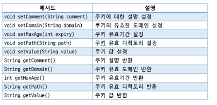
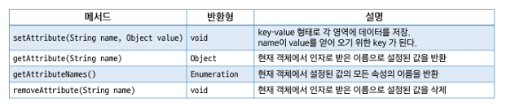
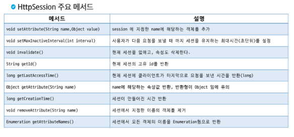

# Cookie & Session
- HTTP
- Cookie
- JSP 기본객체 영역
- Session

## HTTP
### HTTP
- 인터넷 프로토콜
    - 인터넷에서 데이터 통신을 위한 표준화된 규약이나 규칙
    - TCP (Transmission Control Protocol)
    - UDP (User Datagram Protocol)
- HTTP (Hyper Text Transfer Protocol)
    - 웹 서버와 웹 브라우저 간의 통신에 사용
    - HTML, IMAGE, VIDEO, JSON 등의 다양한 데이터 전송 기능
    - 기본 포트번호 : 80
    - 보안 버전의 HTTPS (Hyper Text Transfer Protocol Secure)가 있음 (기본 포트번호 : 443)
    - 클라이언트 - 서버 구조 ( 요청을 주는쪽이 클라이언트, 받는 쪽이 서버)
- HTTP 특징
    - 비 연결성 (Connectionless)
        - 지속적인 연결 유지로 인한 자원낭비 방지를 위해 연결 해제
        - 서버의 자원을 효율적으로 사용할 수 있음
    - 무 상태 (Stateless)
        - 서버가 클라이언트의 상태를 저장하지 않음
        - 클라이언트의 상태를 알 수 없기 때문에 추가적인 데이터 전송이 필요함
        - 응답 서버를 쉽게 바꿀 수 있음
        - 브라우저 쿠기 or 서버 세션 등을 이용하여 상태유지
- HTTP 상태코드
    - 모를 때는 http status code mdn을 검색해보면됨
    - 1XX : Informational response
    - 2XX : Successful response
    - 3XX : Redirection messages
    - 4XX : Client error responses
    - 5XX : Server error responses
        - 사용자에게 노출이 잘 안됨 (나의 실수를 알리는 꼴)

## Cookie
### Cookie 
- Cookie 사용
- Cookie 
    - 웹 서버가 클라이언트의 웹 브라우저에 저장하는 작은 데이터 조각 (클라이언트에서 상태를 저장하는 영역)
    - 필요에 따라 요청시 서버로 같이 전송
    - Key : Value 형태의 문자열 데이터
    - 웹 브라우저(클라이언트) 별로 별도의 쿠키 생성 (브라우저가 다르다면 다른 사용자!)
- Cookie 사용목적
    - 세션 관리 (사용자 아이디, 장바구니 등)를 위해 사용
    - 사용자가 설정한 환경 등을 기억하여 페이지 제공
    - 사용자의 행동과 패턴을 분석
    - 사용자의 관심에 따른 광고를 타겟팅 하기 위해서 사용
- Cookie 동작순서
    - Client가 요청 생성
    - WAS는 Cookie를 생성하고 HTTP Header에 Cookie를 넣어 응답
    - Client(Browser)는 Cookie를 저장, 해당 서버에 요청할 때 요청과 함께 Cookie를 전송
    - Cookie는 브라우저가 종료되더라도 계속 저장되기 때문에(만료 기간 전까지) 동일 사이트 재방문하여 요청 시 필요에 따라 Cookie가 재 전송됨
- Cookie 특징
    - 이름(key), 값(value), 만료일(Expire date), 도메인경로(path) 등으로 구성된다.
    - 클라이언트에 최대 300개의 쿠키를 저장할 수 있다.
    - 하나의 도메인당 20개의 쿠키를 저장할 수 있다.
    - 쿠키 하나당 4KB(4096byte) 제한
- Cookie 주요 메서드

- Cookie 실습
    - Cookie객체가 http.servlet안에 있음
    - `Cookie cookie = new Cookie(key, value);` 로 생성
    - `Cookie.setMaxAge(시간)` : Cookie의 수명을 초단위로 지정, 없애고 싶으면 이 수명을 0으로 하면 됨
    - `response.addCookie(cookie)` : 쿠키객체를 response에 추가함

## JSP 기본객체 영역
### JSP 기본객체 영역
- JSP 기본 객체 영역
    - Aplication 영역 : 웹 어플리케이션 영역, 어플리케이션이 시작되면 종료될 때 까지 유지
    - Session 영역 : 하나의 웹 브라우저와 관련된 영역, 로그인 정보 등을 저장
    - Request 영역 : 하나의 요청을 처리할 때 사용되는 영역, 응답이 완료되면 사라짐
    - Page 영역 : 하나의 페이지 정보를 담고 있는 영역, 페이지가 바뀌면 새로운 객체가 생성됨.
- JSP 기본 객체 영역 (Scope) 메서드
    - servlet과 페이지간 정보를 공유하기 위해서 메서드를 지원한다.
    - 아래는 각 영역에서 사용할 수 있는 공통 메서드 

## Session
### Session
- session
    - 서버에서 상태를 저장하는 영역
    - 사용자가 웹 서버에 접속해 있는 상태를 하나의 단위로 보고 세션이라고 한다.
    - 각 세션은 sessionid를 이용해 구분한다.
    - WAS의 메모리에 객체 형태로 저장
    - 메모리가 허용한는 용량까지 제한없이 저장가능
    - 쿠키는 클라이언트에 저장되기 때문에 공유 PC의 경우 보안에 취약할 수 있다. 하지만 세션은 서버에 저장되기 때문에 쿠키에 비해 보안이 좋다.
    - 사용자(로그인)정보 및 장바구니 등에 사용한다. 
- session 동작 순서
    - 클라이언트가 페이지를 요청
    - 서버는 쿠키에 session id가 있는지 확인한다.
    - session id가 존재하지 않으면 session id를 생성해 쿠키에 쓴 다음 클라이언트로 반환
    - 생성된 session id를 이용하며 서버 내 메모리를 생성
    - 클라이언트가 다음 요청 시 쿠키에 session id를 포함해 전달하면 서버 내에 저장된session id와 비굫아ㅕ 대데이터를 조회
- HttpSession 주요 메서드

