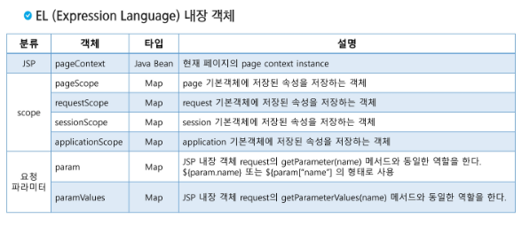
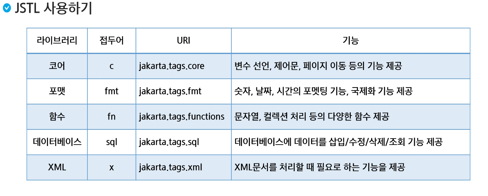
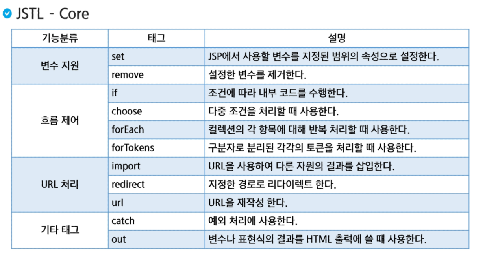

# EL & JSTL
- EL (Expression Language)
- JSTL (JSP Standard Tag Library)

## EL (Expression Language)
### EL (Expression Language)
- EL (Expression Language)
    - EL 표현식은 JSP 내에 데이터를 다루는 데 사용되는 스크립팅 언어
    - JSP 스크립트의 표현식(<%= %>)을 대신하여 속성값을 쉽게 출력할 수 있도록 고안된 언어
    `스크립트 표현식 : <%= expr %>  EL  : ${expr}`
    - ${} : 변수, 속성, 메서드 호출 등을 포함 할 수 있음 

- JavaBeans
    - Java로 작성된 재사용 가능한 소프트웨어 컴포넌트
    - 관례 
        - 클래스는 직렬화 되어야 한다.
        - 클래스는 기본생성자를 가지고 있어야 한다.
        - 클래스의 속성들은 getter, setter를 사용해 접근할 수 있어야 한다.
            - boolean의 경우 getter가 is로 시작함
        - 클래스는 필요한 이벤트 처리 메서드들을 포함하고 있어야 한다.
    - EL 표현식을 이용하여 접근이 가능하다.
        - .(dot) 혹은 ["속성명"]을 사용할 수 있다.
        - 인스턴스만을 작성하면 toString() 메서드가 동작한다.

```
<h2>JavaBeans</h2>
<div>전체 정보 : ${p}</div>
<div>이름 : ${p.name}</div> 
<div>나이 : ${p["age"]}</div>
<div>취미 : ${p["hobbies"][0]}</div> 
```

- 연산자(Operator)

|종류|사용 가능 연산자|
|---|---|
|산술|+,-,*,/,%|
|관계|==,!=,<,>,<=,>=|
|조건|expr? val1:val2|
|논리|&&, \|\|, !|
|null|empty|

- EL 식은 연산자를 포함할 수 있으며 산술 연산, 조건 연산, 논리 연산, 관계 연산을 수행할 수 있다.
- 일반적인 연산 이외에 null 연산을 수행할 수 있따.
- empty 연산자는 검사할 객체가 null인지 아닌지 검사하기 위해서 사용된다.
    - null, "", 요소가 없는 list, map, collection은 True
- EL의 eq는 equals와 동일

- EL 내장 객체 




- 기본적으로 여러 개의 스코프에 같은 이름의 변수가 있다면 자신과 가장 가까운 영역의 변수를 가져온다.

## JSTL (JSP Standard Tag Library)
### JSTL (JSP Standard Tag Library)
- JSTL (JSP Standard Tag Library)
    - JavaEE 기반의 웹 어플리케이션 개발을 위한 컴포넌트 모음
    - JSP 스크립트와 html 코드가 섞여서 복잡한 구조를 가짐
        - 이를 간결하게 작성하기 위해서 자바코드를 캐드 형태로 작성해 놓은 것
    - 유용한 커스텀 태그들을 모아서 표준화 한것 
- JSTL 기능
    - 간단한 프로그램 로직 구현 기능 - 변수선언, if 문장, for문 등
    - 데이터 출력 포맷 설정
    - DB 입력, 수정, 삭제, 조회 기능
    - 문자열 처리 함수
    - XML 문서 처리
- JSTL 사용하기 (jar 파일 or Maven)
    - taglib 지시자를 이용한 태그 사용 선언 
`<%@ tag;ib prefix="c" uri="jakarta.tags.core"%>` 
    - 사용하고자 하는 기능에 따라 어떤 라이브러리를 사용할지 작성한다. (ex:core)
    - 사용자 태그를 구분하기 위해서는 prefix를 작성해준다.
`<c:out value="Hello! JSTL"/>`
    - prefix에 작성한 접두사를 적어주고, 기능에 따른 태그를 선택하여 작성한다.



- JSTL - Core



- `c:out` : 변수나 표현식의 결과를 HTML 출력에 쓸 때 사용한다.
    - value가 필수(출력할 값)
    - `<c:out value="출력값"></c:out>`
- `c:set` : JSP에서 사용할 변수를 지정된 범위의 속성으로 설정한다.
    - var는 변수명, value는 값 value를 지정하지 않고 밖에 써도 된다.
    - scope 변수로 범위를 지정할 수 있으며 default값은 page이다
    - target, property를 통해 target변수의 속성을 바꿀 수 있다.
    - `<c:set var = "name" value="yang"/> ${name} <br> `
    - `<c:set var = "person" value= "<%=new com.ssafy.dto.Person() %>"/>`
	- `<c:set target="${person}" property="name" value="yang3"/>`
- `c:if` : 조건에 따라 내부 코드를 수행한다. 
    - `test=boolean값` 으로 사용한다.
    - else는 없다.
    - `<c:if test="${param.fruit == 4}">메론</c:if>`
- `c:choose` : 다중 조건을 처리할 때 사용한다.  
    - when은 case, otherwise를 default라고 생각하면 switch문과 동일

```
<c:choose>
		<c:when test="${param.fruit == 2}">
			<div style="color: pink">망고스틴</div>
		</c:when>
		<c:when test="${param.fruit == 3}">
			<div style="color: green">멜론</div>
		</c:when>
		<c:otherwise>
			<div>그 외의 과일입니다.</div>
		</c:otherwise>
	</c:choose>
```

- `c:forEach` : 컬렉션의 각 항목에 대해 반복 처리할 때 사용한다.
    - items=반복할 것, var = "반복값을 지정한 변수명"
    - varstatus = "스테이터스명"을 지정한 후 인덱스, 카운트 등으로 접근할 수 있으며 특정 조건을 만족하는 인덱스의 원소만 뽑을 수도 있다. (range느낌)

```
<ul>
	<c:forEach items="${dramaList1}" var = "drama">
		<li> ${drama}</li>
	</c:forEach>
</ul>
```

- `c:forTokens` : 구분자로 분리된 각각의 토큰을 처리할 때 사용한다.
    - var = "구분된 것 저장 변수명", items="구분할 것", delims="구분자"
    - 구분자를 쓸 때는 여러개를 붙여서 할 수도 있다.

```
<c:forTokens var="campus" items="서울,대전,구미.광주.부울경" delims=",.">
		${campus}<br> 
</c:forTokens>
```

- `c:catch` : 예외 처리에 사용한다.
    - var = "발생한 예외를 저장할 변수명"

```
<c:catch var="errmsg">
		<div>예외 발생 전</div>
		<div><%=1/0 %></div>
		<div>예외 발생 후</div>
</c:catch>
${errmsg}
```
