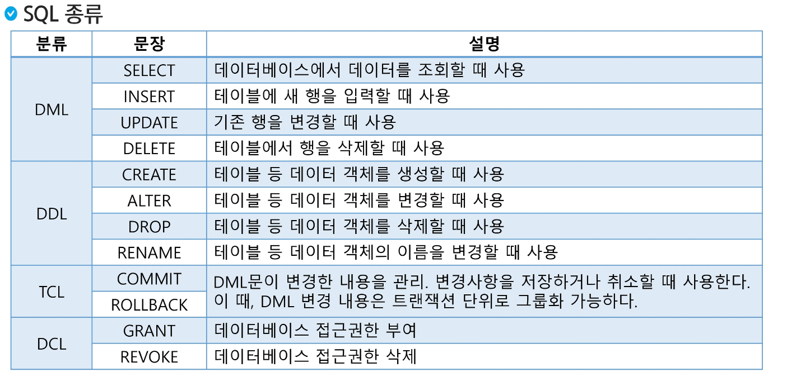
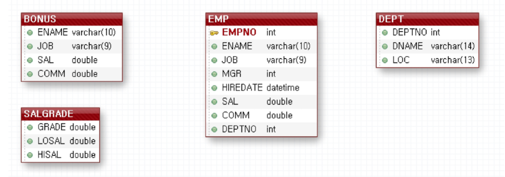

# SELECT
- DataBase
- 관계형 데이터베이스
- SQL
- SELECT
- WHERE 절
- 집계 함수

## 데이터베이스(DataBase)
### 데이터베이스
- 데이터베이스란?
    - 여러 사람이 공유하고 사용할 목적으로 통합 관리되는 정보의 집합
    - 논리적으로 연관된 하나 이상의 자료의 모음
    - 데이터들을 고도로 구조화 함으로써 검색과 갱신의 효율화를 꾀한 것
    - 몇 개의 자료 파일을 조직적을 ㅗ통합하여 중복을 없애고 자료를 구조화 시킨 자료의 집합체

    - 통합된 데이터 : 각자 사용하던 데이터를 모아서 중복을 최소화하고 데이터 불일치를 제거
    - 저장된 데이터 : 문서 형태로 보관되는 것이 아니라 저장장치(디스크, 테이프 등 컴퓨터 저장장치)에 저장됨
    - 운영데이터 : 조직의 목적을 위해서 사용되는 데이터를 의미
    - 공용데이터 : 여러 사람이 각각 다른 목적의 업무를 위해서 공통으로 사용되는 데이터를 의미

    - 조직 또는 개인이 필요에 의해 논리적으로 연관된 데이터를 모아 일정한 형태로 저장한 것

- DBMS(Database Management System)
    - 데이터베이스 관리 프로그램    
        - 데이터베이스 조작 인터페이스 제공
        - 효율적인 데이터 관리 기능 제공
        - 데이터베이스 구축 기능 제공
        - 데이터 복구, 사용자 권한부여, 유지보수 기능제공

## 관계형 데이터베이스 (Relational DB)
### 관계형 데이터베이스
- 관계형 데이터 베이스
    - 테이블(Table) 기반의 Database
    - 테이블
        - 실제 데이터가 저장되는 곳
        - 행과 열의 2차원 구조를 가진 데이터 저장 장소
    - 데이터를 테이블 단위로 관리
        - 하나의 데이터(record)는 여러 속성(Attribute)을 가진다.
        - 데이터 중복을최소화
        - 테이블 간의 관계를 이용하여 필요한 데이터 검색가능 
- 관계형 데이터 베이스 구조
    - 스키마 (Schema) : 데이터베이스에서 자료의 구조, 표현방법, 관계 등 전반적인 명세를 기술한 것
    - ex) 속성명, 속성 설명, ...
- 관계형 데이터 베이스 테이블 구조
    - 테이블 : 행과 열의 모델을 사용해 조직된 데이터 요소들의 집합
    - 열 또는 속성 : 고유한 데이터 형식 (자료형)이 지정됨
    - 행 또는 레코드 : 실제 데이터가 저장되는 형태
    - 기본 키(Primary Key) : 각 행의 고유 값
- 관계형 데이터 베이스 관리 시스템 : oracle, PostgreSQL, MySQL, MariaDB, SQLite 등등

## SQL (Structured Query Language)
- SQL (Structed Query Language)
    - 관계형 데이터 베이스에서 데이터 조작과 데이터 정의를 위해 사용하는 언어
        - 데이터 조회
        - 데이터 삽입, 삭제, 수정
        - DB Object 생성 및 변경, 삭제
        - DB 사용자 생성 및 삭제, 권한 제어
    - 표준 SQL은 모든 DBMS에서 사용가능

- SQL 특징
    - 배우고 사용하기 쉽다
    - 대소문자르 구별하지 않는다. (데이터의 대소문자는 구분)
    - 절차적인 언어가 아니라 선언적 언어이다.
    - DBMS에 종속적이지 않다.

- DML (Data Manipulation Language) : 데이터 조작 언어
    - 데이터베이스에서 데이터를 조작하거나 조회할 때 사용
    - 테이블의 레코드를 CRUD (Creat, Read, Update, Delete)
- DDL (Data Definition Language) : 데이터 정의 언어
    - 데이터 베이스 객체(table, view, user, index 등)의 구조를 정의
- DCL (Data Control Language) : 데이터 제어 언어
    - Database, Table 접근권한이나 CRUD 권한 정의
    - 특정 사용자에게 테이블의 검색권한 부여/금지
- TCL (Transaction Control Langauge) : 트랜잭션 제어 언어
    - 트랜잭션 단위로 실행한 명령문을 적용하거나 취소

- SQL 종류



## SELECT
### SELECT
- SSAFY_CORPORATION database 스키마
    - EMP, DEPT, BONUS, SALGRADE 의 테이블을 가지고 있으며, 연습용으로 사용




- SSAFY_CORPORATION 사용
    - 제공한 SQL 파일 실행
    - 자동완성 대문자 설정

- MySQL 주석
    - `--`, `#` 한 줄 주석
    - `/* */` 여러 줄 주석
- SELECT 문
    - 테이블에서 레코드를 조회하기 위해 사용
    - 조회 시 컬럼이름이라 표현식을 조회할 수 있고 별칭 사용이 가능하다.
    - *는 모든 속성을 조회한다.
    - WHERE 조건식을 이용하여 원하는 레코드를 조회할 수 있다.
- SELECT 문 실행 순서
    1. FROM 절 : 데이터를 가져올 대상 테이블 지정
    2. WHERE 절 : FROM 절에서 선택된 테이블에 조건을 만족하는 행을 필터링
    3. GROUP BY 절 : 데이터를 그룹화함
    4. HAVING 절 : 그룹화된 결과에 대한 조건을 설정하여 특정 그룹을 필터링
    5. SELECT 절 : 지정된 열이나 식에 대한 데이터를 조회
    6. ORDER BY 절 : 결과를 정렬
    7. LIMIT 절 : 결과의 개수를 제한

    - 독립적으로 존재할 수 없는 절도 있기 때문에 무조건 위의 순서는 아니지만 일반적인 경우

- 기본 SELECT 문
    - 모든 사원 정보 검색

``` MySQL
SELECT *
FROM emp;
```

- 사원이 근무하는 부서번호 검색

```
SELECT deptno
FROM emp;
```

```
SELECT DISTINCT deptno AS "부서번호" // 이런식으로 열 명을 저장할 수도 있다. 
FROM emp;   
```

- 사원의 이름, 부선번호, 업무 조회

```
SELECT ename, deptno, job
FROM emp;
```

- 기본 SELET 문 - 별명(allias), 사칙연산
    - 사원의 이름, 사번, 급여*12 (연봉), 업무조회
    - ad를 이용하여 조회 시 컬럼이름을 변경할 수 있다. (띄어 쓰기 포함시 ""으로 묶어준다.)

```
SELECT ename 이름, empno "사번", sal*12 AS 연봉, job AS "업 무"
FROM emp;
```

- 사원의 이름, 사번, 커미션, 급여, 커미션 포함 급여 조회

```
SELECT ename, empno, comm, sal, sal+comm 
FROM emp; 
```

사칙연산 사용가능. NULL 값은 계산 불가
IFNULL 함수를 이용하여 NULL 값 처리 - `IFNULL(exp1,exp2)` : exp1이 NULL 이면 exp2가 return

```
SELECT ename, empno, comm, sal, 
	   sal+comm AS 'comm+sal1',
       sal+IFnull(comm,0) AS 'comm+sal2'
FROM emp; 
```

- 기본 SELECT 문 - CASE Function
문법

```
CASE
    WHEN cond1 THEN result1
    WHEN cond2 THEN result2
    ELSE result
END;
```

CASE 문은 조건을 통과하고 첫 번째 조건이 충족될 때 값을 반환
조건이 충족되지 않으면 ELSE 절의 값을 반환
예시) 모든 사원의 사번, 이름, 급여, 급여 등급 조회

```
SELECT empno, ename, sal,
	CASE WHEN sal >= 5000 THEN "높은연봉"
		 WHEN sal >= 2000 THEN "평균연봉"
         ELSE "낮은연봉"
	END AS "연봉등급"
FROM emp;
```

## WHERE 절
### SELECT - WHERE
- WHERE 절 
    - WHERE절은 조건에 맞는 레코드를 조회하기 위해서 사용한다.
    - SELECT 문장 뿐 아니라, UPDATE, DELETE 등 다른 문장에서도 사용가능
- 논리연산자 - NOT, AND, OR
    - 기본적으로 기본 상식과 똑같지만 NULL이 들어감으로 인해 모르면 NULL을 리턴한다.

부서번호가 30인 사원중 급여가 1500이상인 사원의 이름, 급여, 부서번호 조회

```
SELECT ename, sal, deptno
FROM emp
WHERE deptno = 30 AND sal >=1500;
```

부서번호가 20 또는 30인 부서에서 근무하는 사원의 사번, 이름, 부서번호 조회

```
SELECT empno, ename, deptno
FROM emp
WHERE deptno = 20 OR deptno = 30;
```

부서번호가 20, 30이 아닌 부서에서 근무하는 사원의 사번, 이름, 부서번호 조회 
!=, <>모두 not equal을 의미한다.

```
SELECT empno, ename, deptno
FROM emp
WHERE deptno !=30 AND deptno !=20;
```

NOT - 조건문이 NOT TRUE일 때 레코드를 조회

```
SELECT empno, ename, deptno
FROM emp
WHERE NOT(deptno =30 OR deptno =20);
```

- IN : 피연산자가 여러 표현 중 하나라도 같다면 TRUE
예시) 업무가 'MANAGER', 'ANALYST', 'PRESIDENT' 인 사원의 이름, 사번, 업무 조회

```
SELECT ename, empno, job
FROM emp
WHERE job IN ('MANAGER', 'ANALYST', 'PRESIDENT');
```

NOT IN도 가능

- BETWEEN 
    - 값이 주어진 범위의 범위 안에 있으면 조회
    - 값은 숫자나 문자, 날짜가 될 수 있다.
`WHERE column_name BETWEEN value1 AND value2`

- 급여가 2000 이상 3000 이하 인 사원의 사번, 이름, 급여 조회

```
SELECT empno, ename, sal
FROM emp
WHERE sal BETWEEN 2000 AND 3000;
```

- NULL
    - NULL 비교 : IS NULL, IS NOT NULL
    - 값이 NULL 인지 NULL이 아닌지 검사하기 위해서 사용한다.

커미션이 NULL 인 사원의 사번, 이름, 커미션 조회

```
SELECT empno, ename, comm
FROM emp
WHERE comm IS NULL; // comm = NULL은 안됨
```
- LIKE
    - LIKE - WHERE 절에서 칼럼의 값이 특정 패턴을 가지는지 검사하기 위해 사용
    - 와일드카드 (%,_)를 이용해 패턴을 표현한다.
        - % : 0개 이상의 문자를 의미
        - _: 문자 하나를 의미
이름이 'M'으로 시작하는 사원의 사번, 이름 조회

```
SELECT empno, ename
FROM emp
WHERE ename like 'M%' 
```

- ORDER BY
    - 조회 결과를 오름차순(ASC) 또는 내림차순(DESC)으로 정렬할 때 사용한다. (default: ASC)
    - 정렬 기준(칼럼)을 지정할 수 있다.

```
SELECT column1, column2, ...
FROM table_name
ORDER BY column1, column2,... ASC|DESC; // 각각의 기준에 대한 오름차순, 내림차순 설정 가능
```

- 모든 직원의 모든 정보를 이름을 기준 내림차순으로 정렬하여 조회    

```
SELECT *
FROM emp
ORDER BY ename DESC
```

## 집계 함수 (Aggregate function)

- 집계 함수(Aggregate Function)
    - 여러 값의 집합(복수 행)에 대해서 동작한다. (복수 행 함수, 통계 함수,그룹함수)
    - GROUP BY 절과 함께 사용해 전체 집합의 하위 집합을 그룹화 한다.
    - GROUP BY 절이 쓰일 경우 SELECT 뒤에 GROUP BY로 묶을 열 이름이나 그 열 이름으로 이루어진 집계함수만 사용할 수 있음

|함수|설명|
|---|---|
|AVG()|인수의 평균 값을 반환|
|COUNT()|조회된 행의 수를 반환|
|MAX()|최대값 반환|
|MIN()|최소값 반환|
|SUM()|합 반환|

모든 사원에 대하여 사원수, 급여 총액, 평균급여, 최고급여, 최저급여를 조회

```
SELECT COUNT(*) 사원수, SUM(sal) 급여총액, AVG(sal) 평균급여, MAX(sal) 최고급여, MIN(sal) 최저급여
FROM emp;
```

모든 사원에 대하여 부서, 사원수 급여 총액, 평균급여, 최고 급여, 최저급여를 부서별로 조회 (단 평균 급여는 소수점 둘째자리 반올림)

```
SELECT deptno 부서, COUNT(*) 사원수, SUM(sal) 급여총액, ROUND(AVG(sal),2) 평균급여, MAX(sal) 최고급여, MIN(sal) 최저급여
FROM emp
GROUP BY deptno;    // 부서별로 묶이게 됨, 여러 개 쓰는 것도 가능
```

모든 사원에 대하여 부서, 업무, 사원수, 급여 총액, 평균급여, 최고급여, 최저급여를 부서별, 직급별로 조회

```
SELECT deptno 부서, job 업무, COUNT(*) 사원수, SUM(sal) 급여총액, ROUND(AVG(sal),2) 평균급여, MAX(sal) 최고급여, MIN(sal) 최저급여
FROM emp
GROUP BY deptno, job; 
```

- HAVING 절
    - 집계 함수의 결과내에서 조건문에 맞는 레코드를 조회
    - 급여(커미션포함) 평균이 2000이상인 부서번호, 부서별 사원수, 평균급여(커미션포함) 조회 

```
SELECT deptno 부서번호, COUNT(*) 사원수, ROUND(AVG(sal+IFNULL(comm,0)),2) "평균급여(커미션포함)"
FROM emp
GROUP BY deptno
HAVING AVG(sal+IFNULL(comm,0)) >= 2000;
```

> LIMIT a,b; a명 건너뛰고 b명 가져와


## 실습 함수
- `upper(소문자)` : 대문자로 바꿔서 출력
- `lower(대문자)` : 소문자로 바꿔서 출력
- `concat('A','B')` : 두 문자를 합쳐서 출력
- `substring(column_name,시작위치, 문자수)` : column_name의 시작위치부터 문자수만큼 출력
- `replace(문자열,'바꿀문자열','바뀐문자열')` : 문자열 바꿈
- `CHAR_LENGTH` : 문자열의 문자를 기준으로 셈
- `LENGTH` : 바이트 수를 기준으로 셈
- `reverse(텍스트)` : 거꾸로 출력

- JOIN

``` SQL
SELECT c.id, c.article_id, c.content // 출력할 것
FROM comment c
JOIN article a ON c.article_id = a.id   // article의 id = c의 article_id인 것들 
WHERE a.view_cnt >= 15;  // article 조건
```


## 사소한 사실
- distinct와 ordered by를 함께 사용할 경우 문제가 생길 수 있다.
    - SELECT - DISTINCT - ORDER 순으로 되기 때문에..
    - 따라서 GROUP by로 distinct를 없애는 방법을 쓰면 된다.