# DDL & DML
- Data Type
- DDL
- DML
- MySQL Functions
- Transaction

## Data Type
### Data Type
- 숫자 자료형(Numeric Data Types)

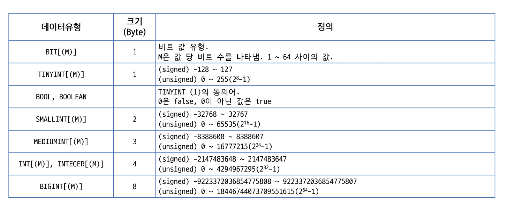

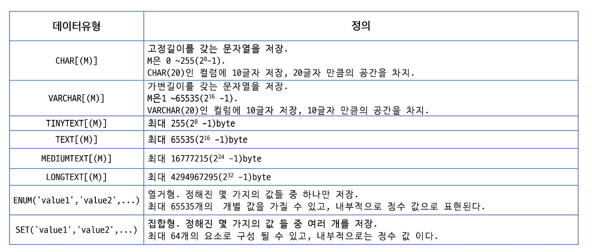

- 날짜 자료형(Date and Time Data Types)

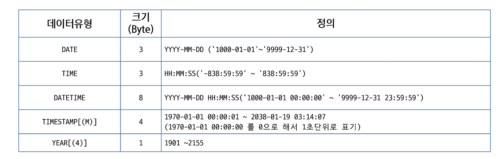

- Binary 타입

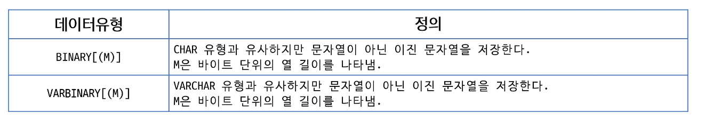

- BLOB 타입
    - 사진, 비디오 등등 
    - 보통 사진, 비디오 등을 담는 서버가 따로 있음
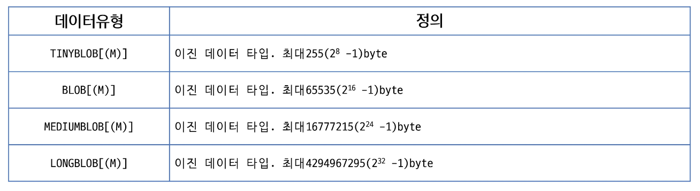

## DDL (Data Definition Language)
### DDL (Data Definition Language)
- 데이터베이스 생성하기
`CREATE DATABASE databasename;`
    - CREAT DATABASE 명령문은 새 데이터 베이스를 생성하는 데 사ㅛㅇ된다.
    - 데이터 베이스는 여러 테이블을 포함하고 있다.
    - 데이터 베이스 생성시 관리자  권한으로 생성해야 한다.
    - SHOW DATABASES -> 데이터베이스 목록 확인 가능
- 데이터베이스 삭제
    - 데이터베이스의 모든 테이블을 삭제하고 데이터베이스를 삭제
    - 삭제 시, DROP DATABASE 권한 필요 
    - DROP SCHEMA 는 DROP DATABASE와 동의어
    - IF EXISTS는 데이터베이스가 없을 시 발생할 수 있는 에러 방지

    `DROP{DATABASE|SCHEMA}[IF EXISTS] db_name`

- 데이터베이스 사용
    - 데이터베이스가 있는 경우(접근 권한이 있는 경우), USE 명령어를 이용하여 사용한다.
    - `USE databasename;`

- 데이터베이스 문자 집합(Character set) 설정하기
    - 데이터베이스 생성 시 설정 또는 생성 후 수정 가능
    - 문자집합은 각 문자가 컴퓨터에 저장될 때 어떠한 '코드로' 자징되는지 규칙을 지정한 집합
    - Collation은 특정 문자 집합에 의해 데이터베이스 저장된 값들을 비교, 검색, 정렬 등의 작업을 수행할 때 사용하는 비교 규칙 집합니다.

- 테이블 생성하기
    - CREAT 명령어를 통해 생성가능
    - 컬럼명과 데이터타입을 지정하고 몇가지 옵션 추가 가능

``` SQL
CREATE TABLE table_name (
    column1 datatype [options],
    column2 datatype
    column3 datatype,
    ...
);
```

- 제약 조건 (CONSTRAINT)
    - 컬럼에 저장될 데이터의 조건을 설정
    - 제약조건에 위배되는 데이터는 저장 불가
    - 테이블 생성시 컬럼에 지정하거나, constraint로 지정가능(ALTER를 이용하여 설정가능)

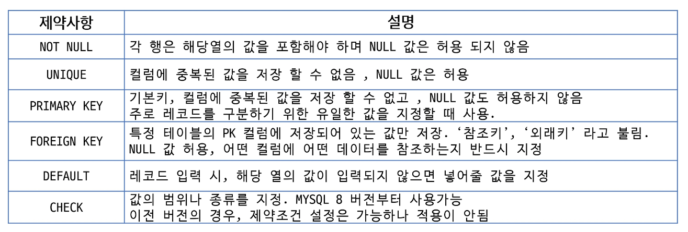

- 테이블 스키마
    - 스키마 : 테이블에 저장될 데이터의 구조와 형식
- 테이블 스키마 확인하기
    - DESCRIBE 또는 DESC 명령어를 이용하여 생성된 테이블 스키마 확인
`{DESCRIBE|DESC}table_name;`    

## DML (Data Manipulation Language)
### DML
- DML
    - 데이터베이스에 데이터를 삽입, 조회, 수정, 삭제할때 사용

|SQL문|설명|
|---|---|
|INSERT (C)|테이블에 새로운 레코드를 삽입|
|SELECT (R)|하나 이상의 테이블에서 레코드들을 조회할 떄 사용|
|UPDATE (U)|테이블의 행을 수정|
|DELETE (D)|테이블의 행을 삭제 |

- INSERT 문
    - 생성시 작성한 모든 컬럼에 입력 값이 주어지면 컬럼이름 생략가능
    - 컬럼이름과 입력 값의 순서가 일치하도록 작성 (NULL, DEAFULT, AUTO INCREMENT 설정 필드 생략 가능)

``` SQL
INSERT INTO table_name
VALUES (col_val1,...col_valN);

INSERT INTO table_name (col_name1,...col_nameN)
VALUES (col_val1,...,col_valN);
```

- UPDATE 문
    - 기존 레코드를 수정한다.
    - WHERE 절을 이용해 하나의 레코드 또는 다수의 레코드를 한 번에 수정할 수 있다.

``` SQL
UPDATE table_name
    SET col_name=value [,col_name2=value2,..]
    [WHERE where_condition];
```

WHERE 절을 생략하면 테이블의 모든 행이 수정된다.
(Safe Mode) 체크 시 작동 X

- DELETE 문
    - 기존 레코드를 삭제한다.
    - WHERE 절을 이용해 하나의 레코드 또는 다수의 레코드를 한 번에 삭제 가능

``` SQL
DELETE FROM tbl_name
[WHERE where_condition];
```

## MySQL Functions (내장 함수) 

- MySQL 내장 함수
    - MySQL은 많은 내장함수를 가지고 있다.
    - 문자열, 숫자, 날짜, 그 외에 대해서 다양한 함수를 제공한다.
        - 숫자 관련 함수
        - 문자 관련 함수
        - 날짜 관련 함수
        - 논리 관련 함수
        - 그룹 함수
- 숫자 관련 함수

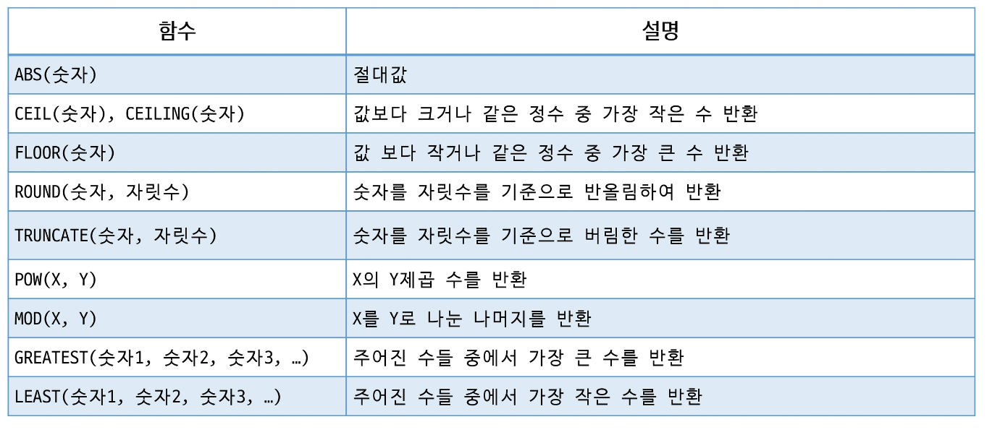

- 문자 관련 함수

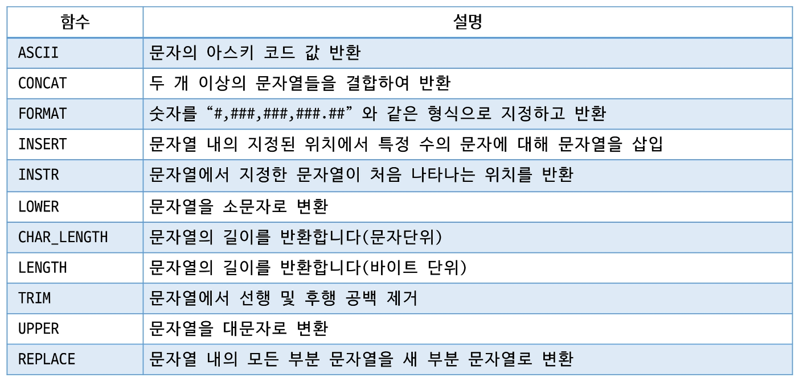

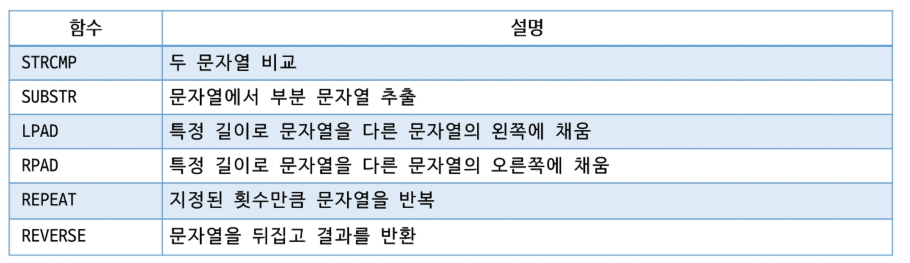

- 날짜 관련 함수

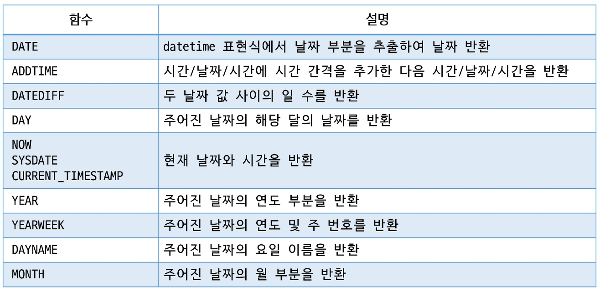

- 그 외 기타 중요 함수

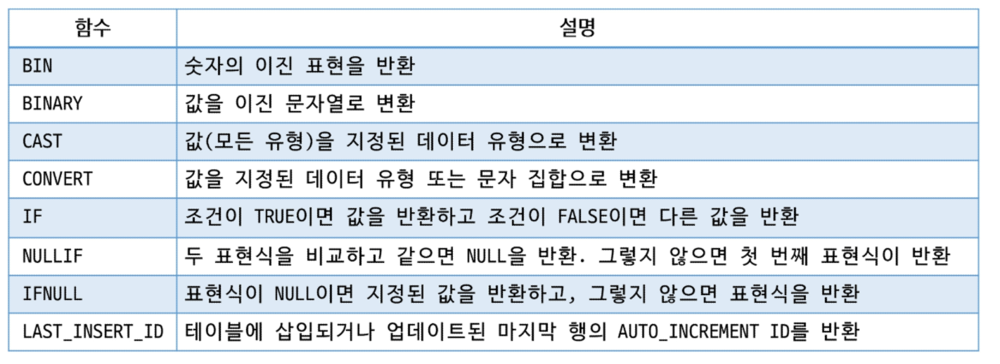

## Transaction
### 트랜잭션(Transaction)
- 트랜잭션 (Transaction)
    - 커밋(Commit)하거나 롤백(Rollback) 할 수 있는 가장 작은 작업 단위
    - 커밋(Commit) : 트랙잭션을 종료하여 변경사항에 대해서 영구적으로 저장하는 SQL
    - 롤백(Rollback) : 트랜잭션에 의해 수행된 모든 변경사항을 실행 취소하는 SQL

|name|description|
|---|---|
|START TRANSACTION|트랜잭션을 시작함. COMMIT, ROLLBACK이 나오기 전까지 모든 SQL을 의미|
|COMMIT|트랙잭션에서 변경한 사항을 영구적으로 DB에 반영|
|ROLLBACK|START TRANSACTION 실행 전 상태로 되돌림|

MySQL에서는 기본이 Auto Commit 상태 (오류가 없으면 자동 Commit)

``` SQL
START TRANSACTION;
INSERT INTO test_table VALUES ('A');
INSERT INTO test_table VALUES ('B');
INSERT INTO test_table VALUES ('C');
INSERT INTO test_table VALUES ('D');
ROLLBACK;

START TRANSACTION;
INSERT INTO test_table VALUES ('A');
INSERT INTO test_table VALUES ('B');
INSERT INTO test_table VALUES ('C');
INSERT INTO test_table VALUES ('D');
COMMIT;

```