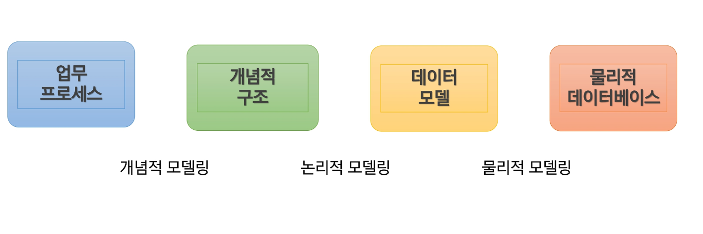

# JOIN_SUBQUERY 
- JOIN
- SubQuery
- Modeling

## JOIN 
### 조인(JOIN)
- JOIN?
    - 둘 이상의 테이블에서 데이터를 조회하기 위해서 사용
    - 일반 적으로 조인조건은 PK(Primary Key) 및 FK(Foreign Key)로 구성
    - PF 및 FK 관계아 없더라도 논리적인 연관만으로도 JOIN 가능
    - JOIN의 종류
        - INNER JOIN : 조인 조건에 해당하는 칼럼 값이 양쪽테이블에 모두 존재하는 경우에만 조회
            - 동등 조인(Equal-join) 이라고도 한다. N개의 테이블 조인 시 N-1개의 조인 조건이 필요
        - OUTER JOIN : 조인 조건에 해당하는 칼럼 값이 한 쪽 테이블에만 존재 하더라도 조회 기준 테이블에 따라 LEFT OUTER JOIN, RIGHT OUTER JOIN으로 구분
- 카타시안 곱(Cartesian Product)
    - 두 개 이상의 테이블에서 데이터를 조회할 때
        - 조인 조건을 지정하지 않음
        - 조인 조건이 부적합 함
    - 첫 번째 테이블의 모든 행이 두 번째 테이블의 모든 행에 조인되어 처리됨

``` SQL
SELECT empno, ename, job, emp.deptio,dept.deptno,dname
FROM emp, dept;
```

- 조인의 필요성
    - ex) 사번이 7788 인 사원의 이름, 업무, 부서번호, 부서이름 조회
    - 문제: 사원의 이름, 업무, 부서 번호는 emp 테이블에 있고, 부서의 이름은 dept 테이블에 있다.

``` SQL
SELECT empno, ename, job, emp.deptno, dname
FROM emp, dept
WHERE emp.deptno = dept.deptno 
AND empno = 7788;
```

USING 사용시 다음과 같이 나타낼 수도 있다.

``` SQL
SELECT empno, ename, job, deptno, dname
FROM emp
INNER JOIN dept
USING (deptno)
WHERE empno = 7788;
```

- INNER JOIN
    - 두 테이블에서 일치하는 값을 가진 레코드를 조회
    - INNER JOIN 절을 쓰지 않고, WHERE 절 만으로도 INNER JOIN 가능

``` SQL
SELECT empno, ename, job, emp.deptno, dname
FROM emp
INNER JOIN dept
ON emp.deptno = dept.deptno
WHERE empno = 7788;
```

- OUTER JOIN
    - 두 테이블에서 하나의 테이블에 조인조건 데이터가 존재하지 않더라도 (조인조건을 만족하지 않음) 데이터를 조회하기 위해서 사용
    - 기준 테이블에 따라 LEFT OUTER JOIN (LEFT JOIN), RIGHT OUTER JOIN (RIGHT JOIN) 으로 구분 (없는 값은 null로 표현됨)


- LEFT OUTER JOIN의 필요성
    - 부서가 없는 직원이 있다고 가정
    - deptno를 JOIN 조건으로 사원의 이름, 부서번호, 부서이름을 조회
    - 부서가 없는 직원은 조회되지 않는다.
- LEFT OUTER JOIN
    - 왼쪽 테이블을 기준으로 JOIN 하여 조건에 일치하지 않는 데이터까지 조회
    - 사원의 이름, 부서번호, 부서 이름 조회

``` SQL
SELECT ename, emp.deptno, dname
FROM emp LEFT OUTER JOIN dept
ON emp.deptno = dept.deptno;
```

emp를 기준 테이블로 LEFT OUTER JOIN 하였을 때, JOIN 조건에 부합하지 않는 레코드가 조회됨

- RIGHT OUTER JOIN
    - 오른쪽 테이블을 기준으로 JOIN하여 조건에 일치하지 않는 데이터까지 조회
    - 회사 내 모든 부서에 대해서 부서이름과, 부서에서 근무하는 사원의 사번, 이름 조회

``` SQL
SELECT ename, emp.deptno, dname
FROM emp RIGHT OUTER JOIN dept
ON emp.deptno = dept.deptno;
```

OPERATION 부서에 근무하는 사원은 없지만 조회 되었음

- 셀프 조인(SELF JOIN)
    - 같은 테이블 2개를 조인
    - 모든 사원의 이름, 매니저 번호, 매니저 이름 조회
        - 사원의 정보는 e1, 매니저의 정보는 e2에서 조회
        - 조인 조건은 `e1.mgr = e2.empno`

``` SQL
SELECT e1.ename, e1.mgr, e2.ename
FROM emp e1, emp e2
WHERE e1.mgr = e2.empno;
```

- 비 동등 조인(Non-Equi JOIN)
    - 조인조건이 table의 PK, FK 등으로 정확히 일치하는 것이 아닐 때 사용
    - 모든 사원의 사번, 이름, 급여, 급여등급을 조회

``` SQL
SELECT e.empno, e.ename, e.sal, sg.grade
FROM emp e, salgrade sg
-- WHERE e.sal >= sg.LOSAL AND e.sal <= sg.HISAL
WHERE e.sal BETWEEN sg.LOSAL AND sg.HISAL
ORDER BY sg.grade;
```

## SubQuery
### 서브 쿼리 (SubQuery)
- 서브 쿼리란?
    - 서브 쿼리란 하나의 SQL 문안에 포함되어 있는 SQL문을 의미
    - 서브 쿼리를 포함하는 SQL을 외부 쿼리 또는 메인 쿼리라고 부르며, 서브 쿼리는 내부 쿼리라고도 부름
- 서브 쿼리의 종류
    - 중첩 서브 쿼리(Nested SubQuery) - WHERE 절 안에 작성하는 서브 쿼리
        - 단일-행, 다중-행, 다중-열
    - 인라인 뷰(Inline view) - FROM 절에 작성하는 서브 쿼리
    - 스칼라 서브 쿼리(Scalar Subquery) - SELECT 문에 작성하는 서브 쿼리

- 서브 쿼리를 포함할 수 있는 SQL 문
    - SELECT, FROM, WHERE, HAVING, ORDER BY
    - INSER문의 VALUES
    - UPDATE문의 SET
- 서브 쿼리의 사용시 주의사항
    - 서브 쿼리는 반드시 ()로 감싸서 사용
    - 서브 쿼리는 단일 행 또는 다중 행 비교 연산자와 함께 사용 가능
        - 단일 행 비교연산자는 서브 쿼리 결과가 1건 이하이어야 하고, 복수 행 비교 연산자는 결과 건수와 상관없다.
- 서브 쿼리의 필요성
    - 사번이 7788인 사원의 부서 이름을 조회
    - dname을 조회하기 위해서 INNER JOIN을 수행하였다. JOIN의 경우 경우에 따라 쿼리가 복잡해지거나 카테시안 곱으로 인해 속도가 느려질 수 있다.
    - 그런데 일반적으로 서브 쿼리보다 JOIN이 성능이 더 좋다.

- 서브 쿼리 - 중첩 서브 쿼리, 단일 행
    - 서브 쿼리 결과가 단일 행을 반환
    - ex) 사번이 7788인 사원의 부서 이름을 조회

``` SQL
SELECT dname
FROM dept
WHERE deptno = (SELECT dname
				FROM dept
				WHERE deptno = 20
);
```

- 매니저의 이름이 KING인 사원의 사번, 이름, 부서번호, 업무 

``` SQL
SELECT empno, ename, deptno, job
FROM emp
WHERE mgr = (SELECT empno FROM emp WHERE ename = 'KING');
```

- 7566번 사원보다 급여를 많이 받는 사원의 이름, 급여를 조회

``` SQL
SELECT ename, SAL
FROM emp
WHERE SAL > (SELECT SAL FROM emp WHERE empno = 7566);
```

- 20번 부서의 평균 급여보다 급여가 많은 사원의 사번, 이름, 업무, 급여조회

``` SQL
SELECT empno, ename, job, SAL
FROM emp
WHERE SAL > (SELECT AVG(SAL) FROM emp WHERE deptno = 20);
```

- 업무가 TURNER와 같고, 사번 7934인 직원보다 급여/가 많은 사원의 사번, 이름, 업무를 조회

``` SQL
SELECT empno, ename, job
FROM emp
WHERE job = (SELECT job FROM emp WHERE ename='TURNER') AND SAL > (SELECT SAL FROM emp WHERE empno = 7934);
```

- 서브 쿼리 - 중첩 서브 쿼리, 다중 행
    - 서브 쿼리 결과가 다중행을 반환 : IN, ANY, ALL 연산자와 함께 사용
    
- 업무가 SALESMAN 인 직원들 중 최소 한명 이상보다 많은 급여를 받는 사원의 이름, 급여, 업무를 조회하시오.

`>ANY` 는 최소값보다 큼 <br>
`<ANY` 는 최대값보다 작음

``` SQL
SELECT ename, sal, job
FROM emp
WHERE sal > ANY ( SELECT sal FROM emp WHERE job = 'SALESMAN') AND job !='SALESMAN';
```

- 업무가 'SALESMAN'인 모든 직원보다 급여(커미션포함)를 많이 받는 사원의 이름, 급여, 업무, 입사일, 부서번호를 조회하시오.

``` SQL
SELECT ename, sal+ifnull(comm,0), job, hiredate, deptno
FROM emp
WHERE sal+ifnull(comm,0) > ALL (SELECT sal+ifnull(comm,0) FROM emp WHERE job = 'SALESMAN');
```

`>ALL` 는 최대값보다 큼
`<ALL` 는 최소값보다 작음

- 직원이 최소 한명이라도 근무하는 부서의 부서번호, 부서이름, 위치

``` SQL
SELECT deptno, dname, loc
FROM dept
WHERE deptno in (SELECT DISTINCT deptno FROM emp);
```

DISTINCT 키워드를 이용해 중첩되는 행은 제거 <br> in 다중행에 하나라도 일치하면 조회, = ANY와 같다.

- 서브 쿼리 - 중첩 서브 쿼리, 다중열 
    - 서브 쿼리의 결과값이 2 개 이상의 칼럼을 반환하는 서브 쿼리
    - PK가 복합키이거나, 여러 칼럼의 값을 한꺼번에 비교해야 할 경우 사용
    - 행 생성자를 이용하여 다중 열 서브 쿼리를 비교
    - 아래 두 SQL은 의미상 동일, 동일한 방식으로 처리됨
        - `SELECT * FROM t1 WHERE (column1,column2 (1,1);`
        - `SELECT * FROM t1 WHERE column = 1 AND column2 = 1;`
    - 결과가 다중 행일 경우 IN 연산자를 이용한다.

``` SQL
SELECT column1, column2, column3
FROM t1 WHERE (column1,column2,column3) IN
              (SELECT column1,column2,column3 FROMT t2);
```

- 이름이 FORD인 사원과 매니저 및 부서가 같은 사원의 이름, 매니저 번호, 부서번호를 조회, 단 FOR 정보는 조회하지 않음

``` SQL
SELECT ename, mgr, deptno
FROM emp
WHERE (mgr, deptno) = (SELECT mgr, deptno FROM emp WHERE ename = 'FORD') AND ename <> 'FORD';
```

- 각 부서별 입사일이 가장 빠른 사원의 사번, 이름, 부서번호, 입사일을 조회

``` SQL
SELECT empno, ename, deptno, hiredate
FROM emp
WHERE (deptno, hiredate) IN (SELECT deptno, MIN(hiredate) FROM emp GROUP BY deptno);
```

- 서브 쿼리 - 상호 연관 서브 쿼리 (Correlated Subqueries)
    - 외부 쿼리에 있는 테이블에 대한 참조를 하는 서브 쿼리를 의미한다.
    - 예시 
    ``` SQL
    SELECT * FROM t1
    WHERE column1 = ANY (SELECT colummn1 FROM t2 WHERE t2.column2 = t1.column2);
    ```

    - 서브 쿼리의 FROM 에는 t1에 대한 선언이 존재하지 않는다.       
        - 따라서 서브 쿼리는 외부 쿼리(메인 쿼리)에서 t1을 참조한다.
    - 테이블에서 행을 먼저 읽어서 각 행의 값을 관련된 데이터와 비교하는 방법 중 하나이다.
    - 기본 질의에서 고려된 각 후보행에 대해 서브 쿼리가 다른 결과를 반환해야 하는 경우에 사용한다.
    - 서브 쿼리에서는 메인 쿼리의 컬럼명을 사용할 수 있으나, 메인 쿼리에서는 서브 쿼리의 컬럼명을 사용할 수 없다.

    - 소속 부서의 평균 급여보다 많은 급여를 받는 사원의 이름, 급여, 부서번호, 입사일, 업무를 조회
   
    ``` SQL
    SELECT ename, sal, deptno, hiredate, job
    FROM emp e
    WHERE sal > (SELECT AVG(sal) FROM emp WHERE deptno = e.deptno);
    ```

- 서브 쿼리 - 인라인 뷰(Inline View)
    - FROM 절에서 사용되는 서브 쿼리
    - 동적으로 생성된 테이블로 사용 가능하다. 뷰와 같은 역할을 한다.
    - `SELECT ... FROM(subQuery)[AS] tbl_name(col_list)...`
    - 인라인 뷰는 SQL 문이 실행될 때만 임시적으로 생성되는 뷰이기 때문에 데이터베이스에 해당 정보가 저장되지 않는다. 그래서 동적 뷰라고도 한다.

    - 모든 사원의 평균급여보다 적게 받는 사원들과 같은 부서에서 근무하는 사원의 사번, 이름, 급여, 부서번호를 조회
    
    ``` SQL
    SELECT e.empno, e.ename, e.sal, e.deptno
    FROM emp e, (SELECT DISTINCT deptno FROM emp WHERE sal < (SELECT AVG(sal) FROM emp)) d WHERE e.deptno = d.deptno;
    ```

    - 모든 사원에 대하여 사원의 이름, 부서번호, 급여, 사원이 소속된 부서의 평균 급여를 조회 (단, 이름 오름차순)

    ``` SQL
    ```

- 서브 쿼리 - 스칼라 서브 쿼리 (Scalar Subquery)
    - 하나의 행에서 하나의 컬럼 값만 반환하는 서브 쿼리
    - 다음과 같은 경우에 사용가능
        - GROUP BY를 제외한 SELECT의 모든 절
        - INSERT 문의 VALUES
        - 조건 및 표현식 부분
        - UPDATE 문의 SET 또는 WHERE 절에서 연산자 목록
    - SELECT에 스칼라 서브 쿼리 사용
    - 사원이름, 부서번호, 급여, 소속부서의 평균 급여를 조회
    - 부서번호가 10인 부서의 총 급여, 20인 부서의 평균 급여, 30인 부서의 최고, 최저 급여
        
    - ORDER BY 에 스칼라 서브 쿼리 사용
    - 모든사원의 번호, 이름, 부서번호, 입사일을 조회 (단, 부서이름기준으로 내림차순)

- 서브 쿼리
    - 서브 쿼리를 이용한 CREATE 문
    - emp table을 emp_copy라는 이름으로 복사
    - emp table 구조만 emp_blank라는 이름으로 복사하여 생성
    
    - 서브 쿼리를 이용한 INSERT 문
    - 부서 번호가 30인 사원의 모든 정보를 emp_blank에 INSERT

## Modeling
### 데이터베이스 모델링
- DataBase Modelling



- 개념적 데이터베이스 모델링
    1. 사용자 부문의 처리현상을 분석한다.
    2. 중요 실체와 관계를 파악하여 ERD를 작성한다.
    3. 실체에 대한 상세 정의를 한다.
    4. 식별자를 정의하고, 식별자 업무규칙을 정한다.
    5. 실체별로 속성을 상세화한다.
    6. 필요한 속성 및 영역을 상세 정의한다.
    7. 속성에 대한 업무규칙을 정의한다.
    8. 각 단계를 마친 후 사용자와 함께 모델을 검토한다.

    - ERD 기호 

    
    
    - ERD 예시
    
    
    
    - 개체 (Entity) : 사용자와 관계가 있는 주요 객체 (데이터로 관리 되어야 하는 것)
    - Entity 찾는법
        - 영속성으로 존재하는 것
        - 새로 식별이 가능한 데이터 요소를 가짐
        - Entity는 Attribute를 가져야 함
    - 속성 (Attribute)
        - 저장할 필요가 있는 실체에 관한 정보
        - 개체의 성질, 분류, 수량, 상태, 특성 등을 나타내는 세부사항
        - 개체에 포함되는 속성의 숫자는 10개 내외로 하는 것이 바람직함
        - 최종 DB 모델링 단계를 통해 테이블의 컬럼으로 활용
        - EX) 학생 : 학번, 이름, 주민번호, 전화번호, 주소, 입학일자, 학과 / 직원: 직원 ID, 이름, 주민번호, 주소, 입사일자, 소속부서
    
    - 식별자 : 한 개체(Entity) 내에서 인스턴스를 구분할 수 있는 단일 속성 또는 속성 그룹
        - 후보키 (Candiate Key) : 개체내에서 각각의 인스턴스를 구분할 수 있는 속성 (기본키가 될 수 있음)
        - 기본키 (Primary Key) : 개체에서 각 인스턴스를 유일하게 식별하는 데 적합한 Key
        - 대체키 (Alternate Key) : 후보키 중에서 기본키로 선정 되지 않은 Key
        - 복합키 (Composite Key) : 하나의 속성으로 기본키가 될 수 없는 경우 둘 이상의 컬럼을 묶어서 식별자로 정의
        - 대리키 (Surrogate Key) : 식별자가 너무 길거나 여러 개의 속성으로 구성되어 있는 경우 인위적으로 추가

    - 관계 (Relationship) : 두 Entity 간의 업무적인 연관성 또는 관련 사실
        - 각 Entity간에 특정한 존재여부 결정
        - 현재의 관계 뿐만 아니라 장래에 사용될 경우도 고려

    - ERD 관계를 설정하는 순서
        1. 관계가 있는 두 실체를 실선(점선)으로 연결하고 관계를 부여
            - ex) 두 실체를 실선으로 연결하고 등록이라는 관계를 마름모로 표현
        2. 관계 차수를 표현
            - ex) 일대일, 일대다, 다대다...
        3. 선택성을 표시
            - 선을 표시하면 의무적, 원은 선택

    - 차수의 종류
        - 1:1 (일 대 일) -> 두 실체의 레코드가 서로 하나씩 대응
        - 1:N (일 대 다) -> 부모 실체의 하나의 레코드가 자식 실체의 여러 레코드에 대응
        - N:M (다 대 다) -> 양쪽 실체 간에 여러 개의 레코드와 관계를 맺을 수 있는 경우

- 논리적 데이터베이스 모델링
    - 개념적 데이터베이스 모델링 단계에서 정의된 ER-Diagram을 Mapping Rule을 적용하여 관계형 데이터베이스 이론에 입각한 스키마를 설계하는 단계와 이를 이용하여 필요하다면 정규화 하는 단계로 구성
    - 기본키
        - 후보키 중에서 선택한 주키
        - NULL의 값을 가질 수 없다. (NOT NULL)
        - 동일한 값이 중복해서 저장될 수 없다. (Unique) 
    - 참조키, 이웃키 (Foreign Key)
        - 관계를 맺는 두 엔티티에서 서로 참조하는 릴레이션의 attribute로 지정되는 키
    - Mapping Rule
        - 개념적 데이터베이스 모델링에서 도출된 개체 타입과 관계 타입의 테이블 정의
    
|개념|논리|
|---|---|
|단순 엔티티|테이블|
|속성|컬럼|
|식별자|기본키|
|관계|참조키,테이블|

    - 정규화 (Normalization)
        - 관계형 데이터베이스 설계에서 중복을 최소화하게 데이터를 구조화 하는 프로세스를 말함.
    - 정규화의 목적
        - 데이터베이스의 변경 시 이상 현상 제거
        - 데이터베이스 구조 확장 시 재 디자인 최소화
        - 사용자에게 데이터 모델을 더욱 의미 있게 작성하도록 함
        - 다양한 질의 지원
    - 제 1 정규화
        - Atomic Columns (한 칸에 하나씩)
    - 제 2 정규화
        - 부분함수 종속 제거 (기본 속성을 제외하고 종속적인 관계 제거)
    - 제 3 정규화 
        - 이행적 함수 종속 제거 (모든 속성은 기본키에만 종속되어야 함)

- 물리적 데이터베이스 모델링
    - 논리적 데이터베이스 모델링 단계에서 얻어진 데이터베이스 스키마를 좀 더 효율적으로 구현하기 위한 작업.
    - DMBS 특성에 맞게 실제 데이터베이스 내의 개체들을 정의하는 단계.
        - Column의 domain 설정 (int, varchar, date,...)

    - 데이터 사용량 분석과 업무 프로세스 분석을 통해서 보다 효율적인 데이터베이스가 될 수 있도록 효과적인 인덱스를 정의하고 상황에 따른 역정규화 작업을 수행.
        - Index, Trigger, 역정규화
    - 역정규화
        - 시스템 성능을 고려하여 기존 설계를 재구성하는 것
        - 정규화에 위배되는 행위
        - 테이블의 재구성
    - 역정규화 방법
        - 데이터 중복 (컬럼 역정규화)
        - 파생 컬럼의 생성
        - 테이블 분리
        - 요약 테이블 생성
        - 테이블 통합
