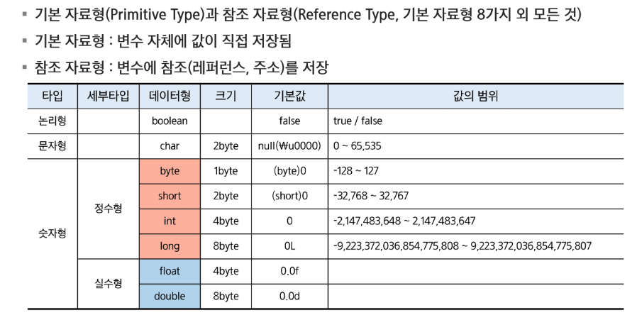
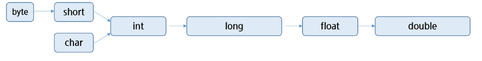

# Java 기본 문법
- Java 기본
- 변수와 자료형
- 연산자
- 제어문
## Java 기본
### 프로그램과 운영체제
- 프로그램 (Program)
    - 컴퓨터가 특정 작업을 수행하도록 지시하는 일련의 명령어들의 집합(작업 지침서)
    - 컴퓨터가 이해할 수 있는 형태로 작성된 명령어의 집합
    - 명령은 CPU에서 실행됨
    - ex) 응용 프로그램, 운영체제 
- 운영체제 
    - 시스템 하드웨어를 관리할 뿐 아니라 응용 프로그램을 실행하기 위하여 하드웨어 추상화 플랫폼과 공통 시스템 서비스(프로세스 관리, 메모리 관리, 파일 시스템 관리 등)를 제공하는 시스템 소프트웨어

### 컴퓨터의 자료표현
- 비트: Binary digit의 줄임말, 0 또는 1의 값만 가질 수 있음
- 바이트: 8개의 비트로 구성된 정보 단위. 컴퓨터 메모리의 기본 단위
- 2진수: 두 가지 상태만을 사용하는  수 체계
- 10001001: 137(0~256범위 나타낼때), -9(맨 앞이 부호 나타낼 때), -119(2의 보수법) 가능
### 자바 가상 머신(JVM, Java virtual machine)
- 자바 바이트코드를 실행할 수 있는 주체
- 자바 바이트코드를 기계어로 번역하여 특정 플랫폼의 실제 하드웨어에서 실행
- 바이트코드: 소스코드와 기계어 사이의 중간단계 (.class 확장자 가짐) (C,C++은 컴파일하면 기계어가 됨)
- JVM은 플랫폼 독립성을 가능하게 함
- 바이트코드는 플랫폼에 독립적
    - 플랫폼 독립성: 자바는 컴파일 시 바이트코드가 되는데 이는 여러 플랫폼에서 돌아감
- JVM 자체는 플랫폼 종속적

### 메인 메서드
- 자바 애플리케이션의 시작점
- 자바 애플리케이션을 실행할 때 가장 먼저 호출
- 자바 애플리케이션에 main() 메서드가 없다면 절대로 실행될 수 없음
- 형태 (고정된 형태)

### 주석
- //내용: 한줄 주석, 해당 기호가 있는 위치부터 그 줄 끝까지 주석처리
- /* 내용*/: 여러 줄 주석, 해당 범위의 내용 주석처리
- /** 내용 */: 문서화 주석, Documentaion API를 위한 주석 처리
- ctrl+/로 한번에 주석 처리 가능
``` java
// 해당 줄을 주석처리
/*
해당 범위 주석처리
*/
/**
 * 문서화
 */
```

### 출력문
- print 메서드: 값을 출력한 후 줄 바꿈을 하지 않음, 필요 시 \n(줄바꿈)을 사용
- println: 값을 출력한 후 줄 바꿈을 함
- printf: 포맷 지정자(%로 시작)를 사용하여 형식을 지정해 데이터를 출력, 줄 바꿈을 자동으로 하지 않음
    - %d: 정수
    - %f: 실수
    - %c: 문자
    - %s: 문자열
``` java
        System.out.printf("%d\n", 10); // 정수 (10진수) 10
        System.out.printf("%o\n", 10); // 정수 (8진수) 12
        System.out.printf("%x\n", 10); // 정수 (16진수) 소문자 a
        System.out.printf("%X\n", 10); // 정수 (16진수) 대문자  A     
        System.out.printf("%4d\n", 10); // 4칸을 확보한 뒤 오른쪽부터 차지 :  빈빈10
        System.out.printf("%-4d\n", 10); // 4칸을 확보한 뒤 왼쪽부터 차지 : 10빈빈 
        System.out.printf("%04d\n", 10); // 4칸을 확보한 뒤 오른쪽부터 차지 (빈칸은 0으로 채움) : 0010     
        System.out.printf("%f\n", 10.12345); // 실수 :10.123450
        System.out.printf("%.2f\n", 10.12545); // 실수 (소수점 둘째자리까지 반올림해서 출력.) :10.13
        System.out.printf("%s\n", "싸피"); // 문자열 : 싸피
        System.out.printf("%c\n", 'A'); // 문자  :A
        System.out.printf("%d\n", (int)'A'); // 문자를 정수로 출력(아스키코드) :65
```

## 변수와 자료형
### 변수
- 정의
    - 변수 데이터 저장을 위해 메모리의 특정 위치를 가리키는 이름
    - 변수를 선언하면 저장할 데이터 타입에 따라 적정한 크기의 메모리 공간을 확보
    - 변수를 통해 메모리 상의 데이터를 읽고 쓸 수 있음
    - '='을 통해서 CPU에게 연산작업을 의뢰
- 메모리의 기본 단위
    - 1 byte
    - 바이트마다 주소가 있음
- 변수의 이름 규칙
    - 대소문자 구분
    - 공백 허용되지 않음
    - 숫자로 시작 불가
    - 특수문자: $와 _는 변수 이름에 사용할 수 있지만, 나머지는 불가
    - 예약어 사용 불가
    - 합성어의 경우 CamelCase표기법 사용
    - 한글 사용 권장x(가능은 함)

### 자료형



- int, double이 각각 정수형, 실수형의 기본형

### 변수와 자료형
- 선언
    1. 자료형 변수명;
    2. 예) `int age; String name;
- 저장(할당)
    1. 변수명=저장할 값;
    2. 예) age=30; name="철수";
- 초기화
    1. 자료형 변수명=저장할 값;
    2. 예) int age=30;

### 형 변환
- 자동 (묵시적,암묵적) 형변환이 가능한 방향



- 데이터 형 변환
    - 묵시적(암묵적) 형변환
        1. 범위가 넓은 데이터 형에 좁은 데이터 형을 대입하는 것
        2. 예) `byte b=100; int i=b;`
    - 명시적
        1. 범위가 좁은 데이터 형에 넓은 데이터 형을 대입하는 것
        2. 형 변환 연산자 사용 - (타입) 값;
        3. 예) int i=100; byte b=i; (X), byte b= (byte) i; (O)
        4. 만약 바꾸려는 데이터의 범위보다 큰 데이터를 명시적으로 바꾸면? - 이상한 값이 출력됨ㅁ
    - 리터럴
    	- 값을 소스코드상에 적어 놓은 것.
    	- 데이터형에 따라서 값의 표기 방법이 다르다.
    	- 100 => int형의 숫자 100
    	- 100L => long형의 숫자 100
    	- 12.321 => double형
    	- 12.321f => float형
    	- "Hello, World!" => String형의 문자열.

## 연산자
- 단항 연산자
    - 증감 연산자 ++,--
        - 피연산자의 값을 1 증가, 감소 시킨다.
        - 전위형 ++i, --i 값을 먼저 증감시킨 후 사용
        - 후위형 i++,i-- 값을 먼저 사용한 후 증감
    - 부호 연산자 +,-
        - 숫자가 양수임을 표시 +
        - 피연산자의 부호를 반대로 변경한 결과 반환 - 
    - 논리 부정 연산자 !
        - 논리 값을 반전
    - 비트 부정 연산자 ~
        - 비트 값을 반전
    - 형 변환 연산자 (type)

``` java
int a = 5;
System.out.println(a++); // 5 : 후위형: 먼저 값을 출력한 다음 증감시킨다.
// a는 현재 6이라는 값을 가지고 있음.
System.out.println(++a); // 7 : 전위형: 먼저 값을 증감시킨다음 출력한다.
```

- 산술 연산자
    - 곱하기 연산자 *
    - 나누기 연산자 /
    - 나머지 연산자 %
    - 더하기 연산자 +
    - 빼기 연산자 -
    - 참고
        - 정수와 정수의 연산 = 정수
        - 정수와 실수의 연산 = 실수

- 비교 연산자
    - 대소 비교 연산
        - <,>=,>,<=
    - 동등 비교 연산
        - == 
            - String 변수 비교할 때는 equals() 사용 (String 내장 메서드)
            - 예를 들어 c,d가 String일 때 c.equals(e)를 한다.
        - !=
    - 객체 타입 비교 연산
        - instance of

- 논리 연산자
    - && 
        - 논리 곱 (AND): 피연산자 모두가 true일 경우에만 true
    - || 
        - 논리 합 (OR) : 피연산자 중 하나라도 true일 경우 true
    - !
        - 논리 부정 (NOT) : 피연산자의 결과를 반대로 바꾼다.
    - 효율적인 연산 가능 (short circuit evalutation)- 더 이상 할 필요 없으면 안한다.

- 삼항 연산자
    - 조건식 ? 식1:식2
    - 조건식이 참일 경우 식1 수행
    - 조건식이 거짓일 경우 식2 수행
- 복합 대입 연산자
    - +=,-=,*=,/=
    - i+=1 -> i=i+1

## 제어문
- 제어문: 프로그램의 흐름을 제어하는 문법 요소
- 제어문의 종류
    - 조건문: if, switch
    - 반복문: for, while, do-while
    - 점프문: break, continue, return
    - 예외처리문: try, catch, finally, throw, throws

- 조건문: 조건이 참인지 거짓인지 여부에 따라 코드 블록 실행 결정
- 반복문: 조건이 참인 동안 코드 블록을 반복

### if문
``` java
if( boolean_expression ) {
    Statements
    ..
}
```

``` java
if( boolean_expression ) {
    Statements
    ..
} else {
    Statements
    ..
}
```

``` java
if( boolean_expression ) {
    Statements
    ..
} else if( boolean_expression){
    Statements
    ..
} else  {
    Statements
    ..
}
```

### switch
- 인자로 선택변수를 받아 변수의 값에 따라서 실행 블록이 결정
- 값이 일치하는 case부터 시작해서 break를 만나면 종료
- break문을 작성하지 않으면 그 다음 case도 진행
- 일치하는 값이 없다면 default에서 시작

``` java
switch (expr) {
    case 값1:
        statements;
        break;
    case 값2:              
        statements;
        break;
    case 값3:
        statements;
        break;
    default:
        statements;
}
```

## 반복문
### for문

``` java
for (초기화;조건식;증감식) {
    반복할 코드 블록;
    ...
}
```
- 초기화는 반복문이 시작될 때 한 번 실행됨
- 조건식이 false이면, 반복문 종료
- 증감식은 반복문의 반복이 끝나면 실행됨
- 초기화식, 증감식은 (,)를 이용하여 둘 이상을 작성할 수 있음
- 필요하지 않은 부분은 생략할 수 있음 for(;;) 무한루프
- 반복횟수를 알고 있을 때 유용
- 중첩 for문 가능

### while문
``` java
while (조건식) {
    반복 코드 블록;
    ...
    ...
}
```

``` java
do {
    Statement or block;
    ...
    ...
} while(boolean)'
```

- do-while은 최소 한 번 시행 

### 점프 제어문
- break 문 
    - switch, while, do-while, for 문의 블록에서 빠져나오기 위해 사용
    - 가장 가까운 반복문 빠져나감
    - 중첩된 반복문 구조에서 반복문에 이름(라벨)을 붙여 빠져 나올 수 있음
- continue 문
    - 현재 반복의 나머지 부분을 건너뛰고 다음 반복으로 감
    - 중첩된 반복문에서 이름(라벨)을 붙여 특정 반복을 건너 뜀
- return 문
    - 현재 메서드를 종료하고 호출한 곳으로 값을 반환
    - void의 경우 값을 반환하지 않음

