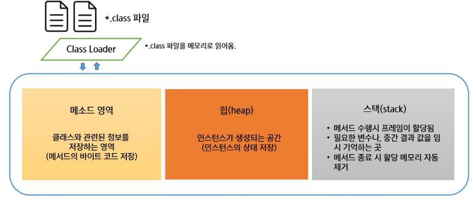
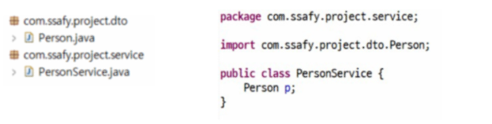
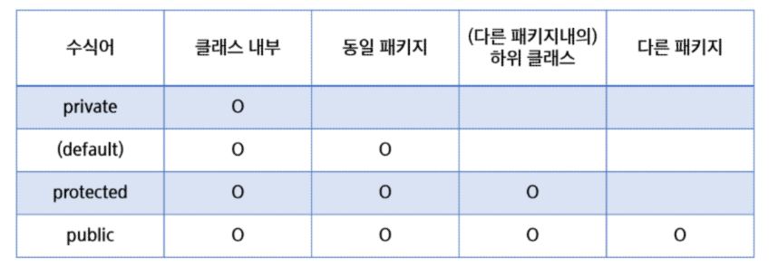

# 객체지향 프로그래밍
- JVM 메모리구조
- 접근제어자
- 객체배열관리
## JVM 메모리구조
### JVM 메모리구조
- JVM 메모리구조
    - Java 언어는 메모리 관리를 개발자가 하지 않음: 메모리 관리는 JVM에 의해 자동으로 처리
    - GC(Garbage Collection): JVM은 가비지 컬렉터를 통해 자동으로 메모리를 관리, 사용되지 않는 객체를 메모리에서 해제

    - JVM의 메모리 영역은 크게 메서드 영역, 힙 영역, 스택 영역으로 나뉨
        - 메서드 영역: 클래스(또는 인터페이스)의 메서드, 필드와 같은 클래스 관련 정보 저장 (설계도 정보를 메모리에 미리 올려놓는다.)(static도 여기에 올라간다.)
        - 힙 영역: 모든 객체(인스턴스의 상태, (멤버)변수)와 배열, 문자열 상수 풀이 저장
        - 스택 영역(LIFO=후입선출): 메서드 호출 시마다 프레임 생성. 프레임 안에는 로컬 변수, 메서드 호출 정보, 중간 연산 결과 등이 저장. 메서드가 종료되면 해당 프레임이 자동으로 제거 됨



    - 이클립스의 경우 .java파일을 src 폴더에 넣고 저장하면 자동 컴파일되서 bin폴더로 감
    - 실행하면 
        - class를 메소드 영역에 설계도 올려 놓음
        - 메인 함수가 스택에 올라감
        - 객체 생성시 heap에, 다른 메서드들은 스택에 올라감

- 객체 생성과 메모리 할당

``` java 
// 이전에 Person, Persontest가 메소드 영역에 들어감
// Persontest의 main함수가 스택영역에 할당
Person p1 = new Person(); // p1에 대한 내용이 힙에 들어감 (name=null,age=0, hobby=null), 참조값이 스택에 들어감 
p1.name="김싸피";          // 힙에서 김싸피 들어감 
p1.age=45;                // 힙에 35 들어감
p1.hobby = "유튜브";       // 힙에 유튜브 들어감
// 
```

### static 특징
1. 로딩 시점
    - static: 클래스 로딩 시
    - non-static: 객체 생성 시

2. 메모리상의 차이
    - static: 클래스당 하나의 메모리 공간만 할당
    - non-static: 인스턴스 당 메모리가 별도로 할당(인스턴스 변수, 상태)
3. 사용 목적
    - static: 모든 인스턴스에 공통으로 사용되는 메서드나 변수를 정의할 때 사용
    - non-static:객체마다 개별적으로 관리되는 상태나 동작을 정의할 때 사용
4. 사용 방법
    - static: 클래스 이름으로 접근
    - non-static: 객체 생성 후 접근
5. static 영역에서는 non-static 영역을 직접 접근이 불가능
    - static 영역은 설계도를 불러오는 시점에 이미 존재하고 non-static영역은 객체 생성 후 생긴다.
6. non-static 영역에서는 static영역에 대한 접근이 가능
    - 인스턴스.static변수명으로도 접근하여 바꿀 수 있으나 권장되지 않음 (모든 인스턴스에서 저 변경 상황이 공유됨)
7. 정적 초기화 블록
    - 클래스가 로드될 때 한 번 실행. 주로 정적 변수를 초기화하는데 사용
``` java
public class Counter{
    public static int staticCount=0;
    public int instanceCount=0;
    // static 초기화 블록
    static {
        staticCount=10;
    }
}
```
## 접근제어자
### 패키지
- 패키지
    - PC의 많은 파일을 관리하기 위해서 폴더를 이용한다.
    - 프로그램의 많은 클래스를 관리하기 위해서 패키지를 이용한다.
    - 패키지는 클래스와 관련 있는 인터페이스들을 모아두기 위한 이름 공간
    - 패키지의 구분은 .(dot) 연산자를 이용한다.
    - 패키지의 이름은 시중에 나와 있는 패키지들과 구분되게 지어야 한다.
    - 일반적으로 소속이나 회사의 도메인을 사용한다.
    - ex) com.ssafy.project_이름.module_이름
- 임포트
    - 다른 패키지에 있는 클래스를 사용하기 위해서는 import 과정이 필요

    - PersonServie.java에서 Person 클래스를 사용하기 위해서는 import 해야 한다.
    - import를 선언 할 때는 import 키워드 위에 패키지 이름과 클래스 이름을 모두 입력하거나, 해당 패키지의 모든 클래스를 포함할 때는 '*'을 사용하기도 한다. (하위 패키지는 안가져옴)
    - `import package_name.class_name`;
    - `import package_name *;`
    - 만약 pkg1 안에 pkg2 안에 pkg3가 있고 각각에 같은 이름을 가진 class가 있다면 pkg1안에서 부르면 기본적으로 pkg1의 class가 나오고 다른 건 import해야 된다.
### 캡슐화
- 객체의 속성와 행위를 하나로 묶고 실제 구현 내용 일부를 외부에 감추어 은닉한다.

### 접근 제어자
- 클래스, 멤버 변수, 멤버 메서드 등의 선언부에서 접근 허용 범위를 지정하는 역할의 키워드이다.
- 접근 제어자의 종류
    - public : 모든 위치에서 접근이 가능
    - protected: 같은 패키지내에서 접근이 가능, 다른 패키지 접근 불가능 ( 단 다른 패키지의 클래스와 상속관계가 있을 경우 접근 가능)
    - (default): 같은 패키지에서만 접근이 허용, 접근제어자가 선언이 안 되었을 경우 기본 적용
    - private: 자신 클래스에서만 접근이 허용
- 클래스(외부) 사용가능: public, default
- 내부클래스, 멤버변수, 메소드 사용 가능: 4가지 모두 가능
- 정리 


- 그 외 제어자
    - static: 클래스 레벨의 요소 설정
    - final: 요소를 더 이상 수정할 수 없게 함
    - abstract: 추상 메서드 및 추상 클래스 작성
    - ...

### 접근자(getter) / 설정자(setter)
- 클래스에서 선언된 변수 중 접근제한에 의해 접근할 수 없는 변수의 경우 다른 클래스에서 접근할 수 없기 때문에, 접근하기 위한 메서드(설정자와 접근자)를 public으로 선언하여 사용 (합법적인 통로를 만든다.)
- 접근자(getter) : 현재 객체의 멤버변수의 값을 반환해주는 함수.
- 설정자(setter) : 현재 객체의 멤버변수의 값을 변경 <=새로운 값은 매개변수로 받는다.
- 보안 로직을 추가할 수 있다. 예를 들어 age의 값의 setter에 0이하의 정수가 들어오면 경고문을 출력

## 객체 배열 관리
### 싱글턴 패턴
- 소프트웨어 디자인 패턴에서는 싱글턴 패턴을 따르는 클래스는 생성자가 여러 차례 호출되더라도 실제로 생성되는 객체는 하나이고 최초 생성 이후에 호출된 생성자는 최초의 생성자가 생성한 객체를 리턴 
- static을 활용하여 클래스가 인스턴스 느낌이 남.

``` java
package modifier06_singleton;

// 점수를 관리하는 객체
// 점수는 1개만 있음.
// => 객체도 1개만 만듦
public class ScoreManager {
	int score;
	
	// 2. 인스턴스는 한개만 만들어서 가지고 있자.
	private static ScoreManager manager = new ScoreManager();
	
	// 싱글턴으로 만들어보자.
	// 1. 오로지 1개만 생성되도록.. => 외부에서 생성자를 호출할 수 없도록 막아야.
	//	- 생성자를 private으로 만든다.
	
	private ScoreManager() {}

	// 3. 인스턴스를 외부에서 가져다 쓸 수 있도록 public으로 getter를 추가
	// 4. 객체생성없이 클래스 이름으로 바로 접근할 수 있도록 static을 추가.
	public static ScoreManager getInstance() {
		return manager;
	}
}
```

## 객체 배열 관리
- 객체 배열 관리란?
    - 정보 관리 시스템 ex) 학사 관리 시스템
    - 캡슐화를 이용하여 클래스 작성
    - DB 대신 배열을 사용해 객체의 정보를 저장
    - 객체의 조회, 추가, 수정, 삭제(CRUD)를 구현
    - 싱글턴 패턴을 사용하여 정보 관리 일원화