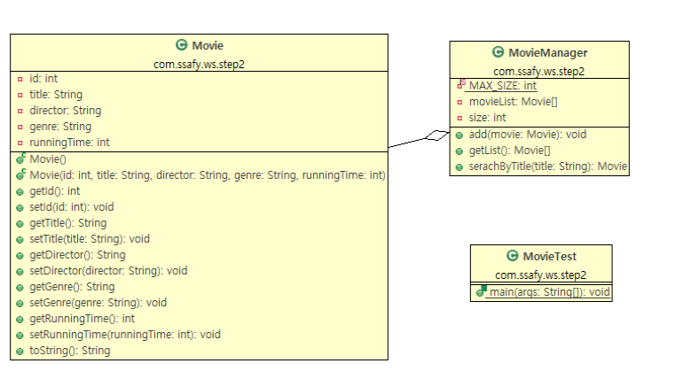
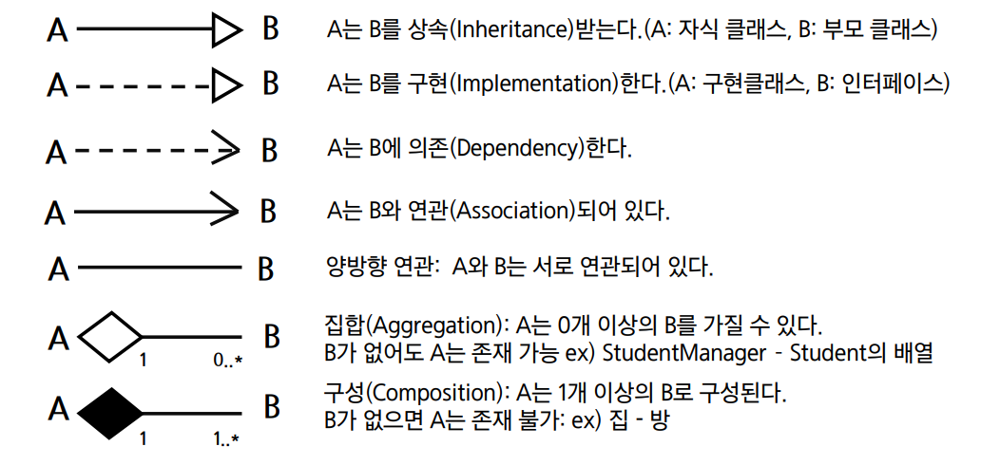

# 객체지향 프로그래밍
- UML 클래스 다이어그램
- 상속
- Object 클래스
- final 키워드
## UML 클래스 다이어그램
### UML 클래스 다이어그램

- 클래스, 멤버필드 등을 나타내는 아이콘들이 있음(이클립스에서 사용하는 아이콘)

- UML 클래스 다이어그램
    - 통합 모델링 언어에서 정의한 다이어그램
    - 많은 종류의 다이어그램이 정의되어 있고, 클래스 다이어그램은 그 중 하나
    - 패키지는 폴더아이콘처럼, 클래스는 직사각형으로 나타낸다.
- 클래스
    - 사각형 모양으로 나타냄
    - Level of Detail에 따라 다양한 모습으로 나타낼 수 있음
    - visibility는 다음 중 하나
        - +public visibility
        - #protected visibility
        - -private visibility
        - ~package visibility
- 인터페이스, 추상 클래스
    - 이름 앞에 인터페이스는 <<interface>>를 추가
    - 추상 클래스는 <<abstract>>를 추가하거나 중괄호 표기법으로 abstract임을 뒤 또는 아래에 표시하거나 이텔릭체로 나타냄
- 관계: 클래스, 인터페이스 간의 관계를 나타냄

- A는 B와 연관되어 있다 = A가 B를 가지고 있다(멤버 변수)
- A는 B에 의존한다 = A는 B를 사용한다.

## 상속
### 상속
- 상위 클래스의 속성과 메서드를 물려받아 확장하여 새로운 자식 클래스를 정의하는 것
    - 상위 클래스 = 부모클래스 = super class
    - 하위 클래스 = 자식클래스 = sub class

``` java
public class 자식클래스명 extends 부모클래스명{
    추가내용;
}
``` 

- java에서 상속받은 변수나 메서드는 부모클래스에서 온거란게 표시됨

- Object: java의 모든 class는 Object를 상속한다.

## about 상속
1. 확장성, 재 사용성
    - 부모의 생성자와 초기화 블록은 상속x
2. 클래스 선언 시 extends 키워드를 명시
    - 자바는 다중 상속 허용x, 단일 상속 지원 - 다중 상속을 지원하기 위해 인터페이스 사용
3. 관계
    - 부모 (상위,Super) 클래스: Person
    - 자식 (하위, Sub) 클래스: Student
4. 자식 클래스는 부모 클래스의 멤버변수, 메소드를 자신의 것처럼 사용할 수 있다.
    - (접근  제한자에 따라 사용 여부가 달라진다.) 
5. Object 클래스는 모든 클래스의 조상 클래스
    - 별도의 extends 선언이 없는 클래스는 extends Object가 생략
6. super 키워드
    - super를 통해 조상 클래스의 생성자 호출
        - 생성자 내부에서 super() 쓰지 않았다면 super(); 생략되어 있는 형태
    - super를 통해 조상 클래스의 메서드 호출
7. 오버라이딩 (재정의, overriding)
    - 상위 클래스에 선언된 메서드를 자식 클래스에서 재정의 하는 것
    - 메서드의 이름, 반환형, 매개변수(타입,개수,순서) 동일해야 한다
    - 하위 클래스의 접근제어자 범위가 상위 클래스보다 크거나 같아야 한다. (부모클래스의 내용(메서드)을 자식이 감출 수 없다.)
    - 조상보다 더 큰 예외를 던질 수 없다. (위와 이 조건은 부모 대신 자식 쓸 때 안되게 되는 걸 방지하기 위해 넣은 것)
    - 메서드 오버로딩과 혼동하지 말것
    - 웬만하면 @Overrid를 써라(없어도 문제는 없긴 함)

## Object
### Object
- Object 클래스
    - 가장 최상위 클래스로 모든 클래스의 조상
    - Object의 멤버는 모든 클래스의 멤버
! [image](./object.PNG)

- toString 메서드
    - 객체를 문자열로 변경하는 메서드
``` java
public String toString(){
    return getClass().getName()+"@"+Integer.toHexString(hashCode()); // 클래스명@해시코드값
}
```

- 정작 궁금한 내용은 해시코드+클래스 이름이 아닌 내용이 궁금

``` java
@Override
public String toString(){
    return "Student [name="+name+", age=" +age+",major="+major+"]";
}
```
- equals 메서드
    - 두 객체가 같은지를 비교하는 메서드 이것과 ==은 주소비교 (String의 equals는 문자열 값 비교)
``` java
public boolean equals(Object obj){
    return (this== obj);
}

    - 두 개의 레퍼런스 변수가 같은 객체를 가리키고 있는가?
    - 우리가 비교할 것은 정말 객체의 주소 값인가??
        - 두 객체의 내용을 비교할 수 있도록 equals 메서드 재정의
        - 객체의 주소 비교: ==활용
        - 객체의 내용 비교: equals 재정의
- hashCode
    - 객체의 해시코드: 시스템에서 객체를 구별하기 위해 사용되는 정수값
    - HashSet, HashMap 등에서 객체의 동일성을 확인하기 위해 사용
``` java
String s1 = new String("Hello");
String s2 = new String("Hello");
```

    - 위의 s1,s2는 주소값은 다르나 해시값이 같음

## final
### final
- final
    - 해당 선언이 최종 상태, 결코 수정될 수 없음
    - final 클래스: 상속 금지
    - final 메소드: overriding 금지
    - final 변수: 더 이상 값을 바꿀 수 없음 상수화 (보통 대문자 snake case)
    