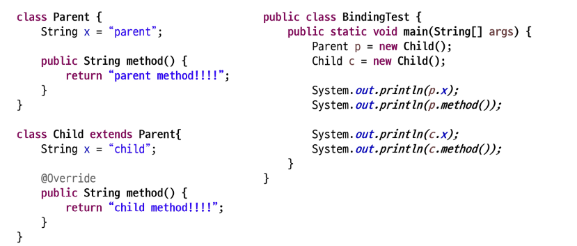

# 객체지향 프로그래밍
- 다형성
- 추상클래스
## 다형성 (Polymorphism)
### 다형성
- 다형성
    - 실제 하나의 객체를 다양한 타입의 참조로 사용하는 것
    - 다양한 유형의 여러 객체를 하나의 공통된 타입으로 참조할 수 있는 것
    - 상속 관계에 있을 때 조상클래스 타입으로 자손 클래스의 객체를 참조할 수 있다.
    - 다양한 타입으로 참조하더라도 참조만 바뀔 뿐 실제 객체 자체(객체의 행위)는 변함이 없다.
    - 하나의 이름으로 다양한 기능을 구현할 수 있다.
    - 다형성의 종류
        - 임시 다형성: 메서드 오버로딩, 연산자 오버로딩 (문자열+문자열 이 이어지는 것도 연산자 오버로딩의 일종이라고 볼 수 있다.)
        - 매개변수 다형성: 제네릭
        - 서브타입 다형성: 상속 관계에 있을 때 조상 클래스의 타입으로 자손 객체 참조 가능
    - 다형성의 장점
        - 코드 재사용성 증가, 유연성과 확장성 증가, 가독성 개선
- 상속관계에 있을 때 조상 클래스의 타입으로 자손 클래스 객체를 참조할 수 있다. 

``` java
조상클래스 이름 = new 자식클래스();
자식클래스 이름 = new 자식클래스();
조상클래스 이름 = new 조상클래스();
자식클래스 이름 = new 조상클래스(); //이건 안됨
```

- 부모클래스의 타입으로 참조를 바꾸면 
    - 부모클래스에 정의된 메서드, 변수만 접근 가능
    - 실제 메모리에 올라와 있는 객체는 더 많은 메서드와 멤버 변수가 있더라도 접근 불가능하다.
- 동적 바인딩
    - 상속을 하면서, 자손 클래스에서 오버라이딩하면 타입과 관계없이 실제 객체가 가진 메서드가 호출된다. 
- 참조함수의 형 변환
    - 자손타입 ->조상타입 (묵시적 형 변환)
    - 형 변환 생략 가능

``` java
Student st = new Student();
Person p=st;
```

    - 조상타입 ->자손타입 (명시적 형변환)
    - 형 변환 생략 불가능 (프로그래머가 책임 져라) - 자손 생성후 부모 갔다가 다시 오는 경우에만 에러가 안 뜸 (언제든 컴파일은 되지만 실행 시 에러가 날수도.. 이는 컴파일에서 잡은 에러는 문법적 오류만 잡기 때문)

``` java
Person p = new Person();
Student st=(Student) p;  (오류)

Person p = new Student();
Student st = (Student)p;
```

- instanceof 연산자
    - 참조변수가 참조하고 있는 인스턴스의 타입을 확인하기 위해서 사용
    - 결과를 boolean으로 반환
    - true가 반환이 되면 해당 타입으로 형 변환 가능 (객체 instanceof 클래스명= 객체가 해당 클래스로 묵시적 형변환이 가능한가? 즉 A는 B이다에 대한 참 거짓)
    - 이를 활용하면 특정 범위에서 Student 메서드만 써도 됨

``` java
if (person instanceof Student) {        // Student인 객체만 출력
    Student student = (Student) person; 
    student.study();
}
```

- 참조 변수와 인스턴스 멤버의 관계


- 답: parent x,child,child x,child
    - 다형성은 행위에 대한 내용이므로 객체가 가지고 있는 메서드에만 적용   
    - 멤버 변수에는 다형성이 적용되지 않는다.
    - static메서드는 클래스의 것이므로 다형성이 적용되지 않는다. 

- 다형성의 활용 - 다른 타입의 객체를 다루는 배열
- 다형성의 활용 - 매개변수의 다형성

## 추상클래스

``` java
public class Chef{
    String name;
    int age;
    String speciality;
    public void eat() {
        System.out.println("음식을 먹는다.");
    }

    public void cook() {
        System.out.println("전공에 맞는 요리한다.");
    }
}
public class KFoodChef extends Chef{
    @Override
    public void cook(){
        System.out.println("한식을 요리한다.");
    }
}
public class JFoodChef extends Chef{
    @Override
    public void cook(){
        System.out.println("일식을 요리한다.");
    }
}
```

- 추상 클래스 정의
    - 한식요리사, 일식요리사 모두 cook 메서드를 가지고 있음
    - 조상클래스 Chef에 선언하고 각 자손 클래스에서 override예정
    - 사용되지 않는 Chef클래스에 cook()메서드를 없애면 override가 안됨..
    - 따라서 cook()메서드는 자손 클래스에서 반드시 재정의하기에 구현이 무의미하므로 선언부만 남기고 구현부는 ;로 대체
    - 구현부가 없으므로 abstract 키워드를 메서스 선언부에 추가 ex) `public abstract speak()`
    - 객체를 생성할 수 없는 클래스라는 의미로 클래스 선언부에 abstract 추가 ex) `public abstract class`
 - 추상 클래스 특징
    - abstract 클래스는 상속 전용의 클래스
    - 클래스에 구현부가 없는 메서드가 있으므로 객체를 생성할 수 없음 (참조는 문제없음)
    - 상위 클래스 타입으로 자식을 참조할 수는 있음 (다형성 ok)
    - 조상 클래스에서 상속 받은 abstract 메서드를 재정의하지 않은 경우 클래스 내부에 abstract 메서드가 있으므로 자식 클래스는 abstract 클래스가 되어야 함
- 추상 클래스 사용하는 이유
    - abstract 클래스는 구현의 강제를 통해 프로그램의 안정성 향상

- 클래스와 추상클래스 비교

|      | 클래스 | 추상 클래스 |
| -------- | ---- | --------- |
| 정의   | 구체적인 객체(인스턴스)를 생성할 수 있는 클래스   | 추상 메서드를 포함할 수 있는 클래스 <br> 객체(인스턴스) 생성이 불가능한 클래스 <br> 추상적 개념이어서 구체적인 객체 생성이 논리적으로 맞지 않는 클래스, 객체 생성이 필요 없는 클래스   |
| 객체 생성 | 가능 | 불가능 |
|추상 메서드|포함 불가|추상 메서드를 포함할 수 있음 <br> (추상메서드없어도 추상클래스 생성가능-객체생성을 못하도록 강제)|
|상속|다른 클래스에 의해 상속될 수 있음|다른 클래스에 의해 상속되어 추상 메서드가 구현되어야만 객체 생성 가능(세부 구현 강제)<br> 만약 하위 클래스가 추상 메서드를 모두 구현하지 않으면 하위 클래스도 추상 클래스|
|키워드|class 키워드 사용|abstract class 키워드 사용|
|목적|완전한 클래스를 정의하여, 해당 클래스로 객체를 생성하기 위함|객체 생성방지 <br> 공통된 기본 기능을 정의 (코드중복 제거) <br> 하위 클래스에서 세부 구현을 강제|
|타입|타입으로 사용 가능|타입으로 사용 가능|
|다이어 그램|정자체|이탤릭체 혹은 어딘가에 abstract 표시|