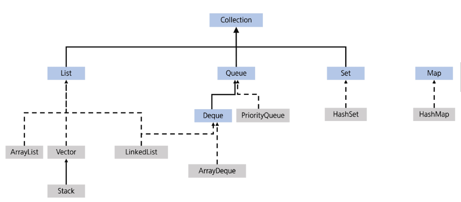
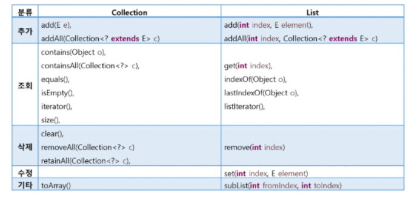
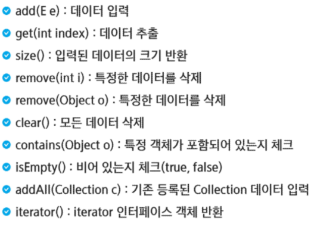
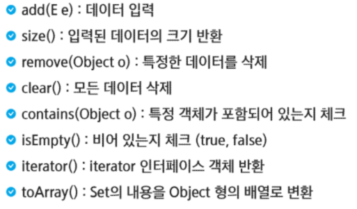
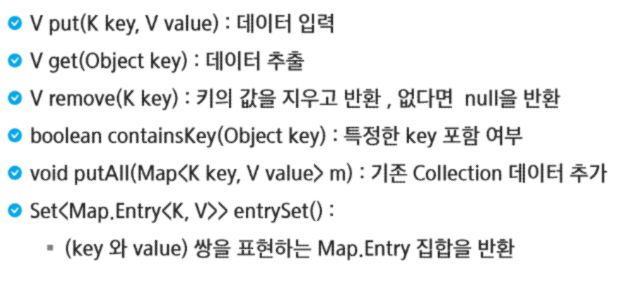
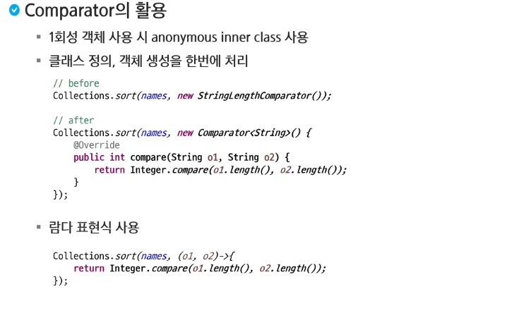

# 객체지향 프로그래밍
- 컬렉션 프레임워크
- 정렬

## 컬렉션 프레임워크
### 자료 구조
- 자료 구조(Data Structure)
    - 데이터에 효율적으로 접근하기 위해 선택되는 데이터의 조직 및 저장 형식
    - 데이터값들의 모음, 이들 간의 관계, 데이터에 적용될 수 있는 연산의 모음
- 자료 구조의 분류
    - 정적 자료구조: 크기가 고정된 자료 구조(예: 배열)
    - 동적 자료 구조: 크기가 변할 수 있는 자료 구조 (예: 리스트, 스택, 큐)
- 자료 구조의 선택 기준
    - 데이터 접근 속도
    - 메모리 사용 효율성
    - 삽입 및 삭제의 효율성
    - 순서 유지 여부
    - 중복 데이터 허용 여부
### 컬렉션 프레임워크
- 자바의 컬렉션 프레임워크
    - 다양한 자료 구조를 구현하여 제공
    - 개발자가 다양한 상황에 맞게 적절한 자료구조를 선택할 수 있음
    - 구성요소: 주요 인터페이스, 구현 클래스, 유틸리티 클래스로 구성
- 주요 인터페이스 (아래의 인터페이스는 모두 제네릭)
    - Collection: List, Set, Queue 등 컬렉션의 상위 인터페이스
    - List: 순서가 있는 컬렉션, 중복을 허용
    - Set: 중복을 허용하지 않는 컬렉션
    - Queue: FIFO(First in First out) 방식의 컬렉션
        - 한 쪽에서는 삭제만, 한 쪽은 삽입만 가능
    - Deque: 양쪽 끝에서 요소의 삽입/삭제가 가능한 컬렉션
    - Map<K,V>: 키-값 쌍으로 이루어진 요소의 컬렉션
- 주요 구현 클래스
    - ArrayList: 동적 배열로 구현된 List (처음엔 정해진 크기로 배열있고 초과시 크기를 2배로 늘리며 기존 배열을 복사해옴, 반대로 줄 수도 있음)
    - LinkedList: 이중 연결 리스트로 구현된 List와 Deque
    - Stack: LIFO 방식의 컬렉션
    - HashSet: 해시 테이블 기반의 Set
    - HashMap<K,V>: 해시 테이블 기반의 Map
    - PriorityQueue: 힙(heap) 기반의 우선순위큐
- 유틸리티 클래스
    - Collections: 컬렉션 객체의 정렬, 검색 등을 위한 정적 메서드 제공
    - Arrays: 배열을 다루기 위한 유틸리티 메서드 제공
- Collection 프레임워크 계층도


- Collection 인터페이스
    - List, Set, Queue의 상위 인터페이스
- Collection 인터페이스의 주요 메서드

| 메서드     | 설명 |
| -------- | ---- | 
| `boolean add(E e)`   | 컬렉션에 요소를 추가 <br> 요소가 성공적으로 추가되면 True를 반환하고 그렇지 않으면 false를 반환   |
|`boolean remove(Object o)`|컬렉션에서 지정된 요소를 제거 <br> 요소가 성공적으로 제거되면 true를 반환하고, 그렇지 않으면 false를 반환|
|`boolean contains(Object o)`|컬렉션에 지정된 요소가 포함되어 있는지 확인 <br> 포함되어 있으면 true를 반환하고, 그렇지 않으면 false를 반환|
|`int size()`|컬렉션의 요소 개수를 반환|
|`void clear()`|컬렉션의 모든 요소를 제거| 
|`Iterator<E> iterator()`|컬렉션의 요소들을 반복할 수 있는 Iterator 객체를 반환|
|`Object[] toArray()`|컬렉션의 모든 요소를 포함하는 배열을 반환|

## List
### List
- 특징: 순서가 있고, 중복을 허용 (배열과 유사)
- 리스트를 사용하려면 기본적으로 `import java.util.List` 해야함
- 구현 클래스
    - ArrayList 
    - LinkedList
    - Vector(옛날 JDK)
- 내부적으로 배열을 이동하여 데이터를 관리 (ArrayList, Vector)
- 배열과 다르게 크기가 유동적으로 변환 (동적 자료구조)
- 배열을 다루는 것과 유사하게 사용할 수 있음
- 주요 메서드


- Array
    - 같은 타입의 데이터를 묶어 사용한느 자료구조
    - 접근 속도가 빠름
    - 크기를 변경할 수 없어 추가 데이터를 넣을 때, 새로운 배열을 만들고 복사함.
    - 데이터 삭제 시, 인덱스를 재조정하기 위해 전체 데이터를 옮겨야 함.
    - ArrayList 역시 Array를 활용하므로 이 같은 특징을 가지고 있음.
### ArrayList
- 기본적으로 `import java.util.ArrayList`해야함
- 메소드

### LinkedList
- 각 요소를 Node로 정의하고 Node는 다음 요소의 참조 값과 데이터로 구성됨
- 각 요소가 다음 요소의 링크 정보를 가지며 연속적으로 구성될 필요가 없음.

## Set
### Set
- 특징: 순서가 없고, 중복을 허용하지 않음
- 장점: 빠른 속도, 효율적인 중복 데이터 제거 수단
- 단점: 단순 집합의 개념으로 정렬하려면 별도의 처리가 필요하다.
- 구현 클래스
    - HashSet: 해시테이블로 구현
    - TreeSet: 트리구조로 구현
- Set 메서드



## Map
### Map
- 특징: Key(키)와 value(값)를 하나의 Entry로 묶어서 데이터 관리, 순서는 없으며, 키에 대한 중복은 없음 (값은 중복 가능)
- 장점: 빠른 속도
- 구현 클래스
    - HashMap
    - TreeMap
- Map 메서드



## Queue
### Queue
- Queue는 인터페이스, 구현체는 LinkedList를 사용
- 큐 자료구조: FIFO 가장 먼저 들어온 값이 가장 먼저 나감
- `add(E e)`: 데이터 추가, 추가될 수 없으면 예외 발생
- `boolean offer(E e)`: 데이터를 추가, 추가될 수 없으면 false, 되면 true 리턴
- `E peek()`: 가장 앞에 있는 데이터 조회, 데이터 없으면 null
- `E element();`: 가장 앞에 있는 데이터 조회, 데이터 없으면 예외 발생
- `E remove()` : 가장 앞에 있는 데이터 빼내기, 삭제할 수 없으면 예외 발생
- `E poll()`: 가장 앞에 있는 데이터 빼내기, 삭제할 수 없으면 return null;
- `boolean isEmpty()`: 큐가 비어 있는지 여부

## Stack
### Stack
- Stack 클래스를 사용
- 스택 자료구조: LIFO 가장 나중에 들어온 값이 가장 먼저 나감
- `E push(E,e)`: 데이터를 추가
- `E peek()`: 가장 위에 있는 데이터 조회
- `E pop()`: 가장 위에 있는 데이터 빼내기
- `boolean isEmpty()`: 스택이 비어 있는지여부

## Deque
### Deque
- Deque는 인터페이스, 구현체는 ArrayDeque, LinkedList를 사용
- 양쪽 끝에서 자유롭게 원소의 추가, 삭제가능
- `addFirst(E e)`: 맨 앞에 데이터를 추가
- `addLast(E e)`: 맨 뒤에 데이터 추가
- `E removeFirst()`: 가장 앞에 있는 데이터 제거
- `E removeLast()`: 가장 뒤에 있는 데이터 제거
- `E peekFirst()`: 가장 앞에 있는 데이터 조회
- `E peekLast()`: 가장 뒤에 있는 데이터 조회
- `boolean ifEmpty()`: 덱이 비어있는지 여부 검사

## 정렬
### 정렬
- 요소들을 특정 기준에 맞추어 오름차순 또는 내림차순으로 배치 하는 것
- 순서를 가지는 Collection들만 정렬 가능
- Collections의 sort()를 이용한 정렬
- Comparable interface (사용자정의 클래스) (클래스에 구현)

``` java
public interface Comparable<T> {
    public int compareTo(T o); // 양수: 자리바꿈, 음수 자리 유지, 0: 동일 위치
}
```

- Comparator의 활용 (Comparator를 만듦)
    - 객체가 Comparable을 구현하고 있지 않거나 사용자 정의 알고리즘으로 정렬하려는 경우
        - String을 알파벳 순이 아니라 글자 수 별로 정렬을 하고 싶다.
    - `sort(List<T> list, Comparator<?Super T>c)`
- Comparator의 활용
    - 1회성 객체 사용 시 anonymous inner class 사용
    - 클래스 정의, 객체 생성을 한번에 처리
    - 람다 표현식 사용


