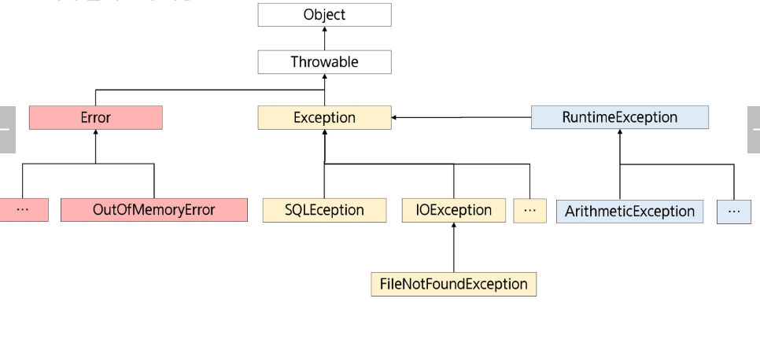
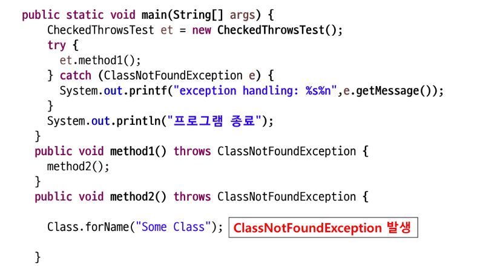
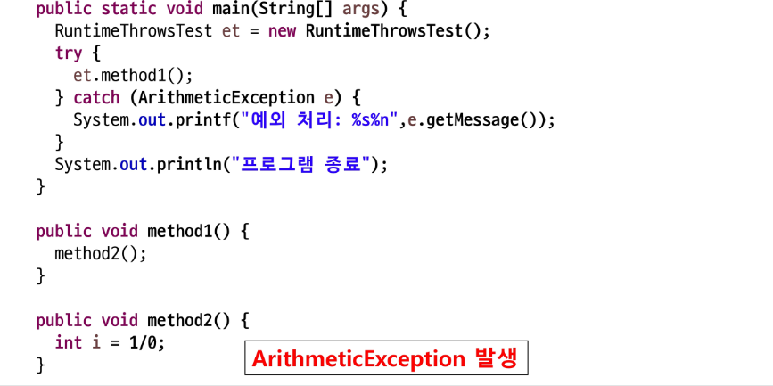

# 객체지향 프로그래밍
- 예외처리
## 예외처리
### 예외처리
- 프로그램 오류(에러, Error)
    - 어떤 원인에 의해 오동작하거나 비정상적으로 종료되는 경우

- 발생 시점에 따른 구분
    - 컴파일 에러: 컴파일 도중 컴파일러가 발견하는 오류
    - 런타임 에러: 컴파일은 성공적으로 진행되었으나, 프로그램 실행 중에 발생하는 오류
    - 논리적 에러: 컴파일도 되고 프로그램도 실행되었으나, 프로그램이 의도대로 동작하지 않는 오류. 프로그램이 정상적으로 실행되고 종료되었지만 결과가 예상과 다른 경우
- 에러와 예외
    - 에러: 발생하면 복구할 수 없는 심각한 오류
       - An Error is a subclass of Throwable that indicates seious problems that a reasonable application should not try to catch
        - 메모리 부족
        - 스택 오버 플로우
        - ...
    - 예외: 프로그래머가 적절한 코드를 통해 대비할 수 있는 오류
        - An exception is an event, which occurs during the execution of a program, that disrupts the normal flow of the program's instructions
        - 클래스 형 변환 실패
        - 파일 읽기 실패
- 예외 처리
    - 예외 발생 시 프로그램의 비 정상 종료를 막고 정상적인 실행 상태를 유지하는 것
    - 예외의 감지 및 예외 발생 시 동작할 코드 작성 필요
- 예외의 종류: 체크 예외와 언체크 예외
    - 체크 예외: 컴파일 시점에서 예외 처리가 요구(강제)되는 예외 (안하면 컴파일 안됨)
        - 예: IOException, SQLException
    - 언체크 예외: 실행 시점에서 발생하는 예외로 컴파일러가 예외 처리를 강제하지 않음 (컴파일은 통과)
        - 예: NullPointerException, ArrayIndexOutOfBoundsException
- 예외 클래스의 계층

    - Exception이 check Exception, RuntimeException이 unchecked Exception이다.

- 예외 발생 예시

``` java
public static void main(String[] args) {
    int[] nums = {10};
    System.out.println(nums[2]); // ArrayIndexOutofBoundsException - 
}
```

- 예외 처리 키워드
    - 직접 처리
        - try{}: 예외가 발생할 가능성 있는 코드를 포함하는 블록
        - catch (예외매개변수) {}: 예외가 발생했을 때 실행할 코드 블록
        - finally {}: 예외 발생 여부와 상관없이 항상 실행되는 코드 블록
    - 간접 처리
        - throws: 메서드 시그니처에 사용되며, 해당 메서드가 특정 예외를 던질 수 있음을 명시
    - 예외를 직접 발생시킬 때
        - throw: 예외를 명시적으로 발생시키는 키워드
- 예외처리 (try~catch 구문)
    - 프로그램 실행 시 발생할 수 있는 예외에 대한 대비코드 작성
    - 프로그램의 비정상적인 종료를 막고, 정상적인 상태를 유지할 수 있도록 함

``` java
try {
    // 1.예외가 발생할 수 있는 코드
    // 2. 정상코드
} catch (SomeException e){
    // 3. 예외가 발생했을 때 처리할 코드
}
// 4. 일반 코드
```

    - 중괄호(블록) 생략 불가능
    - 중첩된 예외처리: 블록 안에 또 다른 try~catch 구문 올 수 있음
    - 위의 경우
        - 예외 발생 안하면 1-2-4
        - catch 되었을 때: 1-3-4
        - 예외 발생하였으나 catch가 안되면: 처리가 안됨 (1-종료)
    
- 다중 예외처리
    - try 블록에서 여러 종류의 예외가 발생할 경우
    - 하나의 try 블록에 여러 개의 catch 블록 추가 가능
- 다중 예외처리 유의 사항
    - 예외 객체에 해당하는 catch 문장을 찾을 때는 다형성이 적용됨
    - 상속 관계에서 상위 타입의 예외가 먼저 선언되는 경우 뒤에 등장하는 catch블록은 동작할 기회가 없음
    - 상속 관계가 없는 경우는 무관
    - 상속 관게에서는 작은 범위에서 큰 범위순으로 정의
- Exception 인스턴스의 주요 메서드
    - getMessage(): 발생된 예외에 대한 구체적인 메시지를 반환 ex) `e.getMessage()`
    - printStackTrace(): 예외 발생 당시의 호출 스택(Call Stack)을 출력한다. ex) `e.printStackTrace()`

- 메서드에서 예외 던지기
    - 메서드 선언부에 throws 키워드를 사용하여 예외 작성
    - 예외가 여러 개일 경우 ,를 이용하여 나열
    - 메서드가 예외를 처리하는 것이 아닌 전달 (나를 호출한 곳으로)
    - 조상 타입의 예외로 처리 가능 (다형성)
- checked exception과 throws

    - main에서까지 미루면 예외처리가 안되고 비정상적 종료가 일어남
- runtime exception과 throws

    - throws가 의미가 없음
- 메서드 재정의(오버라이드)와 throws
    - 메서드 재정의 시 조상클래스 메서드가 던지는 예외보다 부모 예외를 던질 수 없다. (자식은 부모의 기능을 숨길 수 없다.)
- finally 구문
    - finally는 예외 발생 여부와 상관 없이 언제나 실행

``` java
try {
    //예외 발생가능 코드
} catch{
    //예외 처리 코드
} finally {
    // 예외 상관없이 항상 수행해야 하는 코드
}
``` 

    - 예외 발생시 -> try-catch-finally 순으로 코드 실행
    - 예외 미발생시 -> try-finally 순으로 코드 실행
    - 중간에 return이 있어도 finally 블록 수행 후 반환

- 자동 차원 반납 구문 (try with resources)
    - 자원 등을 반납할 때 finally에서 close()를 통해 반납을 주로 함.
    - 코드가 지저분해지고 다른 예외상황을 발생시킬 수 있음
    - try() -> 괄호 안에 객체를 생성하는 코드를 작성하면, 해당 객체는 close()를 호출하지 않아도 블록을 벗어나는순간 close()가 호출됨
    - 해당 객체의 클래스가 AutoCloseable이라는 인터페이스를 구현한 클래스이어야만 함.
- 사용자 정의 예외
    - 기존에 정의된 예외 이외에 사용자가 직접 정의 예외를 작성할 수 있음.
    - 대부분 Exception 또는 RuntimeException 클래스를 상속받아 작성
        - checked exception 활용: 명시적 예외 처리 또는 throws 필요
            - 코드는 복잡해지지만 처리, 누락 등 오류 발생 가능성은 down
        - runtime exception 활용: 묵시적 예외 처리 가능
            - 코드가 간결해지지만 예외 처리, 누락 가능성 발생