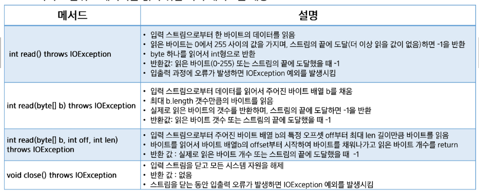
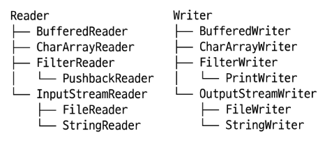
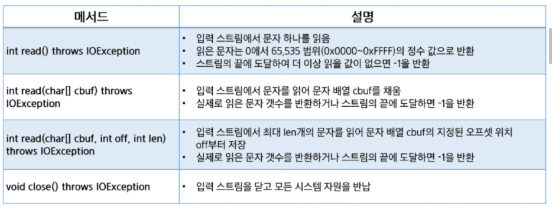
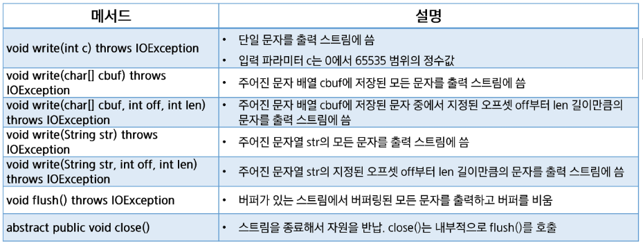
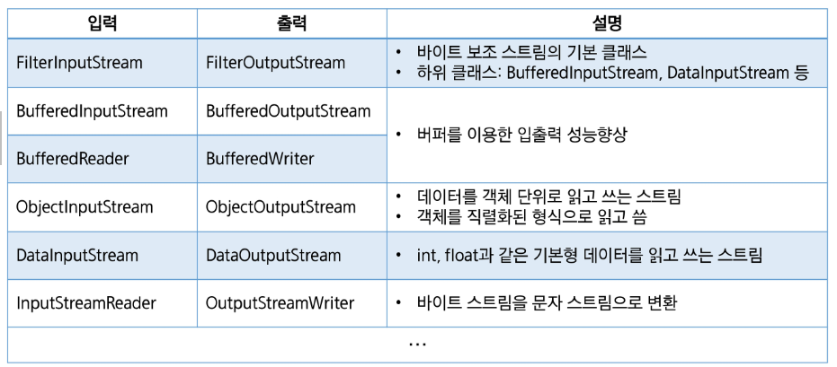

# 객체지향 프로그래밍
- 파일
- 입출력과 스트림
- 보조 스트림
- 객체 직렬화
## 파일
### File 클래스
- File 클래스
    - 파일 및 디렉토리를 객체로서 관리
    - 특정 파일 또는 디렉토리에 대응되는 객체를 생성
    - 파일 및 디렉토리에 대한 정보를 관리하고 조작할 수 있는 다양한 메서드를 제공
    - 파일 객체의 생성: 경로를 문자열로 전달, 해당 파일 또는 디렉토리 경로에 대응되는 객체 생성
        - `File file = new File("파일 또는 디렉토리의 경로");`
    - 문자열 경로는 상대 경로 또는 절대 경로를 사용
    - 경로가 절대 경로인지 아닌지는 isAbsolute() 메서드로 확인
    - 상대 경로
        - 현재 프로그램이 실행회든 위치(소스코드의 위치가 아님)가 기준(STS를 사용할 때는 현재 프로젝트 폴더 기준)
        - 경로가 C:\나 /로 시작하지 앟음
    - 절대 경로: 윈도우의 경우 드라이브 문자(예 C:\), 유닉스 계열의 경우 /로 시작하면 절대 경로
- File 클래스의 다양한 메서드
    - `String getName()` : 파일 또는 디렉토리의 이름을 반환
    - `String getPath()` : 파일 또는 디렉토리의 경로 이름을 반환
    - `String getAbsolutePath()`: 파일 또는 디렉토리의 절대 경로 이름을 반환
    - `String getParent()`: 파일 또는 디렉토리의 부모 경로 이름을 반환
    - `boolean exists()`: 파일 또는 디렉토리가 존재하는 지 여부를 테스트
    - `boolean createNewFile()`: 새로운 빈 파일을 생성. 파일이 이미 존재하면 false를, 그렇지 않으면 true를 반환
    - `boolean delete()` : 파일 또는 디렉토리를 삭제 
    - `boolean mkdir()` : 새로운 디렉토리를 생성. 상위 디렉토리가 존재해야 함
    - `boolean mkdirs()` : 필요한 상위 디렉토리를 포함하여 새로운 디렉토리를 생성
    - `long length()`: 파일의 크기를 바이트 단위로 반환

## 입출력과 스트림
### 입출력과 스트림
- 입출력(I/O Input/Output)
    - 데이터의 입력 / 출력
    - 컴퓨터 내부 혹은 외부의 장치와 데이터를 주고 받는 행위
- 스트림(Stream)
    - 데이터를 운반하는데 사용되는 통로
    - 물흐름과 같이 단방향으로만 통신 가능
    - 하나의 스트림을 이용하여 입력과 출력 처리 불가능
    - 입력 스트림, 출력 스트림
- 노드(Node)
    - 데이터의 출발 지점, 혹은 목적지
    - ex) 키보드, 모니터, 파일, 자바 프로그램,...
- 데이터 타입에 따른 스트림의 분류

    - 뒤에 stream붙으면 바이트 스트림

- 스트림의 종류
    - 데이터의 타입: 바이트, 문자
    - 데이터의 방향: 입력, 출력
    - 노드의 종류: 표준 입출력, 파일, ...
    - 스트림의 성격: 노드 스트림 / 보조 스트림

### 바이트 스트림
- 바이트 스트림
    - 바이트 단위로 데이터를 입력받거나 출력하기 위한 스트림 클래스
    - 주로 이진 파일(이미지, 오디오, 비디오,...)을 읽고 쓰는 데 사용
    - 최상위 추상 클래스: InputStream, OutputStream
    - 노드의 종류에 따라 다양한 서브 클래스 사용

- InputStream 클래스
    - 모든 바이트 입력 스트림의 최상위 추상 클래스
    - 바이트 단위로 데이터를 읽기 위한 여러 메서드를 제공

- OutputStream 클래스
    - 모든 바이트 출력 스트림의 최상위 추상 클래스
    - 바이트 단위로 데이터를 출력하기 위한 여러 메서드 제공

### 문자 스트림
- 문자 스트림
    - 바이트 스트림과는 달리 문자(16비트 유니코드) 단위로 데이터를 처리
    - 자바는 내부적으로 UTF-16 인코딩을 사용하여 문자를 메모리에 저장
    - 주로 키보드에서 입력을 받거나 텍스트 파일을 읽고 쓰는 데 사용
    - 문자 스트림의 최상위 추상 클래스: Reader, Writer
    - FileReader와 FileWriter가 파일에 텍스트를 읽거나 쓸 때는 현재 JVM이 돌아가고 있는 시스템의 기본 문자 인코딩 방식을 사용
    - 기본 문자 인코딩 확인:
        - `System.getProperty("file.encoding");`

- Reader 클래스
    - 자바의 모든 문자 입력 스트림의 최상위 추상 클래스
    - 문자 단위로 데이터를 입력받기 위한 다양한 메서드 정의

- Writer 클래스
    - 자바의 모든 문자 출력 스트림의 최상위 추상 클래스
    - 문자 단위로 데이터를 출력하기 위한 다양한 메서드 제공

## 보조 스트림
### 보조 스트림
- 스트림의 종류: 노드 스트림, 보조 스트림
- 노드 스트림 (Node Stream)
    - 실제 노드에 연결
    - 데이터의 실제 입출력을 담당
- 보조 스트림 (Filter Stream)
    - 실제 노드에 연결되지 않음
    - 다른 스트림을 감싸서 추가적인 기능(ex:버퍼링, 데이터 형식 변환, 객체 직렬화)을 제공
    - 여러 보조 스트림을 체인 형태로 연결하여 다양한 기능을 조합할 수 있음
    - 노드 스트림 없이 단독으로 사용할 수 없음
    - 보조 스트림의 close()를 호출하면 노드 스트림의 close()까지 호출됨
- 보조 스트림의 종류

    - BufferedInputStream, BufferedReader 자주 사용함.

## 객체 직렬화
### 객체 직렬화
- 직렬화
    - 객체의 상태를 바이트 스트림으로 변환하여 저장하거나 전송할 수 있도록 하는 과정
    - 역직렬화: 직렬화된 바이트 스트림을 다시 객체로 복원하는 절차
    - ObjectOutpusStream: 객체를 바이트 스트림으로 변환하는 스트림
    - ObjectInputStream: 바이트 스트림을 객체로 복원하는 스트림
- 직렬화 가능 클래스 만들기
    - 객체가 ObjectOutpustStream에 의해 직렬화하기 위해서는 해당 객체의 클래스가 반드시 Serializable 인터페이스를 구현해야 함
    - Serializable 인터페이스: 메서드를 포함하지 않으며, 직렬화 가능 여부를 표시하는 마커 인터페이스
    - 해당 인터페이스를 구현한 클래스를 상속받았다면 구현하지 않아도 된다.
    - 자손에만 구현했다면 조상클래스는 직렬화 되지 않는다.
    - 직렬화 과정에서 제외하고 싶은 필드는 transient 키워드를 통해 직렬화 대상에서 제외시킬 수 있음
    - seialVersionUID: 클래스의 버전 관리를 위해 serialVersionUID를 명시적으로 선언하는 것을 권장 (역직렬화할때 클래스가 변경되면 원래 객체로 복원이 안되기 때문)
    - 클래스의 변경으로 인한 역직렬화 오류를 방지하는 데 사용
