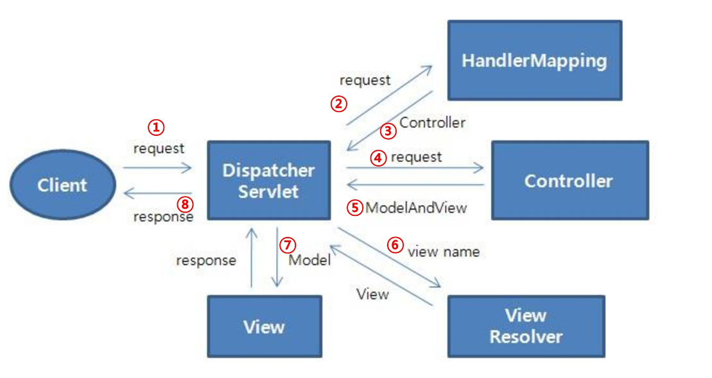
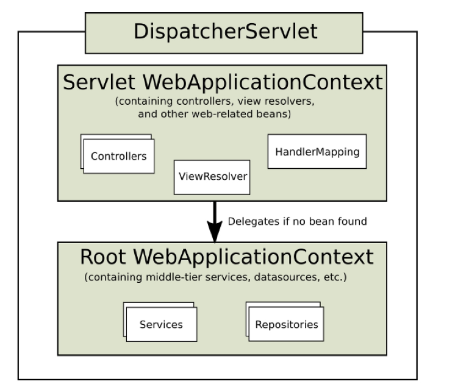
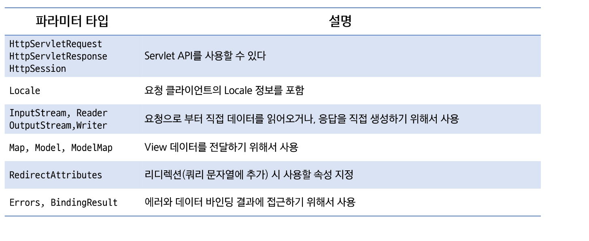

# Spring MVC
- MVC 패턴
- Spring Web MVC

## MVC 패턴
### 요청과 응답의 흐름
1. 클라이언트가 요청(req)을 날림
2. 서블릿(/main)에서 모든 요청을 받고 작업을 전달함 (Front controller pattern)
3. Model에서 로직을 처리하려고 함. 먼저 서비스가 요청을 받았는데 만약 DB와 소통이 필요하다면 DAO에게 요청하고 DAO가 DB에서 데이터를 받아 Service에 전달함 (이 때 데이터 전달하는 객체를 DTO(Data transfer object)라고 함)
4. 그 후 서비스에서 컨트롤러로 결과를 전달하면 컨트롤러에서는 포워딩 혹은 리다이렉트로 요청을 처리함. 
5. View에서 전달받으면 보통 JSP로 웹페이지를 나타냄. (EL/JSTL 쓰기도 함)
6. Spring에서 Controller와 Model을 bean으로 관리할 것이다. (@Controller, @Service, @Repository 등이 있음)

### MVC 패턴
- Model
    - 동작을 수행하는 코드
    - 사용자 View에 어떻게 보일지에 대해서 신경x
    - 데이터 질의에 대한 정보를 제공하는 기능 및 데이터에 대한 수정을 담당
- View
    - 사용자가 화면에 무엇을 어떻게 볼 것인지를 결정
    - 사용자 화면에 보이는 부분
    - 모델의 정보를 받아와 사용자에게 보여주는 역할 수행
    - 자체적으로 모델의 정보를 보관 x
- Controller
    - 요청을 받아 검증하고 비즈니스 로직을 수행
    - 모델과 뷰를 연결하는 역할을 수행
    - 사용자에게 데이터를 가져오고 수정하고 제공함

## Spring Web MVC
### Spring Web MVC
- Spring Web MVC
    - Servlet API를 기반으로 구축된 Web Framework
    - 정식 명칭을 Spring Web MVC이지만, Spring MVC로 주로 알려져 있음
    - Spring Framework이 제공하는 DI, AOP뿐만 아니라, WEB 개발을 위한 기능을 제공
    - DispatcherServlet(Front-Controller)를 중심으로 디자인 되었으며, View Resolver, Handler Mapping, Controller와 같은 객체와 함께 요청을 처리하도록 구성됨
- Spring MVC 구성 요소
    - DispatcherServlet -> 클라이언트 요청처리 (요청 및 처리 결과 전달)
    - HandlerMapping -> 요청을 어떤 Controller가 처리할 지 결정
    - Controller -> 요청에 따라 수행할 메서드를 선언하고, 요청처리를 위한 로직 수행(비즈니스 로직 호출)
    - ModelAndView -> 요청처리를 하기 위해서 필요한 혹은 그 결과를 저장하기 위한 객체
    - ViewResolver -> Controller에 선언된 view 이름을 기반으로 결과를 반환할 View를 결정
    - View -> 응답화면 생성
- Spring MVC - 요청 처리 흐름

1. 클라이언트 요청이 들어오면 DispatcherServlet이 받는다.
2. HandlerMapping이 어떤 Controller가 요청을 처리할 지 결정한다.
3. DispatcherServlet은 Controller에 요청을 전달
4. Controller는 요청을 처리한다.
5. 결과(요청처리를 위한 data, 결과를 보여줄 view의 이름)를 ModelAndView에 담아 반환
6. ViewResolver에 의해서 실제 결과를 처리할 View를 결정하고 반환
7. 결과를 처리할 View에 ModelAndView를 전달
8. DispatcherServlet은 View가 만들어낸 결과를 응답

- Spring MVC (DispatcherServlet)
    - 컨테이너 구성

    
    
    - Web과 관련된 설정이 Dipatcher Servle에, Web과 관련된 설정은 RootWebapplication Context

- Spring Web MVC 구성하기   
    - Dynamic Web PJT 생성 (web.xml 체크)
    - maven 프로젝트로 변경
    - Spring Web MVC 추가

    - DispatcherServlet 등록
        - Servlet 등록 방법 1 : web.xml에 직접 작성
        - Servlet 등록 방법 2 : @Webservlet("")
    - servlet-context.xml / root-context.xml 파일 생성
    - web.xml

    - root-context.xml 설정 추가  
    - web.xml

    - servlet-context.xml 작성
    - 뷰 리졸버 등록
    - DefaultAnnotationHandlerMapping을 기본으로 사용하므로 별도 등록없이 사용가능 (spring 3.0)

## Spring Web MVC 실습
- RequestMapping 
    - URL을 클래스 또는 특정 핸들러(메서드)에 메핑
    - 메서드 Annotation은 요청 방식(GET,POST) 등으로 범위를 좁혀 준다
- Controller Parameter

