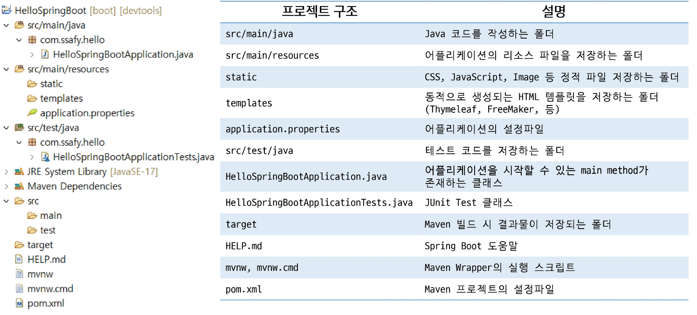

# Spring Boot
- Spring Boot 
- Spring Boot Project
- Spring Boot JSP
- Spring Boot MVC 실습

## Spring Boot
### Spring Boot 
-  Spring Framework의 등장
    - 자바에서는 EJB(Enterprise JavaBeans)를 이용하여 엔터프라이즈 급 어플리케이션 제작
        - 경량 컨테이너 사용
        - 의존성 주입
        - AOP
        - POJO
        - 등의 개념 등장
- Spring Boot 의 등장
    - 스프링을 더욱 편리하게 사용할 수 있게 만들어 줌 (간결한 설정)
    - 호환이 가능한 라이브러리에 대한 버전을 가지고 있음
    - "Just run" 할 수 있는 독립형, 프로덕션 등급의 스프링 기반의 어플리케이션을 쉽게 생성할 수 있음
- Spring Boot 특징
    - 독립 실행형 스프링 어플리케이션 생성
    - Tomcat 을 내장하고 있어, WAR 파일을 배포할 필요가 없음
    - 'starter' 종속성을 제공하여 빌드 구성을 단순화함
    - 스프링, 3rd-파티 라이브러리의 버전을 자동으로 관리
    - 상태 확인 기능 제공
    - XML에 대한 요구사항 없음

## Spring Boot Project
### Spring Boot Project
- Spring Boot Project 생성(STS)
    - Spring Starter Project를 통해 생성 가능
    
    - 프로젝트명
    - Type, Packaging ... 등 설정 후
    - Next

    - 의존성 추가
    - Spring Boot DevTools (변경 시 자동 재시작 등 ...)
    - Spinrg Web MVC를 사용하기 위하여 추가
    - Next or Finish

- Spring Boot Project 구조

- Spring Boot Project 실행
    - static 폴더에 index.html 생성
    - Spring Boot 에서는 기본으로 static/index.html 을 Welcome Page로 읽으려고 한다.

    - 프로젝트 -> 우클릭 -> Run As -> Spring Boot App으로 실행
    - main 메서드 실행

## Spring Boot JSP
### Spring Boot JSP
- Spring Boot 간단한 MVC
    - HelloController 생성
    - 기존 Spring에서 사용하던 폴더 구조를 생성 후 hello.jsp 작성

    - application.properties 에 ViewResolver 설정 등록

> Spring Boot Bean 확인
>    - Application Context context = SpringApp ...
>    - for문으로 확인

- Spring Boot 간단한 MVC
    - JSP를 위한 설정 추가 (dependency)

