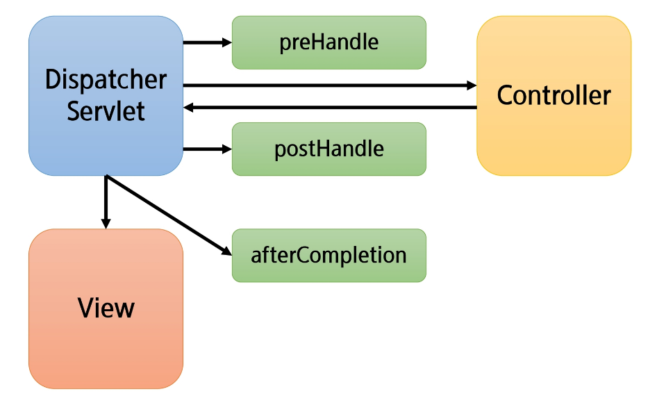

# Filter & Interceptor
- Listener & Filter
- Interceptor

## Listener & Filter
### Listener & Filter
- Listener이란? 
    - 프로그래밍에서 Listener란 특정 이벤트가 발생하기를 기다리다가 실행되는 객체
    - 이벤트란 특정한 사건발생.
        - EX) 버튼클릭, 키보드입력, 컨테이너 빌드 완료, 웹 어플리케이션 시작, HTTP요청수신 등등..
    - 서블릿 컨테이너에서 발생하는 이벤트 감지
    - web.xml 파일에 <listener>태그를 이용하여 사용 가능
    - 리스너가 여러 개 일 경우 보통 선언된 순서대로 실행되지만 아닌 경우가 있으므로 각각의 리스너는 독립적으로 동작할 수 있도록 설계 하는 것이 좋음
- Listener 사용 (Annotation)
    - `@WebListener`

- Listener 사용 (web.xml)
    - <listener> </listener> <context-param></context-param> 등을 추가
    - STS에서 Listener만들면 알아서 web.xml에 <listener></listener> 추가해줌

- Filter
    - 요청과 응답 데이터를 필터링하여 제어, 변경하는 역할
    - 사용자의 요청이 Servlet에 전달되어지기 전에 Filter를 거침
    - Servlet으로부터 응답이 사용자에게 전달되어지기 전에 Filter를 거침
    - FilterChain을 통해 연쇄적으로 동작 가능
- Filter 사용
    - implements Filter 후 사용
    - FilterConfig 타입 사용
    - web.xml에서 <filter></filter> 와 <filter-mapping><filter-mapping> 추가 하여 사용 (filter-mapping은 filter가 언제 작동할지를 결정)
    - @Order(숫자) 로 순서 지정가능 (우선 순위 필터가 먼저 시작하고 나중에 끝남)

## Interceptor
## Interceptor
- Interceptor?
    - HandlerInterceptor를 구현한 것
    - 요청(request)을 처리하는 과정에서 요청을 가로채서 처리
    - 접근 제어(Auth), 로그(Log) 등 비즈니스 로직과 구분되는 반복적이고 부수적인 로직 처리
    - HandlerIntercepter의 주요 메서드
        - preHandle()
        - postHanle()
        - afterCompletion()
- preHandle
    - Controller(핸들러) 실행 이전에 호출
    - true를 반환하면 계속 진행한다.
    - false를 반환하면 요청을 종료한다.
- postHandle
    - Controller(핸들러) 실행 후 호출
    - 정상 실행 후 추가 기능 구현 시 사용
    - Controller 에서 예외 발생 시 해당 메서드는 실행되지 않음
- afterCompletion
    - 뷰가 클라이언트에게 응답을 전송한 뒤 실행
    - Controller에서 예외 발생시, 네번째 파라미터로 전달이 된다. (기본은 null)
    - 따라서 Controller에서 발생한 예외 혹은 실행 시간 같은 것들을 기록하는 등 후처리 시 주로 사용
- Interceptor 흐름

- Interceptor 등록 (설정파일)
    - implements WebMvcConfigurer 해야 함
    - addInterseptors 메서드를 통해서 등록 할 수 있음
    - 매핑할 URL을 지정할 수 있고, 제외할 URL 또한 지정할 수 있음.
- Interceptor 체이닝
    - 여러 개의 인터셉터를 동시에 등록할 수 있음
    - 작성 순서에 따라 동작