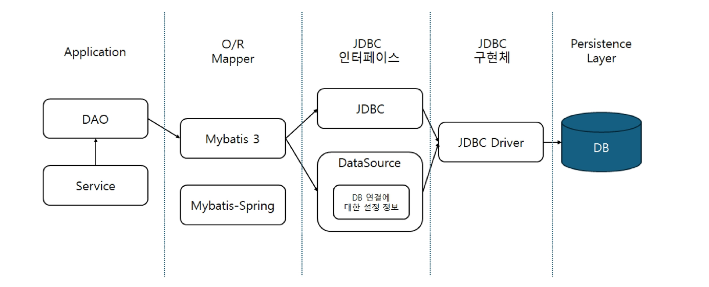
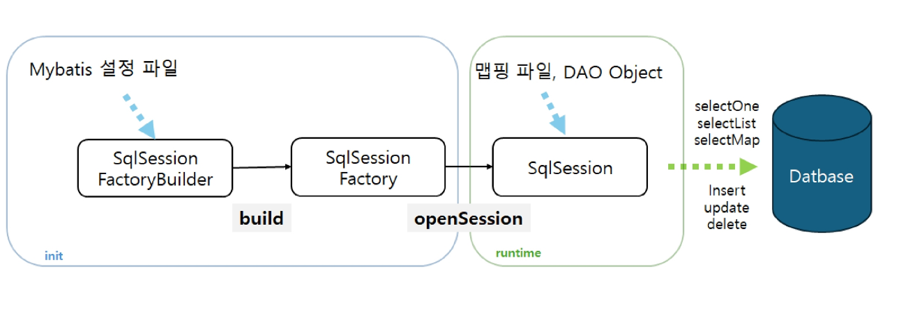
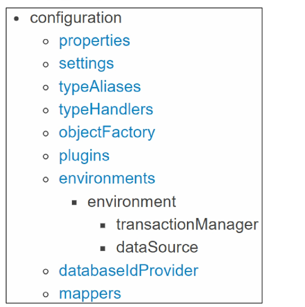

# MyBatis
- MyBatis
- MyBatis-Java PJT

## MyBatis
### MyBatis
- JDBC 사용할 때 불편한 점
    - DB 설정 정보 + 각 함수에 대한 정의를 SQL 구문 외에도 해야할게 많음
    - pstmt, conn, resultset 등등 설정..
- MyBatis
    - SQL 매핑 프레임워크
    - SQL문과 저장 프로시저(Stored Procedure)(쿼리문 등의 집합) 등의 매핑을 지원하는 퍼시스턴스 프레임워크(persistence framework)
    - JDBC로 처리하는 상당부분의 코드와 파라미터 설정 및 결과 처리를 대신해줌
    - Map 인터페이스 그리고 자바 POJO를 설정 데이터베이스와 매핑해서 사용할 수 있음
    - XML과 Annotation 설정을 통해 사용가능

    - MyBatis는 SQL을 처리하고 Java 객체와 DB 간의 매핑을 처리
        - 기존에는 DAO와 JABC를 연결하는 코드를 짰으나 이제는 DAO와 MyBatis를 연결하는 코드를 짤 것 

    

- MyBatis 구성 요소
    - MyBatis는 SqlSession 인터페이스를 통해 DB와 상호작용을 한다.

    

    - MyBatis 설정 파일
        - MyBatis 전반에 걸친 세팅
        - DB 접속 정보, 모델 클래스 정보, 매핑 정보
        - XML, Annotation, Java 설정을 만드 수 있음
    - SqlSessionFacotryBuilder : SqlSessionFactory 인스턴스를 생성하는데 사용되는 빌더 클래스

    - SqlSessionFactory
        - SqlSesion 객체를 생성하는 팩토리 클래스
        - 런타임 도중 CRUD 처리 요청에 따라 SqlSession 객체를 생성
        - openSession() 메서드를 통해 객체를 생성
    - SqlSession
        - SQL 실행이나 트랜잭션 관리를 위한 메소드를 가진 인터페이스
        - SELECT, INSERT, UPDATE, DELETE 구문을 수행하기 위해 사용
        - SqlSessuion을 받드시 닫도록 한다. (try with resources 로 사용 권장)

    - MyBatis- 시작하기
        - Mybatis -x.x.x.jar파일을 프로젝트에 추가
        - maven프로젝트 사용시 pon.xml에 의존성 추가  (MySQL, MyBatis)
    - MyBatis - 설정하기 (XML 설정파일)
        - 설정파일 작성 (resource 폴더) (Mybatis-config.xml)

        - 작성 순서 중요

    

    - MyBatis - 설정하기 (typeAliases)
        - 타입 별칭은 자바 타입에 대한 짧은 이름(본래 class를 식별하기 위해 풀패키지명을 사용하였음), XML 설정에서만 사용
        - 클래스 단위 or 패키지 단위로 등록할 수 있음
        - 이름을 지정하지 않으면 소문자로 바뀐 형태의 값이 지정됨
        - 공통 자바 타입을 위한 여러 내장 타입 별칭이 존재 (대소문자 구별하지 않음)
        - 오버로딩 된 이름 때문에 원시형 타입은 특별 취급

    - MyBatis - 설정하기 (environments)
        - 여러 개의 환경으로 설정할 수 있음 (개발, 테스트, 실제 환경, 여러 개의 DBMS 등...)
        - DB별로 하나의 SqlSessionFactory
        - 스프링과 함께 사용하는 경우 transactionManager 구성할 필요 없음
    - MyBatis - 설정하기 (mappers)
        - 매핑된 SQL 구문 설정파일의 위치 작성
        - class path의 상대경로의 리소스 사용
        - 절대경로의 url 사용
        - mapper 인터페이스 사용
        - 매퍼 패키지 내의 모든 인터페이스를 등록
    - Mapper XML 파일
        - cache -> 해당 네임스페이스를 위한 캐시 설정
        - cache-ref -> 다른 네임스페이스의 캐시 설정에 대한 참조
        - resultMap -> DB 결과 데이터를 객체에 로드하는 방법을 정의
        - parameterMap -> 비권장됨 (현재 사용x)
        - sql -> 다른 구문에서 재사용하기 위한 SQL 조각
        - insert -> 매핑된 INSERT 구문
        - update -> 매핑된 UPDATE 구문
        - delete -> 매핑된 DELETE 구문
        - select -> 매핑된 SELECT 구문
