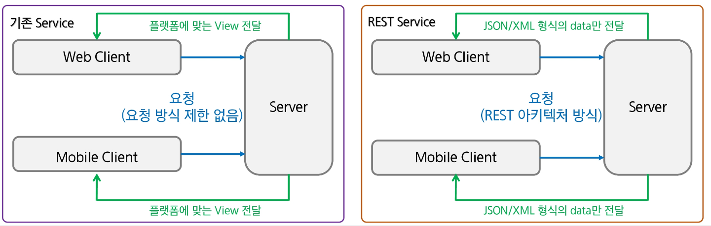

# REST API
- REST API
- Spring REST API

## REST API
### REST API
- REST
    - 웹의 장점을 최대한 활용할 수 있는 아키텍처로서 발표됨
    - 'Representational State Transfer'의 약어
    - HTTP 프로토콜을 사용하여 데이터를 주고 받는 방법
    - HTTP URI를 통해 제어할 자원(Resource)를 명시하고, HTTP Method(GET, POST, PUT, DELETE)을 통해 해당 자원을 제어하는 명령을 내리는 방식의 아키텍처

- REST 구성
    - 자원 ->URI (Uniform Resource Identifier)
    - HTTP 메서드 -> 작업에 대한 정의 (C/R/U/D) (각각 POST,GET,PUT,DELETE에 대응)
    - 표현 -> Client와 Server 간 자원의 상태를 전달하는 방법으로 JSON, XML 등의 형식을 사용한다.

- API
    - Application Programming Interface
    - 다른 소프트웨어 어플리케이션에서 사용할 수 있는 기능을 제공하는 인터페이스
    - 어플리케이션 간 데이터를 교환하고 상호 작용하도록 도움을 줌
    - (예: 미세먼지 정보 제공 시스템, 핸드폰 정보 미세먼지 앱)
- API 유형
    - Private API
        - 비공개 API
        - 내부 시스템 또는 서비스 간의 통신을 위해 사용되는 API로 외부에 공개되지 않음
        - 주로 기업 내부 시스템에서의 통신을 위해 사용
    - Public API
        - 공개 API
        - 외부 사용자 혹은 외부 어플리케이션과 상호작용하기 위해 공개된 API
        - 사용에 대한 권한 설정과 비용이 있을 수도 있음
        - 공공데이터 포털, 기상청, Naver, Kakao, Youtube 등 다양한 API가 존재
        - 대부분이 REST 방식으로 작성되어 있음
- REST API (REST + AOI)
    - 기존의 전송방식과는 달리 서버는 요청으로 받은 리소스에 대해 순수한 데이터를 전송
    - 기존의 GET/POST 외에 PUT, DELETE 방식을 사용하여 리소스에 대한 CRUD 처리 가능
    - HTTP URI을 통해 제어할 자원을 명시하고 HTTP method(GET/POST/PUT/DELETE)를 통해 해당 자원을 제어하는 명령을 내리는 방식의 Architecture
    - 표준이 정해진 것이 없어 관례 정도로 사용하는 Rule이 있음
        - 하이폰(-)은 사용 가능하지만 언더바(_)는 사용하지 않는다.
        - 특별한 경우를 제외하고 대문자 사용은 하지 않는다.(대소문자 구분을 하기 때문)
        - URI 마지막에 슬래시(/)를 사용하지 않는다.
        - 슬래시(/)로 계층 관계를 나타낸다.
        - 확장자가 포함된 파일 이름을 직접 포함시키지 않는다.
        - URI는 명사를 사용한다.
    
    - 기존 Service와 REST API Service
        - 기존 Service : 요청에 대한 처리를 한 후 가공된 data를 이용하여 특정 플랫폼에 적합한 형태의 View로 만들어서 반환
        - REST API Service : data처리만 하거나 처리 후 반환될 data가 있다면 JSON이나 XML 형식으로 전달, View에 대해서 신경 X ->Open API에서 많이 사용

    

- API URI 설계 (기존)
    - 기존의 접근 방식은 GET과 POST만으로 자원에 대한 CRUD를 처리
    - URI에 해당 기능을 추가 작성함.

- API URI 설계 (REST API)
    - URI는 board라는 Resource를 활용하여 식별
    - HTTP method를 통해 C/R/U/D 행위를 구분

- RESTful
    - REST 아키텍처 스타일을 따르는 웹 서비스를 설계하고 구현하는 방식
    - 플랫폼 독립성 -> REST API는 특정 언어나 플랫폼에 종속되지 않음
    - 높은 성능 -> REST API를 cacheable 데이터를 지원하여 데이터를 캐시에 저장하고 빠르게 접근할 수 있음
    - 간결함과 명확성 -> REST API는 URI와 HTTP method를 이용하여 자원과 행위를 명확하게 표현
    - 표준화된 통신 -> REST API는 HTTP를 통해 작동

## Spring REST API
### Spring REST API
- REST Client
    - RESTful 웹 서비스에 HTTP 요청을 보내고 응답을 받는 프로그램 혹은 라이브러리
    - HTTP 요청 전송 / 응답 수신 가능
    - 대표적인 client로는 cURL, Postman, Talend API (크롬 웹스토어 설치) 등...
- Spring REST 관련 Annotation / Class

- @ResponseBody 
    - Controller 메서드가 HTTP 응답의 본문(Body)을 직접 반환함을 나타내는 Annotation
    - 기존의 @Controller는 뷰 리졸버(ViewResolver)를 통해 View를 찾지만 데이터를 반환하기 위해서 해당 Annotation을 사용해야 함
    - Spring은 반환된 객체를 JSON, XML 등의 형식으로 변환하여 HTTP 응답 본문으로 Client에게 전송
- Jackson Databind
    - Jackson 라이브러리의 일부
    - Java 객체와 Json 데이터 간의 변환을 담당
    - 별도의 Annotation 없이 자동으로 Java 객체와 JSON 데이터를 매핑할 수 있음
    - JSON 외에도 다양한 데이터 변환 지원
    - jar 파일 혹은 pom.xml을 통해 의존성을 추가하여 사용

- @RestController
    - Spring MVC에서 RESTful 서비스를 개발할 때 주로 사용함
    - 해당 Annotation을 활용하면 모든 메서드가 @ResponseBody를 포함하게 됨
    - 따라서 반환객체가 HTTP 응답 본문에 작성되며, JSON 또는 XML 등의 형태로 전송 가능
    - @Controller + @ResponseBody
- HTTP method에 따른 Annotation
    - @GetMapping -> 데이터를 조회하는데 사용
    - @PostMapping -> 데이터를 생성하는데 사용
    - @PutMapping -> 데이터를 수정하는데 사용
    - @DeleteMapping -> 데이터를 삭제하는데 사용
- @PathVariable
    - URI의 일부를 변수로 가져와 메서드의 매개변수로 전달할 때 사용
    - RESTful 웹서비스에서 경로 변수를 처리하는데 사용
- @RequestBody
    - HTTP 요청의 본문에 포함되어 있는 데이터를 Java 객체로 변환할 떄 사용
    - RESTful 웹 서비스에서 Client가 전송한 데이터를 서버에서 받아서 처리하는데 사용
    - form-data로 요청 전송 시 @ModelAttribute를 사용하여 처리
    - JSON 형태의 요청 전송 시 @RequestBody를 사용하여 처리