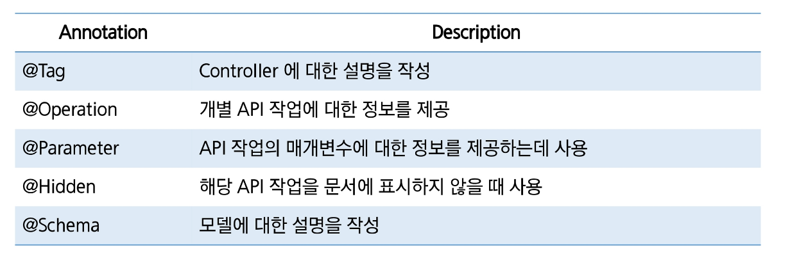

# Swagger
## Swagger
- Rest API 문서화
    - API의 사용법과 기능을 설명하는 문서를 작업하는 과정
    - 문서화가 잘 되어 있다면 API에 대한 이해도를 높이고 개발 생산성을 높일 수 있음
    - 문서 작성 순서
        1. API 명세서 작성
        2. 엔드포인트(URI) 및 메서드 정의
        3. 매개변수 및 페이로드 정의 (요청 시 넘어오는 것들)
        4. 응답의 형식과 내용 정의 (상태코드, 헤더, 본문)
        5. 발생할 수 있는 오류 코드 문서화
        6. API에 대한 예제 작성
        7. 명세를 기반으로 API 문서 생성 (Swagger를 통해 자동으로 생성 가능)

- Swagger
    - 대규모로 API를 설계하고 문서화하는데 도움을 주는 오픈소스 API 문서화 프레임워크
    - API를 시각적으로 표현하고, 직접 API를 테스트해 볼 수 있음
- Swagger 특징
    - 시각적 표현 -> API를 직관적으로 이해할 수 있도록 Swagger UI를 지원하여 시각적으로 API를 표현하는 기능을 제공하고, 이를 통해 개발자들이 API의 구조와 작동 방식을 쉽게 파악할 수 있음
    - 실시간 테스트 -> API를 실시간으로 테스트하고 디버깅 하는 기능 제공
    - 문서 자동화 -> API 문서를 자동으로 생성하고 업데이트 하는 기능을 제공
- Swagger 사용
    - 의존성 추가 -> pom.xml 파일에 Swagger 의존성 추가
    - Spring Boot 2.x 버전에서는 springfox 라이브러리를 주로 사용
    - Spring Boot 3.x 버전에서는 springdoc 라이브러리를 주로 사용
- Swagger Java 설정파일
    - springdocs의 migrating부분에서 내용을 얻을 수 있다.
- Swagger 문서 접속
    - http://localhost:8080/swagger-ui/index.html
- Swagger 문서화 Annotation
    - springdoc에서는 API 문서화할 때 다양한 어노테이션 사용

