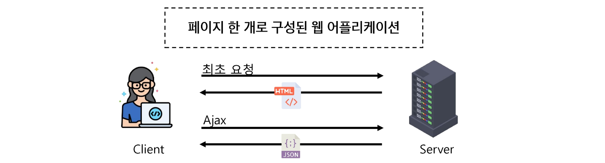

# Introduction of Vue
- Front-End Development
- Vue.js
- Appendix

## Front-End Development
### Front-End Development
- Front-End Development
    - 웹 사이트와 웹 어플리케이션의 사용자 인터페이스(UI)와 사용자 경험(UX)을 만들고 디자인하는 것
    - HTML, CSS, JavaScript 등을 활용하여 사용자가 직접 상호작용하는 부분을 개발

- Client-side Frameworks
    - 클라이언트 측에서 UI와 상호작용을 개발하기 위해 사용되는 JavaScript 기반 프레임워크
    - reactjs, angular, vuejs ...

- Client-side Frameworks가 필요한 이유 - 1
    - "웹에서 하는 일이 많아졌다" : 단순히 무언가를 읽는 곳 -> 무언가를 하는 곳
    - 사용자는 이제 웹에서 문서만을 읽는 것이 아닌 음악을 스트리밍하고, 영화를 보고, 원거리에 있는 사람들과 텍스트 및 영상 채팅을 통해 즉시 통신을 하고 있음
    - 이처럼 현대적이고 복잡한 대화형 웹 사이트를 "웹 어플리케이션(Web Application)" 이라 부름
    - JavaScript 기반의 Client-side framework 출현으로 매우 동적인 대화형 어플리케이션을 훨씬 더 쉽게 구축할 수 있게 됨.

- Client-side Frameworks가 필요한 이유 - 2
    - "웹에서 하는 일이 많아졌다." : 다루는 데이터가 많아졌다.
    - 만약 친구가 이름을 변경했다면?
    - 친구 목록, 타임라인, 스토리 등 친구 이름이 출력되는 모든 곳이 함께 변경되어야 함
    - 어플리케이션의 기본 데이터를 안정적으로 추적하고, 업데이트(렌더링, 추가, 삭제 등) 하는 도구가 필요
    - 어플리케이션의 상태를 변경할 때마다 일치하도록 UI를 업데이트해야 한다는 것

- Vanilla JS(순수한 JS)만으로 모든 데이터를 조작한다면 
    - 불필요한 코드가 반복된다.

- Single Page Application (SPA)

    

    1. 서버로부터 필요한 모든 정적 HTML을 처음에 한번 가져옴
    2. 브라우저가 페이지를 로드하면 Vue 프레임워크는 각 HTML 요소에 적절한 JavaScript 코드를 실행 (이벤트 응답, 데이터 요청 후 UI 업데이트 등)
        - ex) 페이지 간 이동시, 페이지 갱신에 필요한 데이터만을 JSON으로 전달 받아 페이지 일부 갱신 (Google Maps, Instagram 등의 서비스에서 갱신 시 새로 고침이 없는 이유)
    
    - CSR(Client Side Rendering) 방식 : 웹 어플리케이션 초기 로딩 후 새로운 페이지 요청 없이 동적으로 화면을 갱신하며 사용자와 상호작용하는 웹 어플리케이션

- Client Side Rendering(CSR)
    - 클라이언트에서 화면을 렌더링 하는 방식

    1. 브라우저는 페이지에 필요한 최소한의 HTMl 페이지와 JavaScript를 다운로드
    2. JavaScript를 사용하여 DOM을 업데이트하고 페이지를 렌더링

- Client Side Rendering (CSR) 장점
    1. 빠른 속도
        - 페이지의 일부를 다시 렌더링할 수 있으므로 동일한 웹 사이트의 다른 페이지로 이동하는 것이 일반적으로 더 빠름.
        - 서버로 전송되는 데이터의 양을 최소화
    2. 사용자 경험
        - 새로 고침이 발생하지 않아 네이티브 앱과 유사한 사용자 경험을 제공
    3. Front-end와 Back-end의 명확한 분리
        - Front-end는 UI 렌더링 및 사용자 상호 작용 처리를 담당
        - Back-end는 데이터 및 API 제공을 담당
        - 대규모 어플리케이션을 더 쉽게 개발하고 유지 관리 가능
- Client Side Rendering (CSR) 단점
    1. 초기 구동속도가 느림
        - 전체 페이지를 보기 전에 약간의 지연을 느낄 수 있음 (JavaScript가 다운로드, 구문 분석 및 실행될 때까지 페이지가 완전히 렌더링 되지 않기 때문)
    2. SEO(검색 엔진 최적화) 문제
        - 페이지를 나중에 그려 나가는 것이기 때문에 검색에 잘 노출되지 않을 수 있음

## Vue.js
### Vue.js
- What is Vue?
    - 사용자 인터페이스를 구축하기 위한 JavaScript 프레임워크
    - 2014년 발표 -> Evan You 
    - 2023년 기준 최신 버전 "Vue3"
    - Vue2 문서에 접속되지 않도록 주의
- Vue를 학습하는 이유
    1. 쉬운 학습 곡선 및 간편한 문법
        - 새로운 개발자들도 빠르게 학습할 수 있음
    2. 반응성 시스템
        - 데이터 변경에 따라 자동으로 화면이 업데이트 되는 기능을 제공
    3. 모듈화 및 유연한 구조
        - 어플리케이션을 컴포넌트 조각으로 나눌 수 있음.
        - 코드의 재사용성을 높이고 유지보수를 용이하게 함
- SSAFY에서의 Vue
    - Vue 는 React나 Anular 대비 간결하고 직관적인 문법을 가지고 있어 초기 학습이 상대적으로 원활
        - 짧은 시간애에 효율적으로 결과물을 만들어 낼 수 있음
    - 거대하고 활발한 커뮤니티를 가지고있어 풍부한 문서, 튜토리얼, 예제 및 다양한 리소스를 공유 받을 수 있음
        - 최신 업데이트 및 트랜드를 공유함으로써 지속적인 학습을 촉진

- Vue의 2가지 핵심 기능
    1. 선언적 렌더링 (Declarative Rendering)
        - HTML을 확장하는 템플릿 구문을 사용하여 HTML이 JavaScript 데이터를 기반을 어떻게 보이는지 설명할 수 있음
    2. 반응형 (Reactivity)
        - JavaScript 상태 변경사항을 자동으로 추적하고 변경사하이 발생할 때 DOM을 효율적으로 업데이트

### Vue.js(Tutorial)
- Vue를 사용하는 방법
    1. CDN 방식
    2. NPM 방식

- 첫번째 Vue 작성하기 (1/3)
    - CDN 및 Application instance 작성
- 첫번째 Vue 작성하기 (2/3)
    - Application instance
        - 모든 Vue 어플리케이션은 createApp 함수로 새 Application instance를 생성하는 것으로 시작
- 첫번째 Vue 작성하기 (3/3)
    - app.mount()
        - 컨테이너 요소에 어플리케이션 인스턴스를 탑재(연결)
        - 각 앱 인스턴스에 대해 mount()는 한 번만 호출할 수 있음

- ref 함수(1/2)
    - 반응형 상태(데이터)를 선언하는 함수 (Declaring Reactive State)
    - 인자를 받아 .value 속성이 있는 ref 객체로 래핑 (wrapping)하여 반환
    - ref로 선언된 변수의 값이 변경되면, 해당 값을 사용하는 템플릿에서 자동으로 업데이트 
    - 인자는 어떠한 타입도 가능

- ref 함수(2/2)
    - 템플릿의 참조에 접근하려면 setup 함수에서 선언 및 반환 필요
    - 템플릿에서 ref를 사용할 때는 .value를 작성할 필요 없음

- ref ()    
    - 반응형을 가지는 참조 변수를 만드는 것

- Vue 기본 구조
    - createApp()에 전달되는 객체는 Vue 컴포턴트 (Component)
    - 컴포넌트의 상태는 setup() 함수 내에서 선언되어야 하며 객체를 반환해야 함

- 템플릿 렌더링 (1/2)
    - 반환된 객체의 속성은 템플릿에서 사용할 수 있음
    - Mustache syntax(콧수염 구문)를 사용하여 메시지 값을 기반으로 동적 텍스트를 렌더링

- 템플릿 렌더링 (2/2)
    - 콘텐츠는 식별자나 경로에만 국한되지 않으며 유효한 JavaScript 표현식을 사용할 수 있음

- Event Listeners in Vue
    - 'v-on' directive를 사용하여 DOM 이벤트를 수신할 수 있음

    - 함수 내에서 refs를 변경하여 구성 요소 상태를 업데이트

## Appendix
### Appendix
- 템플릿에서의 unwrap 시 주의사항 
    - 템플릿에서의 unwrap은 ref가 최상위 속성인 경우에만 적용가능

    ``` js
    const object = {id:ref(0)}
    {{object.id+1}}
    ```

    - [object Object]1 출력
    - Object는 최상위 속성이지만 object.id는 그렇지 않음
    - 표현식을 평가할 때 object.id가 unwrap되지 않고 ref객체로 남아있기 때문
    - 이 문제를 해결하기 위해 "id를 최상위 속성으로 분해"해야 함

    ``` js
    const{id} =object
    {{id+1}}
    ```

    - 단 ref가 {{}}의 최종 평가 값인 경우는 unwrap 가능
        - `{{object.id}}`, `{{object.id.value}}` 동일

- Why Refs
    - 일반 변수 대신 굳이 .value가 포함된 ref가 필요한 이유는 ?
    - Vue는 템플릿에서 ref를 사용하고 나중에 ref의 값을 변경하면 자동으로 변경 사항을 감지하고 그에 따라 DOM을 업데이트 함. ("의존성 추적 기반의 반응형 시스템")
    - Vue는 렌더링 중에 사용된 모든 ref를 추적하며, 나중에 ref가 변경되면 이를 추적하는 구성요소에 대해 다시 렌더링
    - JavaScript에서는 일반 변수의 접근 또는 변형을 감지할 방법이 없기 때문

- SEO (Search Engine Optimization)
    - google, bing 과 같은 검색 엔진 등에 내 서비스나 제품 등이 효율적으로 검색 엔진에 노출되도록 개선하는 과정을 일컫는 작업
    - 정보의 대상은 주로 HTML에 작성된 내용
    - 검색
        - 각 사이트가 운용되는 검색 엔진에 의해 이루어지는 작업
    - 검색엔진
        - 웹 상에 존재하는 가능한 모든 정보들을 긁어 모으는 방식으로 동작
    - 최근에는 SPA, 즉 CSR로 구성된 서비스의 비중이 증가
    - SPA 서비스도 검색 대상으로 넓히기 위해 JS를 지원하는 방식으로 발전하는 중

- CSR & SSR
    - CSR과 SSR은 흑과 백이 아님
        - 내 서비스에 적합한 렌더링 방식을 적절하게 활용할 수 있어야 함
    - SPA 서비스에서도 SSR을 지원하는 Framework가 발전하고 있음
        - Vue의 Nuxt.js
        - React의 Next.js
        - Angular의 Universal