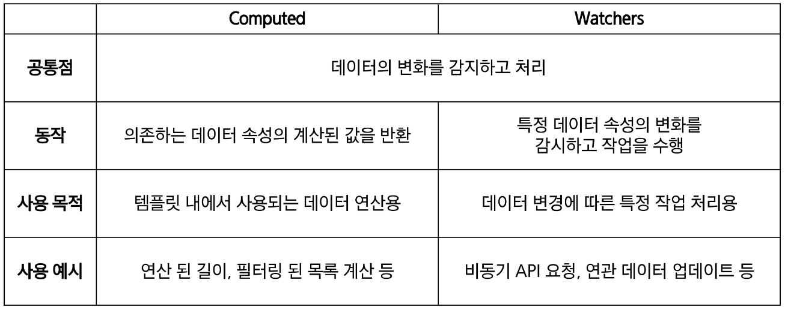

# Basic Syntax - 02
- Computed Property
- Conditional Rendering
- List Rendering
- Watchers
- Lifecycle Hooks
- Vue Style Guide

## Computed Properties
### Computed Properties
- computed()
    - 계산된 속성을 정의하는 함수
        - 미리 계산된 속성을 사용하여 템플릿에서 표현식을 단순하게 하고 불필요한 반복 연산을 줄임
- computed 기본 예시 
    - 할 일이 남았는지 여부에 따라 다른 메시지를 출력하기

    ``` js
    const todos = ref([
        { text: 'Vue 실습'},
        { text: '자격증 공부'},
        { text: 'TIL 작성'}
    ])

    <h2> 남은 할 일</h2>
    <p>{{todos.length>0 ? '아직 남았다' : '퇴근'}}</p>
    ```

    - 템플릿이 복잡해지며 todos에 따라 계산을 수행하게 됨
    - 만약 이 계산을 템플릿에 여러 번 사용하는 경우에는 반복이 발생

    - computed 사용
    - 반응성 데이터를 포함하는 복잡한 로직의 경우 computed를 활용하여 미리 값을 계산

    ``` js 
    const {createApp,ref,computed} = Vue;
    const restofTodos = computed(()=>{
        return todos.value.length >0? '아직 남았다' : '퇴근'
    })

    <h2> 남은 할일 </h2>
    <p>{{restOfTodos}}</p>
    ```

- computed 특징
    - 반환되는 값은 computed ref 이며 일반 refs와 유사하게 계산된 결과를 .value로 참조 할 수 있음 (템플릿에서는 .value 생략가능)
    - computed 속성은 의존된 반응형 데이터를 자동으로 추적
    - 의존하는 데이터가 변경될 때만 재평가
        - restOfTodos의 계산은 todos에 의존하고 있음
        - 따라서 todos가 변경될 때만 restOfTodos가 업데이트 됨

- computed와 동일한 로직을 처리할 수 있는 method
    - computed 속성 대신 methdo로 동일한 기능을 정의할 수 있음
    - 두 가지 접근 방식은 실제로 완전히 동일

    ``` js
     const getRestOfTodos = function() {
            console.log(2)
            return todos.value.length >0? '아직 퇴근 못해2' : '이제 퇴근2'
    }

    <p>{{getRestOfTodos()}}</p>
    ```

- computed와 method 차이
    - computed 속성은 의존된 반응형 데이터를 기반으로 캐시된다.
    - 의존하는 데이터가 변경된 경우에만 재평가됨
    - 즉, 의존된 반응형 데이터가 변경되지 않는 한 이미 계산된 결과에 대한 여러 참조는 다시 평가할 필요 없이 이전에 계산된 결과를 즉시 반환
    - 반면 method 호출은 다시 렌더링이 발생할 때마다 항상 함수를 실행

- Cache (캐시)
    - 데이터나 결과를 일시적으로 저장해두는 임시 저장소
    - 이후에 같은 데이터나 결과를 다시 계산하지 않고 빠르게 접근할 수 있도록 함
- Cache 예시
    - "웹 페이지의 캐시 데이터"
        - 페이지 일부 데이터를 브라우저 캐시에 저장 후 같은 페이지에 다시 요청 시 모든 데이터를 다시 응답 받는 것이 아닌 캐시 된 데이터를 사용하여 더 빠르게 웹 페이지를 랜더링
- computed와 method의 적절한 사용처
    - computed
        - 의존하는 데이터에 따라 결과가 바뀌는 계산된 속성을 만들 때 유용
        - 동일한 의존성을 가진 여러 곳에서 사용할 때 계산 결과를 캐싱하여 중복 계산 방지
    - method
        - 단순히 특정 동작을 수행하는 함수를 정의할 때 사용
        - 데이터에 의존하는 지 여부와 관계없이 항상 동일한 결과를 반환하는 함수
- computed와 method 정리
    - computed
        - 의존된 데이터가 변경되면 자동으로 업데이트
    - method
        - 호출해야만 실행됨
    - 무조건 computed만 사용하는 것이 아니라 사용 목적과 상황에 맞게 computed와 method를 적절히 조합하여 사용

## Conditional Rendering
### Conditional Rendering
- v-if
    - 표현식 값의 T/F를 기반으로 요소를 조건부로 렌더링
    - 'v-else' directive를 사용하여 v-if에 대한 else 블록을 나타낼 수 있음

    ``` js
    const isSeen = ref(false)

    <p v-if="isSeen">true 일 때 보여요</p>
    <p v-else>false 일 때 보여요</p>
    <button @click="isSeen=!isSeen">토글</button>>
    ```

    - 'v-else-if' directive를 사용하여 v-if에 대한 else if 블록을 나타낼 수 있음

    ``` js
    const name = ref("Yang")
    <div v-if="name==='Alice'">Alice입니다.</div>
    <div v-else-if="name==='Bob'">Bob입니다.</div>
    <div v-else-if="name==='Yang'">Yang입니다.</div>
    <div v-else>아무도 아닙니다.</div>
    ```

- 여러 요소에 대한 v-if 적용
    - v-if는 directive이기 때문에 단일 요소에만 연결 가능
    - 이 경우 templeate 요소에 v-if를 사용하여 하나 이상의 요소에 대해 적용할 수 있음 (v-else, v-else-if 모두 적용 가능)

    ``` js
    <template v-if="name==='Bot'">
        <div>로보트입니다.</div>
        <div>AI기능이 있습니다.</div>
    </template>
    ```
- HTML <template> element
    - 페이지가 로드 될 때 렌더링 되지 않지만 JavaScript를 사용하여 나중에 문서에서 사용할 수 있도록 하는 HTML을 보유하기 위한 메커니즘
    - "보이지 않는 wreapper 역할"
- v-show   
    - 표현식 값의 T/F를 기반으로 요소의 가시성을 전환
    - v-show 요소는 항상 렌더링 되어 DOM에 남아 있음
    - CSS display 속성만 전환하기 때문

    ``` js
    const isShow = ref(false)
    <div v-show="isShoe">v-show</div>
    ```

- v-if vs v-show
    - v-if (Cheap initial load, expensive toggle)
        - 초기 조건이 false인 경우 아무 작업도 수행하지 않음
        - 토글 비용이 높음
    - v-show (Expensive initial load, cheap toggle)
        - 초기 조건에 관계 없이 항상 렌더링
        - 초기 렌더링 비용이 더 높음
    - 무언가를 매우 자주 전환해야 하는 경우에는 v-show, 실행 중에 조건이 변경되지 않는 경우에는 v-if를 권장

## List Rendering
### List Rendering
- v-for
    - 소스 데이터를 기반으로 요소 또는 템플릿 블록을 여러 번 렌더링
    - v-for는 alias in expression 형식의 특수 구문을 사용하여 반복되는 현재 요소에 대한 별칭(alias)을 제공
        - `<div v-for="p in myArr">{{p.name}} / {{p.age}}</div>`
    - 인덱스(객체에서는 키)에 대한 별칭을 지정할 수 있음    
    
    ``` js
    <div v-for="value in myObj">{{item}}</div>
    <hr />
    <div v-for="(value, key) in myObj">{{key}} : {{value}}</div>
    <hr />
    <div v-for="(value, key, index) in myObj">{{index}} - {{key}} : {{value}}</div>
    <hr />
    ```

- 여러 요소에 대한 v-for 적용
    - template 요소에 v-for를 사용하여 하나 이상의 요소에 대해 반복 랜더링 할 수 있음

    ``` js
        <ul>
        <template v-for="item in myArr">
          <li>{{item.name}}</li>
          <li>{{item.age}}</li>
        </template>
      </ul>
    ```

- 중첩된 v-for
    - 각 v-for 범위는 상위 범위에 접근할 수 있음

    ```js
    <ul v-for="item in myInfo">
        <li v-for="friend in item.friends">{{item.name}}는 {{friend}}와 친구입니다.</li>
    </ul>
    ```
- v-for with key
    - 반드시 v-for와 key를 함께 사용한다. (안써도 에러는 안남)
    - 내부 컴포넌트의 상태를 일관되게 유지
    - 데이터의 예측 가능한 행동을 유지 (Vue 내부 동작 관련)
    - key는 반드시 각 요소에 대한 고유한 값을 나타낼 수 있는 식별자

    ``` js
    let id = 0
    const items = ref([
        {id: id++, name: 'Alice'},
        {id: id++, name: 'Bella'}
    ])

    <div v-for="item in items" :key="item.id">
    
    </div>
    ```
- v-for with v-if
    - 동일 요소에 v-for와 v-if를 함께 사용하지 않는다.
    - 동일한 요소에서 v-if가 v-for보다 우선순위가 더 높기 때문
    - v-if조건은 v-for 범위의 변수에 접근할 수 없음
- v-for와 v-if 문제상황 -1  
    - todo 데이터 중 이미 처리한 (isComplete===true) todo만 출력하기

    ``` js
    let id = 0
    const todos = ref([
        {id: id++, name:'복습', isComplete:true},
        {id: id++, name:'예습', isComplete:false},
        {id: id++, name:'저녁식사', isComplete:true},
        {id: id++, name:'노래방', isComplete:false}
    ])

    <ul>
        <li v-for="todo in todos" v-if="todo.isComplet === true" :key="todo.id">
        {{todo.name}}
        </li>
    </ul>
    ```

- v-for 와 v-if 해결법 -1
    - computed를 활용해 필터링 된 목록을 반환하여 반복하도록 설정

    ``` js
    const completeTodo = computed(()=>{
            return todos.value.filter((todo)=>todo.isComplete)
    })

    <ul>
        <li v-for="todo in completeTodo" :key="todo.id">
          {{todo.name}}
        </li>
    </ul>
    ```

- v-for와 v-if 문제 상황 -2
    - v-if가 더 높은 우선 순위를 가지므로 v-for의 todo 요소를 v-if에서 사용할 수 없음
- v-for와 v-if 해결법 2
    - v-for와 template 요소를 사용하여 v-if를 이동

    ``` js
    <ul>
        <template v-for="todo in todos" :keys="todo.id">
          <li v-if="!todo.isComplete">{{todo.name}}</li>
        </template>
    </ul>
    ```

## Watchers
### Watchers
- watch 구조
    - 반응형 데이터를 감시하고, 감시하는 데이터가 변경되면 콜백 함수를 호출

    ``` js
    watch(variable, (newValue,oldValue)=>{
        //do something
    })
    ```

    - variable : 감시하는 변수
    - newValue : 감시하는 변수가 변화된 값, 콜백 함수의 첫번째 인자
    - oldValue : 콜백 함수의 두 번째 인자

- watch 예시 
    1. 감시하는 변수에 변화가 생겼을 때 기본 동작 확인하기 
    

    ``` js
    const count = ref(0)

    const countWatch = watch(count, (newValue,oldValue)=>{
    console.log(`new:${newValue} / old: ${oldValue}`)
    })
    <p>{{count}}</p>

    <button @click="count++">증가</button>

    ```

    2. 감시하는 변수에 변화가 생겼을 때 연관 데이터 업데이트 하기

    ``` js
    const message = ref("")
    const messageLength = ref(0)

    const messageWatch = watch(message,(newValue,oldValue)=>{
         messageLength.value = newValue.length
    })
    <input type="text" v-model = message>
      <div>{{messageLength}}</div>
    ```

- Computed와 Watchers



## Lifecycle Hooks
### Lifecycle Hooks
- Lifecycle Hooks
     - Vue 인스턴스의 생애주기동안 특정 시점에 실행되는 함수
     - 개발자가 특정 단계에서 의도하는 로직이 실행될 수 있도록 함
- Lifecycle Hooks 예시
    1. Vue 컴포넌트 인스턴스가 초기 렌더링 및 DOM 요소 생성이 완료된 후 특정 로직을 수행하기

    2. 반응형 데이터의 변경으로 인해 컴포넌트의 DOM이 업데이트된 후 특정 로직 수행하기
- Lifecycle Hooks 예시 특징

## Vue Style Guide
### Vue Style Guide
- Vue Style Guide
    - Vue의 스타일 가이드 규칙은 우선순위에 따라 4가지 범주로 나눔
    - 규칙 범주
        1. 우선순위 A : 필수
        2. 우선순위 B : 적극 권장
        3. 우선순위 C : 권장
        4. 우선순위 D : 주의 필요
- 우선순위 별 특징
    1. A : 필수
        - 오류를 방지하는 데 도움이 되므로 어떤 경우에도 규칙을 학습하고 준수
    2. B : 적극 권장
        - 가독성 및 개발자 경험을 향상시킴
        - 규칙을 어겨도 코드는 여전히 실행되겠지만, 정당한 사유가 있어야 규칙을 위반할 수 있음
    3. C : 권장
        - 일관성을 보장하도록 임의의 선택을 할 수 있음
    4. D : 주의 필요
        - 잠재적 위험 특성을 고려함

## 참고
### 참고
- [주의] computed의 반환 값은 변경하지 말 것
- [주의] computed 사용 시 원본 배열 변경하지 말 것
- [주의] 배열의 인덱스를 v-for의 key로 사용하지 말 것
- v-for와 배열 - "배열 변경 감지"
- v-for와 배열 - "필터링/정렬 결과 표시"
    - computed 활용
    - method 활용