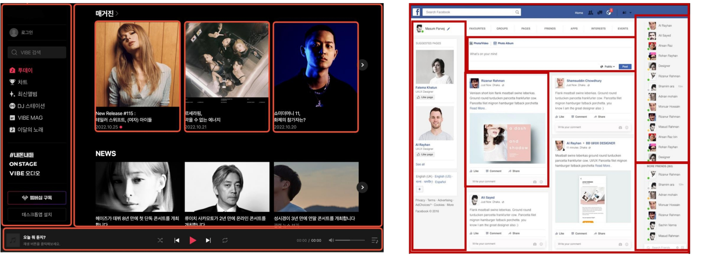

# Single-File Components
- Single-File Components
- SFC build toole (Vite)
- Vue Component
- 추가 주제

## Single-File Components
### Single-File Components

- Component    
    - 재사용 가능한 코드 블록
- Component 특징
    - UI를 독립적이고 재사용 가능한 일부분으로 분할하고 각 부분을 개별적으로 다룰 수 있음
    - 그러면 자연스럽게 앱은 중첩된 Component의 트리로 구성됨
- Component 예시
    - 웹 서비스는 여러 개의 Component로 이루어져 있음

- Single-File Components (SFC)
    - 컴포넌트의 템플릿(DOM), 로직(JS) 및 스타일(CSS)을 하나의 파일로 묶어낸 특수한 파일 형식 (*.vue 파일)
- SFC 파일 예시
    - Vue SFC 는 HTML, CSS 및 JavaScript 3개를 하나로 합친 것
    - `<template>`, `<script>` 및 `<style>` 블록은 하나의 파일에서 컴포넌트의 뷰, 로직 및 스타일을 캡슐화 하고 배치
- SFC 문법 개요
    - 각 *.vue 파일은 세 가지 유형의 최상위 언어 블록 `<template>`, `<script>`, `<style>` 으로 구성됨
    - 언어 블록의 작성 순서는 상관 없으나 일반적으로 `<template>` -> `<script>` -> `<style>` 순서로 작성

- 언어 블록 - `<template>`
    - 각 *.vue 파일은 최상위 `<template>` 블록을 하나만 포함할 수 있음
    - `<template>` 내부에 최상위 태그는 하나 쓰는 것을 권장 (Vue3부터 풀어줌)
- 언어 블록 - `<script setup>`
    - 각 *.vue 파일은 하나의 `<script setup>` 블록만 포함할 수 있음 (일반 `<script>`제외)
    - 컴포넌트의 setup() 함수로 사용되며 컴포넌트의 각 인스턴스에 대해 실행
- 언어 블록 - `<style scoped>`
    - *.vue 파일은 여러 `<style>` 태그가 포함될 수 있음
    - scoped가 지정되면 CSS는 현재 컴포넌트에만 적용

- 컴포넌트 사용하기 
    - https://play.vuejs.org 에서 Vue 컴포넌트 코드 작성 및 미리보기
    - Vue SFC는 컴파일러를 통해 컴파일 된 후 빌드 되어야 함
    - 실제 프로젝트에서 일반적으로 SFC 컴파일러를 Vite와 같은 공식 빌드 도구를 사용해 사용

## SFC build tool (Vite)
### SFC build tool (Vite)
- Vite
    - 프론트 엔드 개발 도구
    - 빠른 개발 환경을 위한 빌드 도구와 개발 서버를 제공
- Vite 튜토리얼 
    - vite 프로젝트 생성
        - `$npm create vue@latest`
    - 프로젝트 설정 관련 절차 진행
    - 프로젝트 폴더 이동 및 패키지 설치
    - Vue 프로젝트 서버 실행
    - Node Package Manager (NPM)
        - Node.js 의 기본 패키지 관리자
- Node.js
    - Chrome의 V8 Javascript
        - Chrom V8 JavaScript 엔진을 기반으로 하는 Server-Side 실행환경

- Node.js의 영향
    - 기존에 브라우저 안에서만 동작할 수 있었던 JavaScript를 브라우저가 아닌 서버 측에서도 실행할 수 있게 함
        - 프론트엔드와 벡엔드에서 동일한 언어로 개발할 수 있게 됨
    - NPM을 활용해 수많은 오픈 소스 패키지와 라이브러리를 제공하여 개발자들이 손쉽게 코드를 공유하고 재사용할 수 있게 함
- Vite 프로젝트 구조 (node-modules)
    - Node.js 프로젝트에서 사용되는 외부 패키지들이 저장되는 디렉토리
    - 프로젝트의 의존성 모듈을 저장하고 관리하는 공간
    - 프로젝트가 실행될 때 필요한 라이브러리와 패캐지들을 포함
    - .gitignore에 작성됨
- Vite 프로젝트 구조 (package-lock.json)
    - 패키지들의 실제 설치 버전, 의존성 관계, 하위 패키지 등을 포함하여 패키지 설치에 필요한 모든 정보를 포함
    - 패키지들의 정확한 버전을 보장하여, 여러 개발자가 협업하거나 서버 환경에서 일관성 있는 의존성을 유지하는데 도움을 줌
    - npm install 명령을 통해 패키지를 설치할 때, 명시된 버전과 의존성을 기반으로 설치
- Vite 프로젝트 구조 (package.json)
    - 프로젝트의 메타 정보와 의존성 패키지 목록을 포함
    - 프로젝트의 이름, 버전, 작성자, 라이선스 등과 같은 메타 정보를 정의

    - package-lock.json과 함께 프로젝트의 의존성을 관리하고, 버전 충돌 및 일관성을 유지하는 역할

- Vite 프로젝트 구조 (public 디렉토리)
    - 주로 다음 정적 파일을 위치 시킴
        - 소스 코드에서 참조되지 않는
        - 항상 같은 이름을 갖는
        - import 할 필요 없는
    - 항상 root 절대 경로를 사용하여 참조
        - public/icon.png 는 소스 코드에서 /icon.png로 참조할 수 있음
- Vite 프로젝트 구조 (src 디렉토리)
    - 프로젝트의 주요 소스 코드를 포함하는 곳
    - 컴포넌트, 스타일, 라우팅 등 프로젝트의 핵심 코드를 관리

- Vite 프로젝트 구조 (src/assets)
    - 프로젝트 내에서 사용되는 자원(이미지, 폰트, 스타일 시트 등)을 관리
    - 컴포넌트 자체에서 참조하는 내부 파일을 저장하는 데 사용
    - 컴포넌트가 아닌 곳에서는 public 디렉토리에 위치한 파일을 사용
- Vite 프로젝트 구조 (src/components)
    - Vue 컴포넌트들을 작성하는 곳
- Vite 프로젝트 구조 (src/App.vue)
    - Vue 앱의 최상위 Root 컴포넌트
    - 다른 하위 컴포넌트들을 포함
    - 어플리케이션 전체의 레이아웃과 공통적인 요소를 정의
- Vite 프로젝트 구조 (src/main.js)
    - Vue 인스턴스를 생성하고, 어플리케이션을 초기화 하는 역함
    - 필요한 라이브러리를 import하고 전역 설정을 수행 
- Vite 프로젝트 구조 (index.html)
    - Vue 앱의 기본 HTML 파일
    - 앱의 진입점 (entry point)
    - Root 컴포넌트인 App.vue 가 해당 페이지에 마운트(mount) 됨 (Vue 앱이 SPA인 이유)
    - 필요한 스타일 시트, 스크립트 등의 외부 리소스를 로드 할 수 있음 (ex: bootstrap CDN)
- Module
    - 프로그램을 구성하는 독립적인 코드 블록 (*.js 파일)
    - 개발하는 어플리케이션의 크기가 커지고 복잡해지면서 파일 하나에 모든 기능을 담기가 어려워짐
    - 따라서 자연스럽게 파일을 여러 개로 분리하여 관리를 하게 되었고, 이때 분리된 파일 각각이 모듈, 즉 js 팔일 하나가 하나의 모듈
    - 모듈의 수가 많아지고 라이브러리 혹은 모듈 간의 의존성이 깊어지면서 특정한 곳에서 발생한 문제가 어떤 모듈 간의 문제인지 파악하기 어려워 짐
    - 복잡하고 깊은 모듈의 의존성 문제를 해결하기 위한 도구가 필요 -> Bundler
- Bundler
    - 여러 모듈과 파일을 하나(혹은 여러개)의 번들로 묶어 최적화 하여 어플리케이션에서 사용할 수 있게 만들어주는 도구
- Bundler의 역할

## Vue Component
### Vue Component
- 컴포넌트 사용 2단계
    1. 컴포넌트 파일 생성
    2. 컴포넌트 등록 (import)

- 1. 컴포넌트 파일 생성
    - MyComponent.vue 생성
- 2. 컴포넌트 등록
    - App 컴포넌트에서 MyComponent를 등록
    - App(부모) -> MyComponent(자식) 관계 형성
- 결과 확인
    - Vue dev tools를 사용해 컴포넌트 관계 형성 확인

## 추가 주제
### 추가 주제(Virtual DOM)
- Vitual DOM
    - 가상의 DOM를 메모리에 저장하고 실제 DOM과 동기화하는 프로그래밍 개념
    - 실제 DOM과의 변경 사항 비교를 통해 변경된 부분만 실제 DOM에 적용하는 방식
    - 웹 어플리케이션의 성능을 향상시키기 위한 Vue의 내부 렌더링 기술
- Virtual DOM 패넡의 장점
    - 효율성
        - 실제 DOM 조작을 최소화 하고, 변경된 부분만 업데이트하여 성능을 향상
    - 반응성
        - 데이터의 변경을 감지하고, Virtual DOM을 효율적으로 갱신하여 UI를 자동으로 업데이트
    - 추상화
        - 개발자는 실제 DOM 조작을 Vue에게 맡기고 컴포넌트와 템플릿을 활용하는 추상화된 프로그래밍 방식으로 원하는 UI 구조를 구성하고 관리할 수 있음
- Virtual Dom 주의사항
    - 실제 DOM에 직접 접근하지 말 것
        - JavaScript에서 사용하는 DOM 접근 관련 메서드 사용 금지
        - querySelector, createElement, addEventListener 등
    - Vue의 ref와 Lifecycle Hooks 함수를 사용해 간접적으로 접근하여 조작할 것
- 직접 DOM 엘리먼트에 접근해야 하는 경우
    - ref 속성을 사용하여 특정 DOM 엘리먼트에 직접적인 참조를 얻을 수 있음