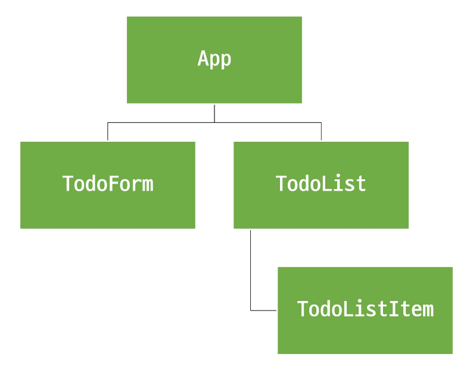

# State Management
- State Management
- Pinia
- Pinia 실습

## State Management
### State Management
- State Management (상태관리) 
    - Vue 컴포넌트는 이미 반응형 상태를 관리하고 있음
        - 상태 === 데이터
- 컴포넌트 구조의 단순화
    - 상태 (State)
        - 앱 구동에 필요한 기본 데이터 
    - 뷰 (View)
        - 상태를 선언적으로 매핑하여 시각화
    - 기능 (Action)
        - 뷰에서 사용자 입력에 대해 반응적으로 상태를 변경할 수 있게 정의된 동작
- 상태 관리의 단순성이 무너지는 시점 
    - "여러 컴포넌트가 상태를 공유할 때"
    1. 여러 뷰가 동일한 상태에 종속되는 경우
        - 공유 상태를 공통 조상 컴포넌트로 "끌어올림" 다음 props로 전달하는 것
        - 계층 구조가 깊어질 경우 비효율적, 관리가 어려워 짐
    2. 서로 다른 뷰의 기능이 동일한 상태를 변경시켜야 하는 경우
        - 발신(emit)된 이벤트를 통해 상태의 여러 복사본을 변경 및 동기화 하는 것
        - 마찬가지로 관리의 패턴이 깨지기 쉽고 유지 관리할 수 없는 코드가 됨
- 해결책
    - 각 컴포넌트와 공유 상태를 추출하여, 전역에서 참조할 수 있는 저장소에서 관리
    - 컴포넌트 트리는 하나의 큰 "뷰"가 되고 컴포넌트는 트리 계층 구조에 관계없이 상태에 접근하거나 기능을 사용할 수 있음
    - Vue의 공식 상태 관리 라이브러리==="Pinia"

## Pinia
### State management library (Pinia)
- Pinia 설치    
    - Vite 프로젝트 빌드 시 Pinia 라이브러리 추가
- Pinia 구성 요소
    - store
    - state
    - getters
    - actions
    - plugin
- Pinia 구성 요소 'store'
    - 중앙 저장소
    - 모든 컴포넌트가 공유하는 상태, 기능 등이 작성됨
- Pinia 구성 요소 'state'
    - 반응형 데이터 (상태)
    - ref() === state
- Pinia 구성 요소 'getters'
    - 계산된 값
    - computed() === getters
- Pinia 구성 요소 'actions'
    - 메서드
    - function() === actions
- Pinia 구성 요소 'plugin'
    - 어플리케이션의 상태 관리에 필요한 추가 기능을 제공하거나 확장하는 도구나 모듈
    - 어플리케이션의 상태 관리를 더욱 간편하고 유연하게 만들어주며 패키지 매니저로 설치 이후 별도 설정을 통해 추가됨
- Pinia 구성 요소 종합
    - Pinia는 store 라는 저장소를 가짐
    - stores 는 state, getters, actions 으로 이루어지며 각각 ref(), compute(), function() 과 동일함
- State
    - store 인스턴스로 state에 접근하여 직접 읽고 쓸 수 있음
    - 만약 store 에 state를 정의하지 않았다면 컴포넌트에서 새로 추가할 수 없음
- Getters
    - store의 모든 getter를 state 처럼 직접 접근할 수 있음
- Actions
    - store의 모든 actions를 직접 접근 및 호출 할 수 있음
    - getters 와 달리 state 조작, 비동기, API 호출이나 다른 로직을 진행할 수 있음
- Vue devtools로 Pinia 구성 요소 확인하기

## Pinia 실습
### Pinia 실습
- Pinia를 활용한 Todo 프로젝트 구현
    - Todo CRUD
    - Todo 개수 계산
        - 전체 Todo
        - 완료된 Todo
        - 미완료된 Todo
- 컴포넌트 구성

- 사전 준비 
    - 초기 생성된 컴포넌트 모두 삭제 (App.vue 제외)
    - src/assets 내부 파일과 main.js 해당 코드 삭제
    - TodoListItem 컴포넌트 작성
    - TodoList 컴포넌트 작성
    - TodoListItem 컴포넌트 등록
    - TodoForm 컴포넌트 작성
    - App 컴포넌트에 TodoList, TodoForm 컴포넌트 등록
    - 컴포넌트 구성 확인
- Todo 조회
    - store에 임시 todos 목록 상태를 정의
    - store의 toolss 상태 참조
    - 하위 컴포넌트인 TodoListItem을 반복하면서 개별 todo를 props로 전달
    - props 정의 후 데이터 출력 확인
- Todo 생성
    - todos 목록에 todo를 생성 및 추가하는 addTodo 액션 정의
    - TodoForm 에서 실시간으로 입력되는 사용자 데이터를 양방향 바인딩하여 반응형 변수로 할당
    - submit 이벤트가 발생 했을 때 사용자 입력 텍스트를 인자로 전달하여 store에 정의한 addTodo 액션 메서드를 호출
    - form 요소를 선택하여 todo 입력 후 input 데이터를 초기화 할 수 있도록 처리
    - 결과 확인
- Todo 삭제
    - todos 목록에서 특정 todo를 삭제하는 deleteTodo 액션 정의
    - 각 todo에 삭제 버튼을 작성
    - 버튼을 클릭하면 선택된 todo의 id를 인자를 전달해 deleteTodo 메서드 호출
    - 전달 받은 todo의 id 값을 활용해 선택된 todo의 인덱스를 구함
    - 특정 인덱스 todo를 삭제 후 todos 배열을 재설정
    - 결과 확인
- Todo 수정
    - 각 todo 상태의 isDone 속성을 변경하여 todo의 완료 유무 처리하기
    - 각 완료된 todo에는 취소선 스타일 적용하기

- 완료된 todo 개수 계산
    - todos 배열의 길이 값을 반환하는 함수 doneTodosCount 작성
    - App 컴포넌트에서 doneTodosCount getter를 참조
- Local Storage
    - 브라우저 내에 key-value 쌍을 저장하는 웹 스토리지 객체
- Local Storage 특징
    - 페이지를 새로 고침하고 브라우저를 다시 실행해도 데이터가 유지
    - 쿠키와 다르게 네트워크 요청시 서버로 전송되지 않음
    - 여러 탭이나 창 간에 데이터를 공유할 수 있음
- Local Storage 사용 목적
    - 웹 어플리케이션에서 사용자 설정, 상태 정보, 캐시 데이터 등을 클라이언트 측에서 보관하여 웹사이트의 성능을 향상시키고 사용자 경험을 개선하기 위함
- pinia-plugin-persistedstate
    - Pinia의 플러그인 중 하나
    - 웹 어플리케이션의 상태 (state)를 브라우저의 local storage나 session storage에 영구적으로 저장하고 복원하는 기능을 제공
- pinia-plugin-persistedstate 설정
    - 설치 및 등록
        - `npm i pinia-plugin-persistedstate`
        - main.js 파일에 추가
        - 활용 -> defineStore