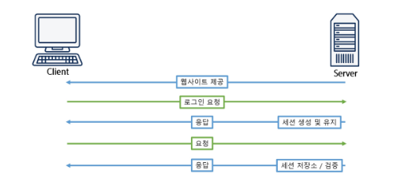
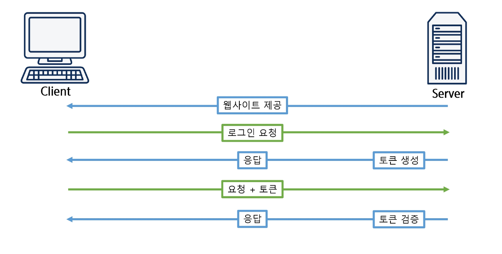

# 인증관리
- JWT
- JWT 실습
## JWT
### JWT
- 기존 서버 인증 방식

- 기존 서버 인증 방식 문제점
    - 세션 : 로그인 유저의 수가 많아지면 서버에 저장해야 할 정보가 많아짐
    - 확장성 : 여러 개의 프로세스를 돌리거나, 여러 대의 서버 컴퓨터를 추가 하는 과정이 복잡하고 어려움
    - CORS (Cross-Origin Resource Sharing)

- 토큰 인증 방식

- JWT (JSON Web Token)
    - JWT는 정보를 JSON의 형태로 안전하게 전송하기 위한 웹 표준(RFC7519)
    - 디지털 서명이 되어 있으므로 신뢰할 수 있음
    - 암호화 알고리즘을 사용
    - JWT 자체가 필요한 모든 정보를 갖고 있기 때문에 검증하기 위해 다른 검증 수단이 필요하지 않음
    - 권한을 부여하거나, 정보를 교환할 때 등의 상황에서 사용 가능

- JWT 구조
    - JWT는 .(dot)을 이용하여 3가지의 영역으로 구성됨
    1. header (헤더)
    2. payload (내용)
    3. signature (서명)
- JWT 구조 (Header)
    - 헤더는 일반적으로 토큰의 유형과 사용중인 암호알고리즘으로 구성
- JWT 구조 (Payload)
    - claim을 포함한 payload 작성
    - claim은 사용자 및 추가 데이터를 의미
        - 등록 / 공개 / 비공개 가 있음
- JST 구조 (Signature)
    - 해당 토큰이 조작되었거나 변경되지 않음을 확인하는 용도로 사용
    - Header와 Payload의 인코딩 값을 더하고, 비밀 키로 암호화 알고리즘을 통해 Hash 값을 생성

||세션방식|jwt|
|---|---|---|
|장점|보안성이 높다|서버부하가 적다|
|단점|서버부하가 크다|보안이 취약하다.|

- Jwt에서 보안의 취약성을 보완하기 위해 Refresh Token 사용
    - 기존에는 access-token만으로 Server의 기능을 사용할 수 있게 함
        - 너무 보안이 취약해짐
    - access-token과 refresh-token을 같이 발부, 유효기간을 각각 30분, 2주 정도로 해둠 
        - access-token이 탈취당해도 30분정도만 이상이 생김
        - refresh-token도 탈취 당할 수 있으나 애초에 교환이 자주 일어나지 않아 확률적으로 더 안전함
    - 만료기간이 지나서 refresh-token을 주면 서버에서 다시 access-token을 만들어서 클라이언트에게 줌
